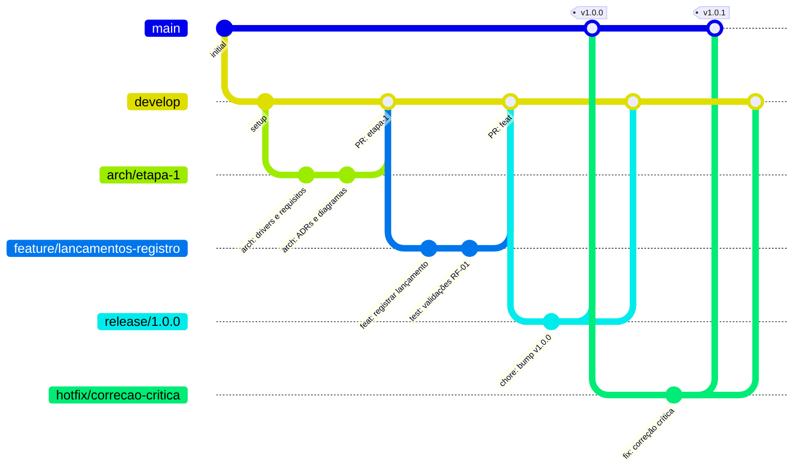

# Contributing

Guia de contribuição do projeto — padrões de branches, commits e versionamento.

---

## Setup do Ambiente Local

```bash
# Clonar o repositório
git clone <repo-url>
cd desafio-carrefour

# Criar e ativar o ambiente Python (para documentação)
python3 -m venv .venv
source .venv/bin/activate
pip install -r requirements.txt

# Subir os serviços de suporte (documentação + diagramas C4)
docker-compose up docs structurizr
```

| Serviço | URL |
|---------|-----|
| Documentação (MkDocs) | http://localhost:8000 |
| Diagramas C4 (Structurizr Lite) | http://localhost:8080 |

---

## Padrão de Branches — Git Flow

### Branches permanentes

| Branch | Propósito |
|--------|-----------|
| `main` | Código em produção. Protegida — merge apenas via PR aprovado. |
| `develop` | Integração contínua do desenvolvimento. Base para features. |

### Branches temporárias

| Prefixo | Origem | Destino | Quando criar |
|---------|--------|---------|--------------|
| `feature/` | `develop` | `develop` | Nova funcionalidade |
| `fix/` | `develop` | `develop` | Correção durante desenvolvimento |
| `hotfix/` | `main` | `main` + `develop` | Correção urgente em produção |
| `release/` | `develop` | `main` + `develop` | Preparação de nova versão |
| `arch/` | `develop` | `develop` | Trabalho arquitetural (ADRs, diagramas) |
| `docs/` | `develop` | `develop` | Documentação isolada |

### Nomenclatura

```
feature/lancamentos-registro-debito
fix/consolidacao-validacao-saldo
hotfix/consolidacao-query-timeout
release/0.2.0
arch/adr-004-message-broker
```

> Usar kebab-case. Incluir o escopo do serviço quando aplicável.

### Visão geral do fluxo



### Fluxo de uma feature

```bash
git checkout develop && git pull
git checkout -b feature/lancamentos-registro-debito

# desenvolver...

# abrir PR para develop
```

### Fluxo de uma release

```bash
git checkout develop && git pull
git checkout -b release/1.0.0

# bump de versão, CHANGELOG...
git commit -m "chore: bump versão para 1.0.0"

git checkout main && git merge --no-ff release/1.0.0
git tag -a lancamentos/v1.0.0 -m "release: lancamentos v1.0.0"
git checkout develop && git merge --no-ff release/1.0.0
git branch -d release/1.0.0
```

---

## Mensagens de Commit — Conventional Commits

Formato:

```
tipo(escopo): descrição curta

[corpo opcional — explica o porquê]

[rodapé opcional — BREAKING CHANGE, refs]
```

### Tipos

| Tipo | Quando usar | Impacto no SemVer |
|------|-------------|------------------|
| `feat` | Nova funcionalidade | MINOR |
| `fix` | Correção de bug | PATCH |
| `perf` | Melhoria de performance | PATCH |
| `refactor` | Refatoração sem mudança de comportamento | — |
| `test` | Testes | — |
| `docs` | Documentação | — |
| `arch` | Decisão ou mudança arquitetural | — |
| `ci` | CI/CD e pipeline | — |
| `chore` | Manutenção (deps, config, build) | — |

> `feat!` ou qualquer tipo com `!` indica **breaking change** → MAJOR

### Escopos do projeto

| Escopo | O que cobre |
|--------|------------|
| `lancamentos` | Serviço de Lançamentos |
| `consolidacao` | Serviço de Consolidação Diária |
| `broker` | Mensageria e eventos de domínio |
| `infra` | Infraestrutura e docker-compose |
| `docs` | Documentação MkDocs |
| `adr` | Architecture Decision Records |
| `arch` | Modelos ArchiMate ou Structurizr |
| `ci` | Pipeline de CI/CD |
| `contrib` | Arquivos de governança do projeto (CONTRIBUTING.md, scripts/, hooks) |

### Exemplos

```bash
feat(lancamentos): adicionar endpoint de registro de débito
fix(consolidacao): corrigir cálculo de saldo quando não há lançamentos no dia
feat(broker)!: migrar de RabbitMQ para Kafka

BREAKING CHANGE: contrato de mensagens alterado — consumers precisam ser atualizados

docs(adr): adicionar ADR-001 sobre escolha do message broker
chore(infra): adicionar healthcheck no docker-compose para o broker
```

---

## Versionamento — Semantic Versioning

Formato: `MAJOR.MINOR.PATCH`

| Segmento | Quando incrementar |
|----------|-------------------|
| **MAJOR** | Breaking change |
| **MINOR** | Nova funcionalidade compatível |
| **PATCH** | Correção de bug compatível |

### Relação com Conventional Commits

| Commit | Impacto |
|--------|---------|
| `fix:`, `perf:` | → PATCH |
| `feat:` | → MINOR |
| `feat!:`, `BREAKING CHANGE:` | → MAJOR |
| demais tipos | → sem bump |

### Estratégia por serviço

Cada serviço tem versionamento independente, com tags Git no formato:

```bash
lancamentos/v0.1.0
consolidacao/v0.1.0
```

Versão `0.x.y` durante desenvolvimento ativo — breaking changes podem ocorrer. A transição para `1.0.0` marca a primeira versão pública estável.

### Pré-lançamento

```
1.0.0-alpha.1   →   1.0.0-beta.1   →   1.0.0-rc.1   →   1.0.0
```
