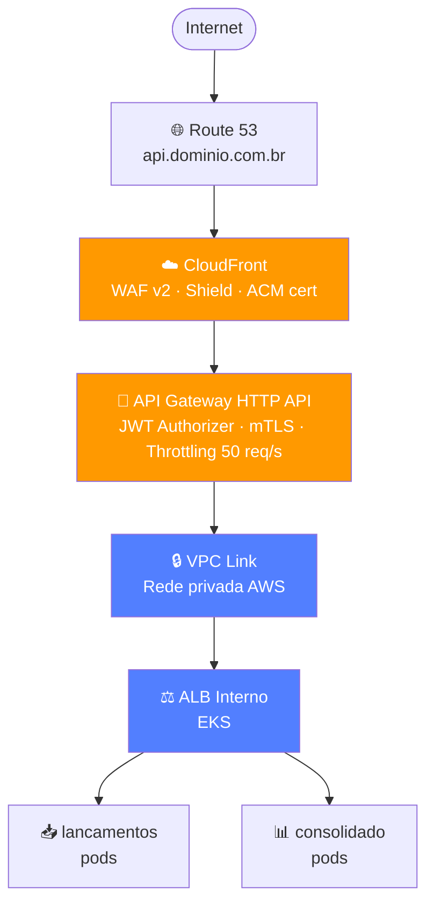

# ADR-009 — API Gateway de Produção: AWS API Gateway HTTP API

**Status:** Aceito  
**Data:** 2026-05-08  
**Papéis:** 🧩 Arquiteto de Soluções · 🔒 Arquiteto de Segurança · 🏗️ Arquiteto de Infraestrutura  
**Requisito de origem:** [ADR-004](ADR-004-jwt-validacao-local.md) (JWT validação local), [NFR-02](../negocio/requisitos.md#nfr-02) (50 req/s), [NFR-05](../negocio/requisitos.md#nfr-05) (segurança)

---

## Contexto

O ADR-007 definiu o Traefik como API Gateway do ambiente local de desenvolvimento.
Para produção na AWS, é necessário decidir se o Traefik segue como Ingress Controller
no EKS ou se um serviço gerenciado de API Gateway assume essa função.

Os requisitos da camada de gateway em produção são:
1. **TLS terminado** com certificado confiável ([ADR-007](ADR-007-api-gateway.md))
2. **Validação de JWT** sem roundtrip ao IdP por requisição ([ADR-004](ADR-004-jwt-validacao-local.md))
3. **Rate limiting** por rota para proteção de abuso ([NFR-07](../negocio/requisitos.md#nfr-07))
4. **Integração com WAF** para filtragem de tráfego malicioso
5. **Observabilidade** — logs estruturados de acesso

---

## Decisão

**AWS API Gateway HTTP API (v2)** com JWT Authorizer nativo, VPC Link para o ALB
interno do EKS, e domínio customizado via ACM + Route 53.

O Traefik permanece como Ingress Controller interno ao cluster para roteamento
entre serviços — separando a responsabilidade de borda (API Gateway) da
responsabilidade interna (Ingress/Service Mesh).

---

## Justificativa

### JWT nativo elimina risco do plugin experimental

O Traefik JWT Plugin está em estágio experimental e não é oficialmente suportado.
O JWT Authorizer do API Gateway HTTP API é um recurso GA (Generally Available),
validado via JWKS endpoint do provedor de identidade. Isso implementa o ADR-004
sem dependência de plugin de terceiro.

### HTTP API vs REST API (v1)

| Aspecto | HTTP API (v2) | REST API (v1) |
|---------|--------------|--------------|
| Latência adicionada | ~1-2 ms | ~5-10 ms |
| Custo (sa-east-1) | $1,00/M requisições | $3,50/M requisições |
| JWT Authorizer | Nativo | Via Lambda Authorizer |
| Rate limiting | Por stage/rota | Por stage |
| WebSocket | Não | Sim |
| Timeout máximo | 30 s | 29 s |

Para os casos de uso do sistema (POST /lancamentos, GET /consolidacao/saldo),
HTTP API cobre 100% dos requisitos com 3,5× menor custo.

### Traefik vs API Gateway em produção

| Critério | Traefik no EKS | API Gateway HTTP API |
|----------|---------------|----------------------|
| JWT validação | Plugin experimental | Nativo GA |
| TLS | ALB + ACM | ACM integrado direto |
| WAF | Módulo separado | `aws_wafv2_web_acl` nativo |
| Rate limiting | Por pod (não distribuído) | Distribuído na edge |
| Custo a 50 req/s | $0 (compute EKS) | ~$130/mês |
| Vendor lock-in | Nenhum | Alto (AWS) |
| Operação | Pods + config YAML | Zero |

O rate limiting do Traefik é por instância de pod — em cenários com múltiplas
réplicas do Consolidado, os limites seriam independentes por pod, não agregados.
O API Gateway aplica throttling de forma distribuída e global.

---

## Fluxo de Requisição em Produção

---

## Alternativas Consideradas

### Manter Traefik como gateway de produção

**Prós:** zero custo adicional, portabilidade, já documentado ([ADR-007](ADR-007-api-gateway.md)).  
**Contras:** plugin JWT experimental, rate limiting por pod (não global),
WAF exige configuração separada.  
**Descartado** pelo risco do plugin JWT em sistema financeiro.

### Kong Gateway (self-hosted no EKS)

**Prós:** mais completo que Traefik, plugins enterprise (JWT GA, rate limiting global).  
**Contras:** overhead operacional significativo, custo de licença Enterprise para plugins
avançados. Equivalente ao API Gateway gerenciado mas sem a maturidade do serviço AWS.  
**Descartado** pela complexidade operacional.

### AWS REST API Gateway (v1)

**Prós:** mais recursos que HTTP API (usage plans, API keys, mock integrations).  
**Contras:** 3,5× mais caro, latência maior, Lambda Authorizer para JWT (custo adicional).  
**Descartado** — HTTP API cobre 100% dos requisitos com menor custo e latência.

---

## Trade-offs Aceitos

| Trade-off | Mitigação |
|-----------|-----------|
| Vendor lock-in em AWS API Gateway | A camada de negócio (serviços EKS) é agnóstica de cloud; trocar o gateway exige apenas reconfigurar roteamento |
| Custo de ~$130/mês a 50 req/s | Menor que Amazon MQ eliminado (~$789/mês) — resultado líquido positivo |
| `alb_dns_name` é preenchido após Etapa 8 | Deploy em duas fases documentado no README do Terraform; não bloqueia a estrutura da IaC |
| Rate limiting global (50 req/s) aplica ao sistema inteiro, não por serviço | Adequado para o porte atual; por rota pode ser configurado via `route_settings` se necessário |

---

## Consequências

- `terraform/api_gateway.tf` provisiona o HTTP API, JWT Authorizer, VPC Link e domínio customizado
- `terraform/acm.tf` provisiona o certificado e validação DNS automática
- Traefik permanece no EKS apenas como Ingress interno (sem exposição externa)
- Em Etapa 8, o ALB interno é criado via Kubernetes Ingress + AWS Load Balancer Controller;
  o DNS resultante é adicionado ao `terraform.tfvars` e o Terraform re-executado
- WAF (`aws_wafv2_web_acl`) pode ser associado ao API Gateway em Etapa 5 (Segurança)
