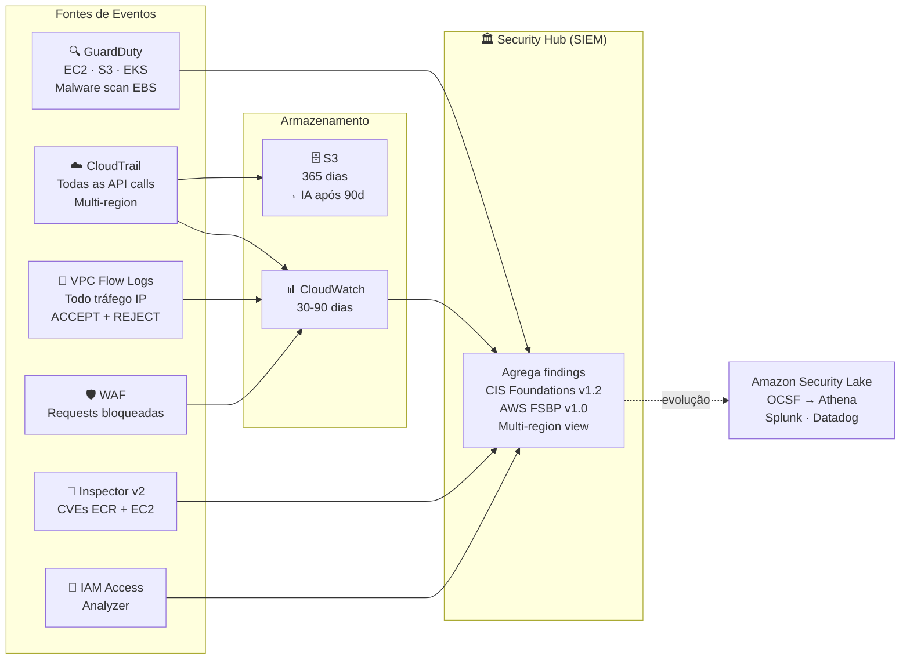
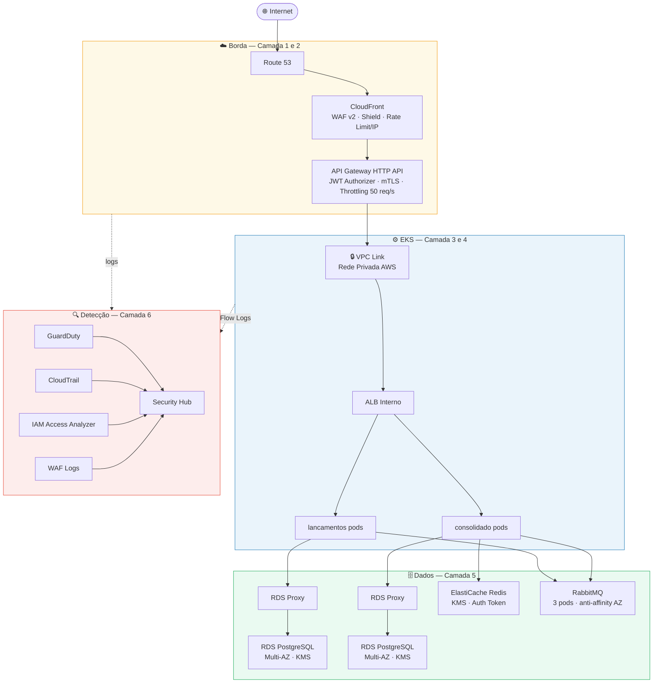

# ADR-010 — Arquitetura de Segurança em Profundidade

**Status:** Aceito  
**Data:** 2026-05-08  
**Papéis:** 🔒 Arquiteto de Segurança · 🔐 DevSecOps · 🏗️ Arquiteto de Infraestrutura  
**Requisito de origem:** NFR-05 (autenticação/autorização), NFR-06 (dados em trânsito e repouso), Compliance LGPD

---

## Contexto

A arquitetura de infraestrutura (ADR-006, ADR-008, ADR-009) definiu a topologia de produção na AWS. Este ADR registra as decisões de segurança em camadas aplicadas sobre essa topologia, seguindo o princípio de *defense in depth* — cada camada assume que as externas podem falhar.

---

## Decisão

Implementar segurança em **seis camadas independentes**, cada uma com controles complementares.

---

## Camadas de Segurança

### Camada 1 — Borda (CloudFront + WAF + Shield)

- **WAF v2** (CLOUDFRONT scope, us-east-1): `AWSManagedRulesCommonRuleSet` (OWASP Top 10), `AWSManagedRulesKnownBadInputsRuleSet`, `AWSManagedRulesSQLiRuleSet`, regra `RateLimitPerIP` (300 req / 5 min por IP)
- **Shield Standard**: proteção DDoS automática e gratuita sobre a distribuição CloudFront
- **`X-Origin-Verify`**: header secreto injetado pelo CloudFront — o API Gateway rejeita requisições sem esse header, impedindo bypass direto ao endpoint `execute-api`

**Por que CloudFront como camada de WAF e não direto no API Gateway?**  
O AWS WAF v2 não suporta associação direta com API Gateway HTTP API (v2) — limitação documentada da AWS. CloudFront com scope `CLOUDFRONT` é o padrão recomendado. Bônus: caching de saldos consolidados na edge reduz carga no EKS.

**Header `X-Origin-Verify`:** o CloudFront injeta um header secreto em cada requisição para a origem (API Gateway). O API Gateway valida esse header — impede que atacantes façam bypass ao CloudFront acessando o endpoint `execute-api` diretamente.

### Camada 2 — Autenticação e Identidade

- **JWT Authorizer** (nativo GA): valida tokens via JWKS público do IdP — sem roundtrip por requisição ([ADR-004](ADR-004-jwt-validacao-local.md))
- **mTLS** (opcional): dupla autenticação — servidor prova identidade ao cliente (TLS padrão) + cliente prova identidade via certificado emitido pela CA interna, cujo PEM fica armazenado em S3

**mTLS:** dupla autenticação — servidor se prova ao cliente (TLS padrão) e cliente se prova ao servidor via certificado emitido pela CA interna. Indicado para integrações B2B ou canais de alta criticidade. Ativado quando `var.mtls_truststore_path != ""`.

### Camada 3 — Rede (VPC)

- **Subnets privadas** para EKS nodes, RDS e ElastiCache — sem IP público, acesso apenas via NAT ou VPC Endpoints
- **Security Groups restritivos**: ingress de RDS e Redis aceito apenas do Security Group dos nós EKS (não por CIDR)
- **VPC Flow Logs**: todo tráfego IP da VPC (ACCEPT + REJECT) → CloudWatch 30 dias → análise forense
- **EKS endpoint restrito por CIDR**: a API do cluster (`kubectl`) responde apenas para IPs autorizados (bastion/VPN corporativa)

### Camada 4 — Compute (EKS)

- **IMDSv2 obrigatório** (`http_tokens = required`, `hop_limit = 1`): impede ataques SSRF onde um pod malicioso acessa `http://169.254.169.254/` para roubar credenciais temporárias do node. Com `hop_limit = 1`, apenas o kubelet (no host) acessa o IMDS — pods recebem erro 401
- **IRSA** (IAM Roles for Service Accounts — Etapa 8): cada pod assume apenas o IAM Role necessário para sua função, seguindo o princípio do menor privilégio

### Camada 5 — Dados

**Em repouso:**

| Recurso | Mecanismo |
|---------|-----------|
| RDS PostgreSQL | KMS CMK + `manage_master_user_password` (rotação automática via Secrets Manager) |
| ElastiCache Redis | KMS CMK + auth token |
| S3 (truststore, logs) | KMS CMK + Block Public Access |
| Secrets Manager | KMS CMK (senhas nunca aparecem no `terraform.tfstate`) |

**Em trânsito:**

| Trecho | Protocolo |
|--------|-----------|
| Cliente → CloudFront | TLS 1.2+ (cert ACM wildcard) |
| CloudFront → API Gateway | HTTPS (TLS 1.2+) |
| API Gateway → EKS (VPC Link) | HTTP sobre rede privada AWS (sem exposição pública) |
| EKS → RDS / Redis | TLS (`enforce_ssl = on` no parameter group do PostgreSQL) |

**Por que KMS CMK e não chaves default (`aws/rds`)?** Chaves default não geram entradas granulares no CloudTrail — impossível auditar *quem* usou a chave para *quê*. CMK com `enable_key_rotation = true` garante audit trail completo e rotação anual automática.

### Camada 6 — Detecção e Resposta (SIEM)

---

## Diagrama Consolidado

---

## Trade-offs Aceitos

| Decisão | Trade-off | Mitigação |
|---------|-----------|-----------|
| CloudFront obrigatório para WAF | Latência adicional ~2-5 ms, custo ~$200-350/mês | Edge caching compensa — GET /consolidacao pode ser servido da edge |
| mTLS opcional (não default) | Clientes precisam de cert de cliente, aumenta complexidade de integração | Ativar por canal/parceiro conforme necessidade |
| Security Hub como SIEM inicial | Não é um SIEM completo — sem correlação customizada de eventos | Evolução planejada para Amazon Security Lake + Athena |
| KMS CMK única compartilhada | Blast radius maior que uma CMK por serviço | Key policy granular por serviço; CMK por serviço em revisão futura |
| Shield Standard (não Advanced) | Sem DDoS Response Team dedicado, sem proteção de custo | Shield Advanced (~$3.000/mês) avaliado se ataques DDoS se tornarem recorrentes |

---

## Consequências

- `terraform/cloudfront.tf` — WAF v2 + CloudFront + Shield + Route 53
- `terraform/kms.tf` — CMK com aliases por serviço e key rotation
- `terraform/secrets.tf` — Secrets Manager para Redis, RabbitMQ e truststore mTLS
- `terraform/detection.tf` — GuardDuty, CloudTrail, VPC Flow Logs, Security Hub
- `terraform/rds.tf` — `manage_master_user_password = true` (senhas saem do tfstate)
- `terraform/eks.tf` — IMDSv2 obrigatório + endpoint restrito por CIDR
- `terraform/api_gateway.tf` — mTLS via `mutual_tls_authentication` dinâmico
- WAF logs → CloudWatch → Security Hub (correlação automática)
- Em Etapa 8: IRSA configurado por pod para acesso granular ao Secrets Manager
