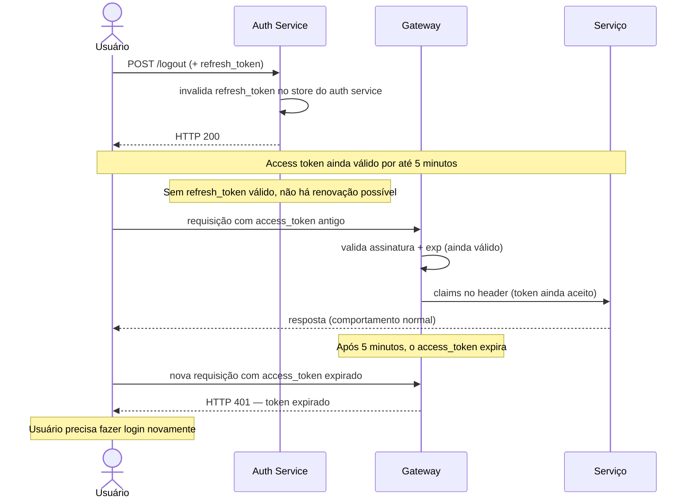

---
tags:
  - adr
  - decisao
  - seguranca
---

# ADR-013 — Revogação de Tokens: TTL Curto + Refresh Rotation

**Papéis:** 🔒 Arquiteto de Segurança · 🧩 Arquiteto de Soluções  
**Data:** 2026-05-09  
**Status:** Aceito  
**Requisitos:** [NFR-05](../negocio/requisitos.md#nfr-05) · [ADR-004](ADR-004-jwt-validacao-local.md)

---

## Contexto

O ADR-004 estabelece que a validação de JWT ocorre **no gateway** (Traefik local / AWS API Gateway HTTP API em produção), e não nos serviços. Os serviços recebem as claims pré-validadas via headers (`X-User-Id`, `X-User-Role`, `X-Scopes`) e as consomem sem qualquer verificação criptográfica própria.

Esse modelo elimina o auth service como bottleneck de runtime, mas levanta uma questão: **como revogar um token antes de ele expirar?** Cenários que exigem revogação imediata incluem comprometimento de credencial, demissão de funcionário ou logout explícito.

A decisão sobre o mecanismo de revogação é diretamente ligada a onde a verificação deve acontecer — e quem é responsável por ela.

---

## Alternativas Consideradas

### 1. Blacklist em Redis verificada pelo serviço

O serviço consultaria Redis a cada requisição para verificar se o `jti` do token está na lista negra.

**Por que foi descartada:**

- **Viola a separação de responsabilidades** — autenticação e autorização são responsabilidades do gateway. O serviço não deve saber que existe um JWT ou uma blacklist; ele apenas consome claims.
- **Anula a principal vantagem do JWT** — validação local sem I/O. Adicionar uma chamada Redis por requisição torna o Redis um bottleneck equivalente ao token introspection que o ADR-004 descartou.
- **Acoplamento desnecessário** — todos os serviços passariam a depender de uma conexão Redis de autenticação, separada do Redis de cache do negócio.

### 2. Lambda Authorizer (prod) + Forward Auth service (local) com blacklist

Substituir o JWT Authorizer nativo pelo gateway por um componente customizado que valida JWT **e** consulta Redis.

**Por que foi descartada:**

- **Complexidade operacional desproporcional** — Lambda Authorizer adiciona latência (~50ms por requisição fria) e um novo componente para operar, monitorar e escalar. Forward Auth service local exige um container adicional no docker-compose.
- **O problema que resolve não justifica o custo** — o sistema serve um comerciante com uma equipe pequena (Caixa + Gestor). Comprometimento de credencial é raro; o impacto de uma janela de 5 minutos é baixo e aceitável.
- **Invalidação do refresh token resolve 90% dos casos** — logout imediato invalida a renovação do access token. O token atual "vaza" por no máximo 5 minutos, mas sem refresh, expira definitivamente.

### 3. Token opaco + introspection

Retornar ao modelo de token opaco com chamada ao auth service a cada requisição.

**Por que foi descartada:** Já avaliado e descartado no ADR-004 — cria dependência de runtime no auth service.

---

## Decisão

Adotar **TTL curto (5 minutos) com refresh token rotation** como estratégia exclusiva de controle de ciclo de vida de tokens. Não implementar blacklist.

| Parâmetro | Valor | Motivo |
|-----------|-------|--------|
| Access token TTL | **5 minutos** | Janela máxima de exposição em caso de comprometimento |
| Refresh token TTL | **24 horas** (configurável) | Não exige re-login frequente para usuários legítimos |
| Refresh rotation | **A cada uso** | Cada renovação invalida o refresh anterior — detecção de roubo de refresh token |
| Validação | **Gateway only** | Serviços nunca verificam JWT nem consultam qualquer store de revogação |

**Fluxo de logout:**

**Detecção de roubo de refresh token (rotation):**

Se um refresh token roubado for usado após o usuário legítimo já tê-lo renovado, o auth service detecta a reutilização (refresh inválido) e pode invalidar **toda a família de refresh tokens** desse usuário, forçando novo login. Isso cobre o cenário de ataque sem blacklist.

---

## Consequências

### Positivas

- **Gateway permanece stateless** — sem dependência de Redis para autenticação; o JWT Authorizer nativo do AWS API Gateway HTTP API e o plugin JWT do Traefik cobrem 100% da validação sem customização
- **Serviços permanecem ignorantes de auth** — recebem apenas headers de claims, sem nenhuma lógica de verificação de token
- **Sem novo componente operacional** — não há Lambda Authorizer, Forward Auth service ou store de blacklist para operar
- **Revogação efetiva na prática** — logout invalida o refresh; a janela de exposição do access token é de no máximo 5 minutos

### Negativas / Trade-offs

- **Janela de 5 minutos após logout** — um access token válido continua funcionando por até 5 minutos após logout ou revogação. Aceitável para o perfil de risco deste sistema (operação interna de um comerciante).
- **Não adequado para sistemas de alta criticidade** — sistemas bancários, saúde ou governo com requisito de revogação imediata exigem a abordagem de Lambda Authorizer + blacklist. Para este desafio, o risco é proporcional ao contexto.

---

## Quando Revisar Esta Decisão

- Se o sistema for adotado por múltiplos comerciantes com equipes grandes (maior superfície de ataque interno)
- Se regulação específica exigir revogação imediata de sessão (ex: PCI-DSS para processamento de cartões)
- Se o auth service evoluir para suportar token introspection com cache distribuído, tornando a abordagem híbrida viável sem bottleneck
