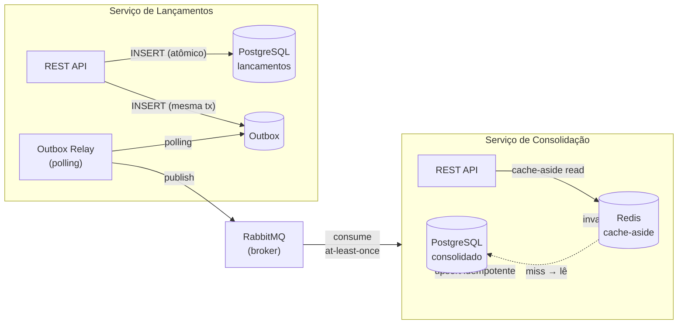
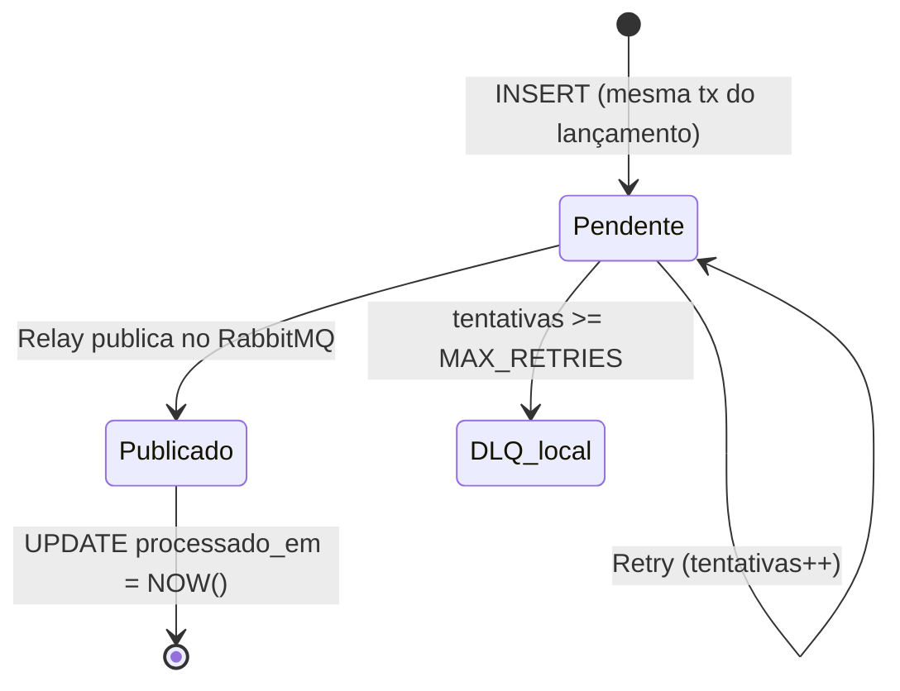
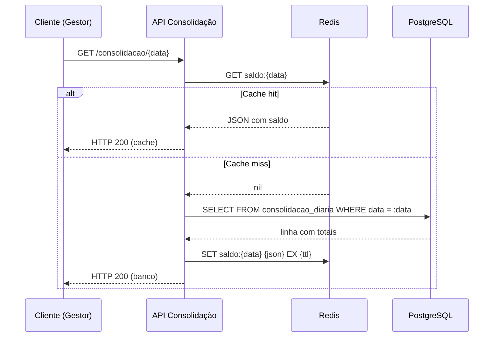
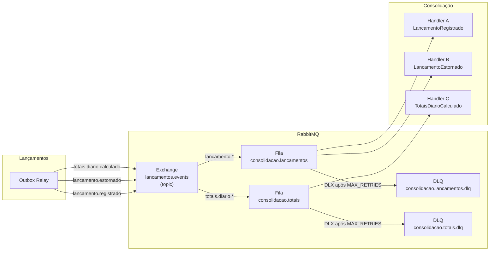

---
tags:
  - dados
  - persistencia
  - schema
---

# Dados e Persistência

**Perspectiva:** 📊 Arquiteto de Dados · 🔗 Arquiteto de Integração  
**Framework:** ArchiMate — Application Layer (data objects) + C4 L2/L3  
**Decisões:** [ADR-001](../adr/ADR-001-padrao-arquitetural.md) (database per service) · [ADR-003](../adr/ADR-003-outbox-pattern.md) (Outbox) · [ADR-012](../adr/ADR-012-persistencia.md) (mecanismos de persistência)

---

## Visão Geral

O sistema adota **database per service**: cada serviço tem seu próprio banco de dados isolado e nenhum serviço acessa diretamente o banco do outro. A consistência entre os serviços é eventual, mediada pelo broker de mensagens.



---

## Serviço de Lançamentos — PostgreSQL

### Tabela `lancamentos`

```sql
CREATE TABLE lancamentos (
    id               UUID        PRIMARY KEY DEFAULT gen_random_uuid(),
    tipo             VARCHAR(10) NOT NULL CHECK (tipo IN ('debito', 'credito')),
    valor            NUMERIC(15,2) NOT NULL CHECK (valor > 0),
    data_competencia DATE        NOT NULL,
    descricao        VARCHAR(255) NOT NULL CHECK (LENGTH(descricao) >= 3),
    estorno_de       UUID        REFERENCES lancamentos(id),
    estornado_por    UUID        REFERENCES lancamentos(id),
    criado_em        TIMESTAMPTZ NOT NULL DEFAULT NOW()
);
```

**Decisões de design:**

| Escolha | Alternativa descartada | Motivo |
|---------|----------------------|--------|
| `NUMERIC(15,2)` | `FLOAT` / `DOUBLE PRECISION` | Precisão exata para valores financeiros — `FLOAT` acumula erro de ponto flutuante |
| `UUID` como PK | `SERIAL` (bigint auto-increment) | UUIDs gerados pelo serviço: sem risco de vazamento de sequência, portáveis entre ambientes |
| `gen_random_uuid()` | UUID gerado na aplicação | Simplifica o INSERT (sem necessidade de gerar na camada de aplicação), garante unicidade no banco |
| `estorno_de` / `estornado_por` | Tabela separada de estornos | Rastreabilidade bidirecional na mesma linha — queries mais simples, integridade referencial nativa |
| Lançamentos imutáveis (append-only) | UPDATE / DELETE | Imutabilidade garante trilha de auditoria — correções via estorno, nunca via edição ([RF-08](../negocio/requisitos.md#rf-08), [NFR-09](../negocio/requisitos.md#nfr-09)) |

**Índices:**

```sql
-- Filtro por período (RF-02, RF-07)
CREATE INDEX idx_lancamentos_data_competencia
    ON lancamentos(data_competencia);

-- Filtro combinado período + tipo (RF-02)
CREATE INDEX idx_lancamentos_data_tipo
    ON lancamentos(data_competencia, tipo);

-- Resolução de self-join de estornos (RF-08)
CREATE INDEX idx_lancamentos_estorno_de
    ON lancamentos(estorno_de)
    WHERE estorno_de IS NOT NULL;
```

---

### Tabela `outbox`

O Outbox Pattern ([ADR-003](../adr/ADR-003-outbox-pattern.md)) garante que eventos são publicados somente após a persistência confirmada — escrita em `lancamentos` e `outbox` ocorrem na **mesma transação**.

```sql
CREATE TABLE outbox (
    id           UUID        PRIMARY KEY DEFAULT gen_random_uuid(),
    tipo         VARCHAR(100) NOT NULL,
    payload      JSONB       NOT NULL,
    criado_em    TIMESTAMPTZ NOT NULL DEFAULT NOW(),
    processado_em TIMESTAMPTZ,
    tentativas   SMALLINT    NOT NULL DEFAULT 0
);

-- Relay lê apenas registros não processados (partial index — muito eficiente)
CREATE INDEX idx_outbox_pendentes
    ON outbox(criado_em ASC)
    WHERE processado_em IS NULL;
```

**Ciclo de vida de uma mensagem outbox:**



O relay faz polling periódico (ex.: a cada 500ms) na `outbox` por registros com `processado_em IS NULL`. Ao publicar com confirmação do broker (`publisher confirm`), atualiza `processado_em`. Mensagens que excedem o limite de tentativas são movidas para análise operacional — nunca descartadas silenciosamente ([NFR-06](../negocio/requisitos.md#nfr-06)).

---

## Serviço de Consolidação — PostgreSQL

### Tabela `lancamentos_processados`

Projeção local dos eventos recebidos. Serve dois propósitos simultâneos: **idempotência** (PK = `id` do evento/lançamento) e **fonte de dados para recálculo** do saldo.

```sql
CREATE TABLE lancamentos_processados (
    id               UUID        PRIMARY KEY,   -- mesmo ID do lançamento original
    tipo             VARCHAR(10) NOT NULL CHECK (tipo IN ('debito', 'credito')),
    valor            NUMERIC(15,2) NOT NULL,
    data_competencia DATE        NOT NULL,
    estorno_de       UUID,                       -- preenchido se for estorno
    estornado_por    UUID,                       -- preenchido pelo Handler B
    processado_em    TIMESTAMPTZ NOT NULL DEFAULT NOW()
);

CREATE INDEX idx_lancamentos_proc_data
    ON lancamentos_processados(data_competencia);

CREATE INDEX idx_lancamentos_proc_data_tipo
    ON lancamentos_processados(data_competencia, tipo);
```

**Por que replicar os dados e não consultar o serviço de Lançamentos?**

Porque cruzar fronteiras de serviço para leitura cria acoplamento em tempo de execução — a Consolidação ficaria indisponível se o Lançamentos caísse, violando [NFR-01](../negocio/requisitos.md#nfr-01). A projeção local é o custo certo para manter o isolamento.

---

### Tabela `consolidacao_diaria`

Agregado pré-computado — não é derivado na query, mas recalculado a cada evento processado. Isso garante que a leitura do saldo ([RF-03](../negocio/requisitos.md#rf-03)) seja sempre O(1), independentemente do volume histórico de lançamentos.

```sql
CREATE TABLE consolidacao_diaria (
    data           DATE         PRIMARY KEY,
    total_creditos NUMERIC(15,2) NOT NULL DEFAULT 0 CHECK (total_creditos >= 0),
    total_debitos  NUMERIC(15,2) NOT NULL DEFAULT 0 CHECK (total_debitos >= 0),
    atualizado_em  TIMESTAMPTZ  NOT NULL DEFAULT NOW()
);
```

**Estratégia de upsert idempotente (Handlers A e B):**

```sql
-- Após inserir/atualizar lancamentos_processados, recalcula o agregado:
INSERT INTO consolidacao_diaria (data, total_creditos, total_debitos, atualizado_em)
SELECT
    :data,
    COALESCE(SUM(valor) FILTER (WHERE tipo = 'credito'), 0),
    COALESCE(SUM(valor) FILTER (WHERE tipo = 'debito'),  0),
    NOW()
FROM lancamentos_processados
WHERE data_competencia = :data
ON CONFLICT (data) DO UPDATE SET
    total_creditos = EXCLUDED.total_creditos,
    total_debitos  = EXCLUDED.total_debitos,
    atualizado_em  = EXCLUDED.atualizado_em;
```

O `INSERT ... ON CONFLICT DO UPDATE` é atômico: sem race condition entre dois consumers processando lançamentos do mesmo dia em paralelo — o banco serializa o acesso via lock de linha no `ON CONFLICT`.

---

## Serviço de Consolidação — Redis

### Esquema de chaves

Cache do saldo consolidado com padrão **cache-aside**:

| Chave | Tipo | Valor | TTL |
|-------|------|-------|-----|
| `saldo:{YYYY-MM-DD}` | String (JSON) | `{"total_creditos": 150.00, "total_debitos": 50.00, "saldo": 100.00, "atualizado_em": "..."}` | 60s (dias recentes) / 1h (dias anteriores) |

### Estratégia cache-aside



**Invalidação ativa:** após cada evento processado com sucesso, o consumer invalida a chave Redis correspondente à `data_competencia` do evento (`DEL saldo:{data}`). Isso garante que o próximo read sempre busca o saldo atualizado — sem esperar o TTL expirar.

### Configuração

```yaml
# redis.conf relevante
maxmemory-policy: allkeys-lru   # LRU global se atingir limite de memória
appendonly: yes                 # AOF para durabilidade do cache entre restarts
```

TTL de 60s para dias recentes (podem receber novos lançamentos) e 1h para datas passadas (consolidadas, imutáveis na prática). O TTL atua como safety net — a invalidação ativa é o caminho principal.

---

## Topologia RabbitMQ

### Exchanges e Filas



| Recurso | Configuração | Motivo |
|---------|-------------|--------|
| Exchange `lancamentos.events` | `topic` | Roteamento por routing key — permite adicionar consumidores sem alterar o produtor |
| Fila `consolidacao.lancamentos` | `durable: true` | Sobrevive a restart do broker |
| `x-dead-letter-exchange` | DLX configurado na fila | Mensagens com ACK negativo após `x-delivery-count` máximo vão para DLQ, nunca são descartadas |
| `x-message-ttl` | 30 min | Mensagens presas mais de 30 min provavelmente exigem intervenção operacional |
| `prefetch` | 10 por consumer | Controla throughput e evita que um consumer fique sobrecarregado com mensagens ainda em processamento |

---

## Consistência Eventual — Estratégia Formal

A Consolidação é um **read model** — uma projeção dos eventos do Serviço de Lançamentos. Não existe consistência forte entre os dois, e isso é intencional ([P-03](../negocio/principios.md), [ADR-001](../adr/ADR-001-padrao-arquitetural.md)).

### Janela de inconsistência

```mermaid
gantt
    title Janela de inconsistência após um lançamento
    dateFormat  ss
    axisFormat  +%Ss

    section Lançamentos
    Persistência confirmada     : 0, 1s
    Outbox relay (polling 500ms): 1, 1s
    Publicação no broker        : 2, 1s

    section Consolidação
    Consumer recebe evento      : 3, 1s
    Upsert + recálculo          : 4, 1s
    Invalidação do cache Redis  : 5, 1s
    Saldo disponível atualizado : 6, 1s
```



Em condições normais, o saldo consolidado fica disponível atualizado dentro de ~2–6 segundos após o registro do lançamento. Em degradação (broker sobrecarregado, consumer lento), a janela se estende mas os dados nunca se perdem — o broker retém os eventos até o consumer processar.

### Garantias oferecidas

| Garantia | Mecanismo |
|----------|-----------|
| Zero perda de lançamentos confirmados | Outbox atômico + at-least-once delivery |
| Idempotência no consumer | PK de `lancamentos_processados` = ID do evento |
| Saldo sempre reconstruível | `lancamentos_processados` + recálculo por `SELECT SUM` |
| DLQ para eventos com falha persistente | `x-dead-letter-exchange` + alerta operacional |
| Detecção de divergência | Reconciliação periódica ([RF-06](../negocio/requisitos.md#rf-06)) |

---

## ABB → SBB — Mapeamento de Blocos Arquiteturais

| ABB (conceito arquitetural) | SBB (implementação concreta) |
|-----------------------------|------------------------------|
| Repositório de eventos de lançamento | Tabela `lancamentos` + índices em `data_competencia` |
| Mecanismo de entrega confiável de eventos | Tabela `outbox` + Outbox Relay (polling 500ms) |
| Broker de mensagens | RabbitMQ — exchange `lancamentos.events` (topic) |
| Dead Letter Queue | `consolidacao.lancamentos.dlq` via `x-dead-letter-exchange` |
| Read model da consolidação | Tabela `lancamentos_processados` (projeção local por serviço) |
| Agregado consolidado | Tabela `consolidacao_diaria` (upsert pré-computado) |
| Cache de leitura de alta performance | Redis — chave `saldo:{YYYY-MM-DD}`, TTL 60s/1h, invalidação ativa |
| Idempotência de eventos | PK de `lancamentos_processados` = UUID do lançamento original |
