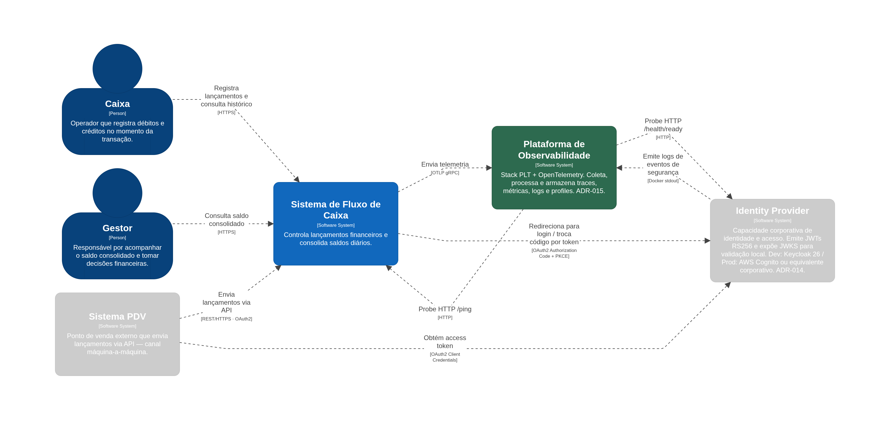
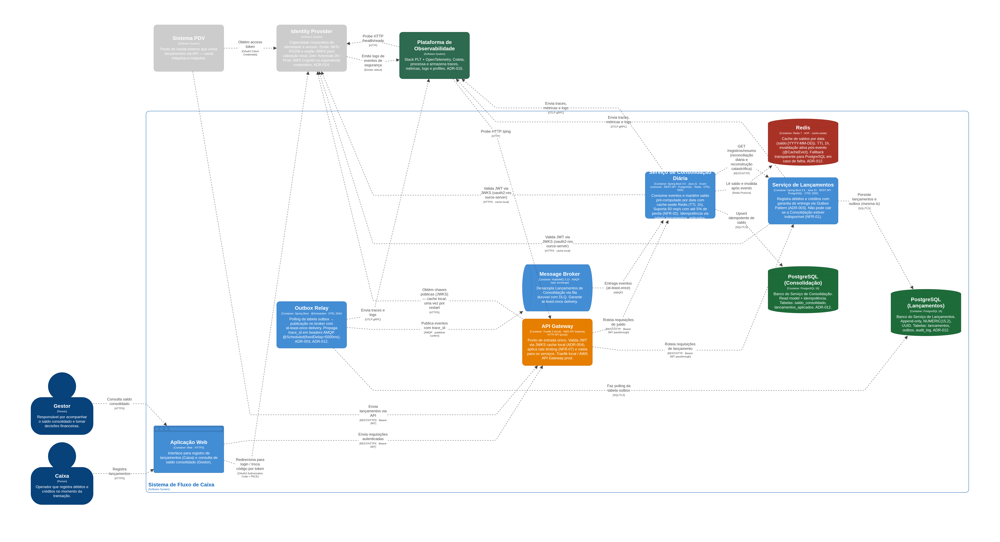
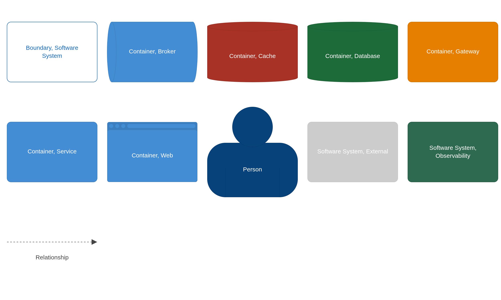
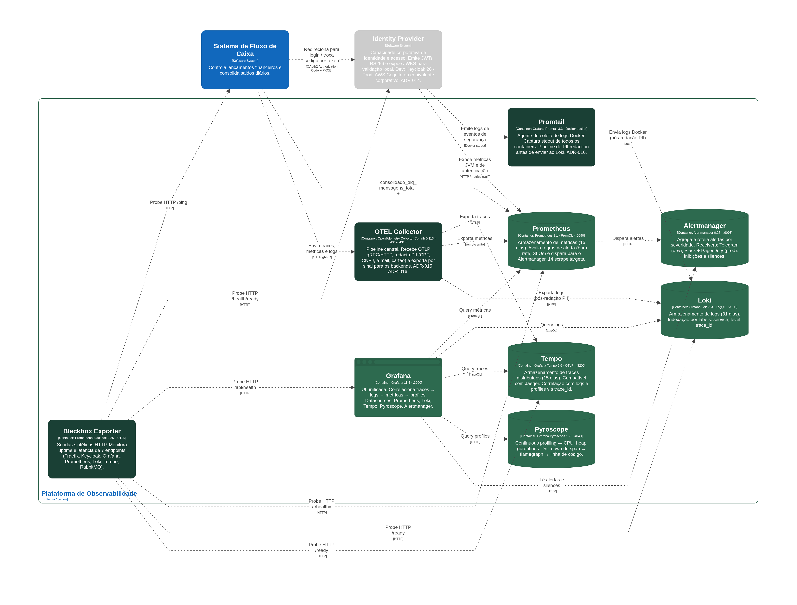
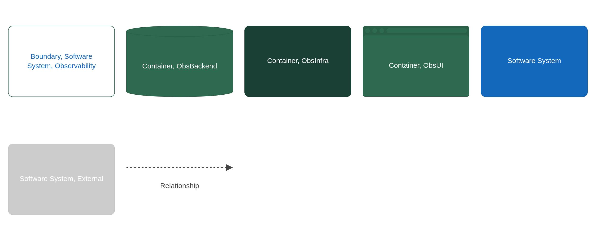

---
tags:
  - arquitetura
  - c4
---

# Diagramas C4

**Perspectiva:** 🧩 Arquiteto de Soluções  
**Nível:** C4 L1 (System Context) + C4 L2 (Containers)  
**Fonte:** [`structurizr/workspace.dsl`](../../structurizr/workspace.dsl) · visualização interativa: `docker compose up structurizr` → http://localhost:8080

---

## C4 L1 — Contexto do Sistema

**O que mostra:** o sistema como uma caixa preta, seus usuários diretos (Caixa, Gestor, PDV) e os sistemas externos com os quais se integra (Identity Provider, Plataforma de Observabilidade).

[](assets/contexto.png)

---

## C4 L2 — Containers do Sistema de Negócio

**O que mostra:** os containers internos — Serviço de Lançamentos, Outbox Relay, Serviço de Consolidação, bancos de dados, cache, broker — e como se comunicam entre si e com os sistemas externos.

[](assets/containers.png)

[](assets/containers-key.png)

---

## C4 L2 — Plataforma de Observabilidade

**O que mostra:** os containers da stack PLG + OTEL — OTEL Collector, Prometheus, Alertmanager, Loki, Promtail, Tempo, Pyroscope, Grafana, Blackbox Exporter — e como recebem telemetria dos serviços de negócio.

[](assets/observabilidade-containers.png)

[](assets/observabilidade-containers-key.png)

---

## Fonte canônica

Os diagramas são gerados pelo Structurizr Lite a partir do DSL versionado:

```bash
docker compose up structurizr
# Acesse: http://localhost:8080
# Exporte: menu Diagrams → Export → PNG
```

O DSL em [`structurizr/workspace.dsl`](../../structurizr/workspace.dsl) é a fonte de verdade — qualquer mudança na arquitetura começa por ali. Os PNGs nesta página são exportações pontuais e podem ficar desatualizados se o DSL for alterado sem re-exportar.
