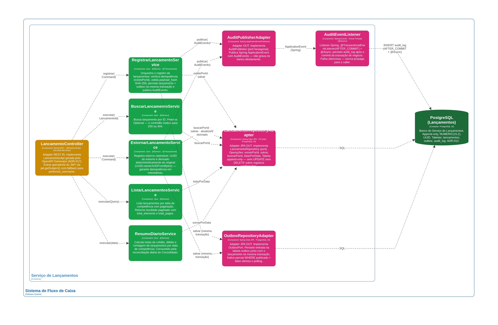
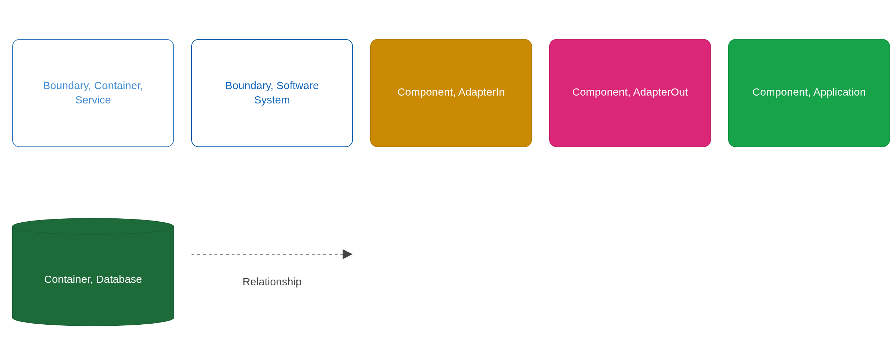
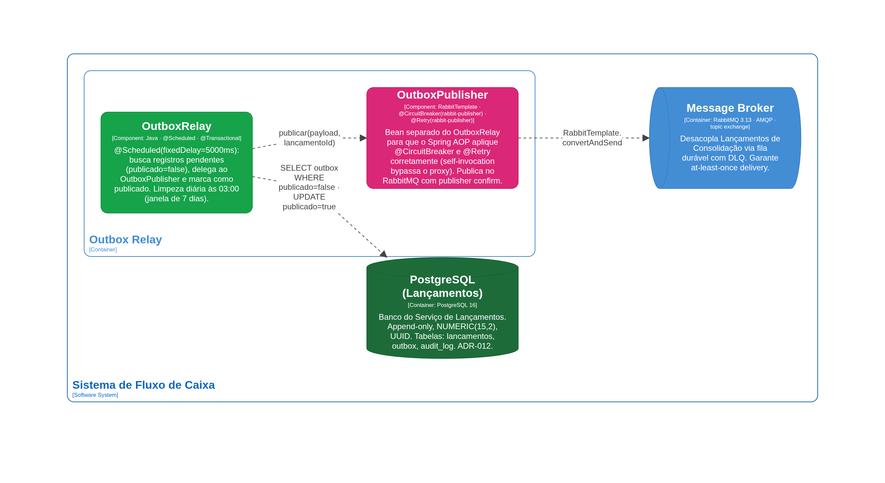
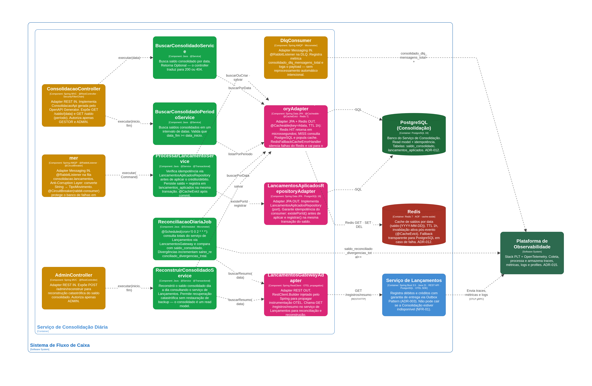
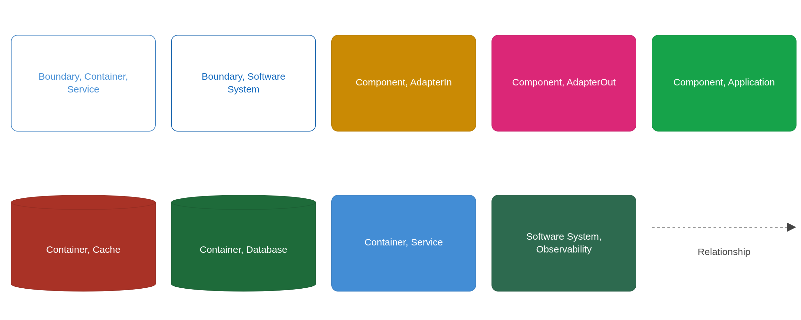
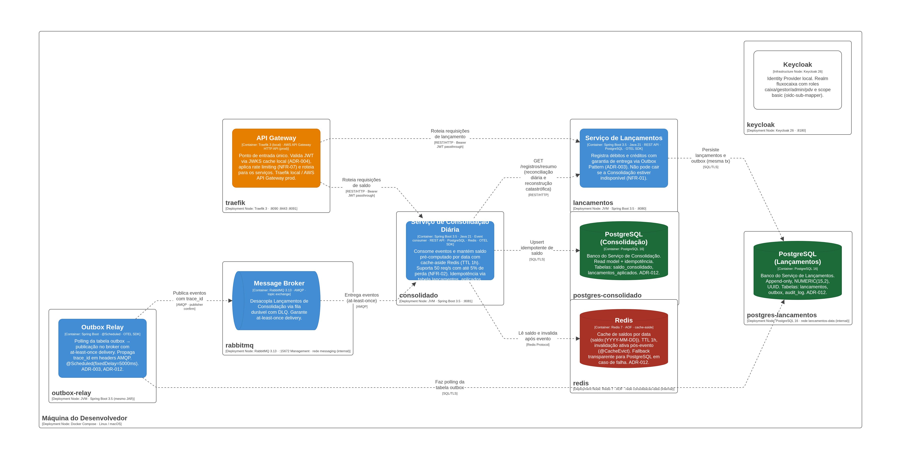
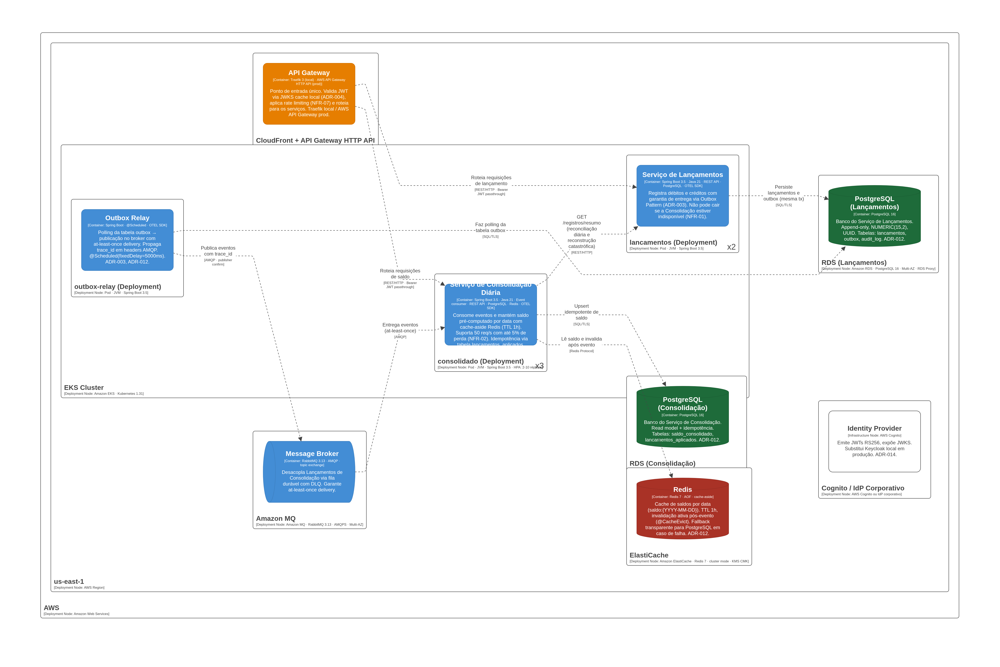

---
tags:
  - arquitetura
  - c4
---

# Diagramas C4

**Perspectiva:** 🧩 Arquiteto de Soluções  
**Níveis:** C4 L1 · L2 · L3 (Components) · L5 (Deployment)  
**Fonte:** [`structurizr/workspace.dsl`](../../structurizr/workspace.dsl) · visualização interativa: `docker compose up structurizr` → http://localhost:8080

---

## C4 L1 — Contexto do Sistema

[](assets/contexto.png)

---

## C4 L2 — Containers do Sistema de Negócio

[](assets/containers.png)

[](assets/containers-key.png)

---

## C4 L2 — Plataforma de Observabilidade

[](assets/observabilidade-containers.png)

[](assets/observabilidade-containers-key.png)

---

## C4 L3 — Components — Serviço de Lançamentos

[](assets/lancamentos-components.png)

[](assets/lancamentos-components-key.png)

---

## C4 L3 — Components — Outbox Relay

[](assets/outbox-relay-components.png)

---

## C4 L3 — Components — Serviço de Consolidação Diária

[](assets/consolidado-components.png)

[](assets/consolidado-components-key.png)

---

## C4 L5 — Deployment — Desenvolvimento Local

[](assets/deployment-dev.png)

---

## C4 L5 — Deployment — Produção AWS

[](assets/deployment-prod.png)

---

## Fonte canônica

```bash
docker compose up structurizr
# Acesse: http://localhost:8080
# Exporte: menu Diagrams → Export → PNG
# Salve em: docs/arquitetura/assets/
```

O DSL em [`structurizr/workspace.dsl`](../../structurizr/workspace.dsl) é a fonte de verdade. Os PNGs são exportações pontuais — re-exporte sempre que o workspace for atualizado.
