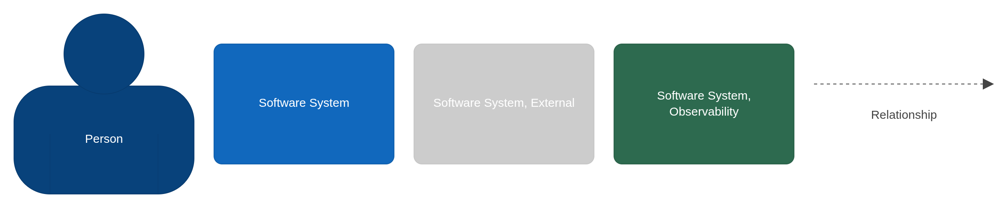

---
tags:
  - arquitetura
  - adr
  - c4
---

# Síntese da Arquitetura

**Papel:** 🧩 Arquiteto de Soluções  
**Framework:** C4 L1/L2 · ADR · ArchiMate Application Layer

Este documento é o ponto de entrada da visão técnica do sistema. Conecta os requisitos não funcionais às decisões arquiteturais e, de lá, à implementação — com evidência em código real.

---

## Os dois NFRs que guiaram tudo

O enunciado impôs dois requisitos não funcionais que determinaram a forma do sistema:

| ID | Requisito | O que ele implica |
|----|-----------|-------------------|
| **NFR-01** | O serviço de lançamentos não pode ficar indisponível se o consolidado cair | Os dois serviços precisam ser fisicamente independentes — falha em um não propaga para o outro |
| **NFR-02** | O consolidado deve suportar **50 req/s** com no máximo **5% de perda** em dias de pico | O caminho de leitura precisa ser desacoplado de qualquer operação cara — banco de dados em hot path é inaceitável |

Cada decisão arquitetural relevante rastreia até um desses dois NFRs.

---

## Visão de contexto — C4 L1

[](assets/contexto.png)

[](assets/contexto-key.png)

O sistema não é acessível diretamente — toda requisição passa pelo API Gateway (Traefik em desenvolvimento, CloudFront + AWS API Gateway em produção). O Identity Provider é externo e substituível sem mudança de código nos serviços.

> Fonte: [`structurizr/workspace.dsl`](../../structurizr/workspace.dsl) · visualização interativa: `docker compose up structurizr`

---

## Visão de containers — C4 L2

[](assets/containers.png)

[](assets/containers-key.png)

Os dois serviços de negócio não se comunicam diretamente. A única ponte entre eles é o RabbitMQ — e mesmo essa ponte é tolerante a falhas por causa do Outbox Pattern.

---

## De NFR a implementação

### NFR-01 — Lançamentos não pode cair se consolidado cair

O problema central é que uma arquitetura síncrona não resolve esse requisito: se o Lançamentos chamar o Consolidado diretamente para notificar sobre um novo lançamento, uma queda no Consolidado derruba a operação do Caixa.

A solução exige três camadas de decisão:

**Camada 1 — Desacoplamento físico** ([ADR-001](../adr/ADR-001-padrao-arquitetural.md))

Os dois serviços são processos separados com bancos separados. Uma queda em um não afeta o outro em nível de processo ou de dados.

**Camada 2 — Comunicação assíncrona** ([ADR-002](../adr/ADR-002-message-broker.md))

A notificação de um novo lançamento vai para o RabbitMQ, não diretamente para o Consolidado. O Consolidado consome quando está disponível — sem bloqueio.

Mas isso ainda não resolve o caso onde o RabbitMQ está fora no momento do registro do lançamento.

**Camada 3 — Transactional Outbox Pattern** ([ADR-003](../adr/ADR-003-outbox-pattern.md))

O lançamento e o evento de notificação são gravados **na mesma transação do banco do Lançamentos**. O RabbitMQ só recebe o evento depois, via relay assíncrono.

```
POST /registros
    │
    ├── INSERT lancamentos (id, tipo, valor, ..., payload_hash)
    └── INSERT outbox (lancamento_id, payload, publicado=false)
         ── transação única ──

OutboxRelay (@Scheduled fixedDelay=5s)
    └── SELECT outbox WHERE publicado=false LIMIT 100
         └── OutboxPublisher.publicar(payload)  ← @CircuitBreaker + @Retry
              └── RabbitTemplate.convertAndSend(...)
                   └── outbox.marcarPublicado() ← UPDATE
```

**Evidência no código:**

| Artefato | Arquivo |
|----------|---------|
| Persistência atômica | [`OutboxRepositoryAdapter.java`](../../services/lancamentos/src/main/java/br/com/carrefour/lancamentos/adapter/out/persistence/OutboxRepositoryAdapter.java) |
| Relay com retry | [`OutboxRelay.java`](../../services/lancamentos/src/main/java/br/com/carrefour/lancamentos/adapter/out/messaging/OutboxRelay.java) |
| Circuit breaker + retry (bean separado para Spring AOP) | [`OutboxPublisher.java`](../../services/lancamentos/src/main/java/br/com/carrefour/lancamentos/adapter/out/messaging/OutboxPublisher.java) — `@CircuitBreaker(name="rabbit-publisher") @Retry(name="rabbit-publisher")` |
| Configuração de resiliência | `services/lancamentos/src/main/resources/application.properties` — `resilience4j.circuitbreaker.rabbit-publisher.*` |

O `OutboxPublisher` é um bean separado do `OutboxRelay` propositalmente: self-invocation (`OutboxRelay → publicar()`) bypassaria o proxy Spring AOP e os decoradores `@CircuitBreaker` e `@Retry` não seriam aplicados.

**Confirmação em chaos engineering:** experimento "Consolidado derrubado enquanto caixa opera" — todos os lançamentos chegaram ao destino após recuperação. Evidências em [`docs/implementacao/caos.md`](../implementacao/caos.md).

---

### NFR-02 — 50 req/s com ≤5% de perda

O caminho de leitura do saldo consolidado é O(1): o saldo por data é pré-calculado e armazenado. A consulta nunca agrega registros de lançamentos — busca diretamente o saldo do dia.

Para suportar 50 req/s com segurança, o saldo pré-calculado é servido do Redis com TTL de 1 hora. O banco de dados só é consultado em cache miss.

```
GET /saldo/{data}
    │
    └── @Cacheable("saldo-consolidado") key=#data
         ├── Redis HIT  → resposta em microssegundos
         └── Redis MISS → PostgreSQL (SELECT PK) → popula cache → resposta
```

**Degradação controlada:** se o Redis falhar, o `RedisFallbackCacheErrorHandler` silencia o erro e o sistema cai para o PostgreSQL — sem indisponibilidade. Isso é registrado como métrica (`cache_redis_errors_total`) e monitorado no Grafana.

**Evidência no código:**

| Artefato | Arquivo |
|----------|---------|
| Cache-aside com fallback | [`SaldoConsolidadoRepositoryAdapter.java`](../../services/consolidado/src/main/java/br/com/carrefour/consolidado/adapter/out/persistence/SaldoConsolidadoRepositoryAdapter.java) — `@Cacheable` |
| Fallback silencioso Redis | [`CacheConfig.java`](../../services/consolidado/src/main/java/br/com/carrefour/consolidado/adapter/out/persistence/CacheConfig.java) — `RedisFallbackCacheErrorHandler` |
| Invalidação no processamento | [`ProcessarLancamentoService.java`](../../services/consolidado/src/main/java/br/com/carrefour/consolidado/application/usecase/ProcessarLancamentoService.java) — `@CacheEvict` |

**Confirmação em carga:** k6 stress test executado com 100 usuários virtuais durante 30 segundos — throughput sustentado acima de 50 req/s, taxa de erro abaixo de 5%. Evidências em [`docs/implementacao/caos.md`](../implementacao/caos.md).

---

## Decisões transversais

### Corretude financeira ([ADR-012](../adr/ADR-012-persistencia.md))

Valores armazenados como `DECIMAL(15,2)` — sem ponto flutuante. Na camada de domínio, o Value Object `Valor.java` rejeita valores com mais de 2 casas decimais (`ArithmeticException`) e não permite operações que gerem imprecisão.

Lançamentos são imutáveis: uma vez confirmado, o registro não é alterado. Correções geram estornos — novos lançamentos com tipo inverso. O ID do estorno é derivado deterministicamente do ID original (`UUID.nameUUIDFromBytes("estorno-" + originalId)`), garantindo idempotência em retentativas.

### Idempotência de lançamentos ([ADR-017](../adr/ADR-017-spec-driven-development.md))

O campo `Idempotency-Key` do HTTP header é o ID do lançamento (UUID v4, gerado pelo cliente). A PK da tabela `lancamentos` é esse mesmo UUID — a tentativa de inserir duas vezes retorna 409 diretamente do banco.

Para detectar o caso mais perigoso — mesma chave, payload diferente — a tabela armazena um `payload_hash` (SHA-256 de `tipo|valor|data|descricao`). Um replay idempotente (mesmo hash) retorna 200 com o recurso original. Um conflito (mesmo key, hash diferente) retorna 409 `IDEMPOTENCY_KEY_CONFLITO`.

### Autenticação e autorização ([ADR-004](../adr/ADR-004-jwt-validacao-local.md) · [ADR-014](../adr/ADR-014-identity-provider.md))

JWT validado localmente via JWKS — sem roundtrip ao Keycloak por requisição. O `operadorId` é o claim `sub` do token (UUID Keycloak), garantindo que a identidade do operador seja imutável e ligada ao sistema de identidade corporativo.

Matriz de autorização por role, implementada no `SecurityFilterChain` (não em `@PreAuthorize`):

| Operação | Roles permitidas |
|----------|-----------------|
| `POST /registros` | CAIXA · PDV |
| `GET /registros/**` | CAIXA · GESTOR · ADMIN |
| `GET /saldo/**` | GESTOR · ADMIN |
| `POST /admin/reconstruir` | ADMIN |

### Rastreabilidade distribuída ([ADR-015](../adr/ADR-015-observabilidade.md) · [ADR-016](../adr/ADR-016-redacao-pii-logs.md))

Três identificadores com propósitos distintos percorrem todas as requisições:

| Identificador | Gerado em | Escopo | Uso |
|---------------|-----------|--------|-----|
| `correlation_id` | `CorrelationIdFilter` (header `X-Correlation-ID`) | Jornada de negócio | Liga lançamento → evento → consolidação |
| `trace_id` | OTEL SDK (automático) | Requisição técnica | Rastreia latência entre spans |
| `idempotency_key` | Cliente (UUID do lançamento) | Deduplicação | Detecta replays |

Dados pessoais são redigidos antes de chegarem ao Loki — CPF, CNPJ, e-mail e número de cartão substituídos por marcadores no pipeline do OTEL Collector e Promtail, conforme [ADR-016](../adr/ADR-016-redacao-pii-logs.md).

### Audit log ([ADR-012](../adr/ADR-012-persistencia.md))

Toda operação de escrita no serviço de Lançamentos gera um registro de auditoria após o commit da transação principal:

```
TX commit (lancamento gravado)
    │
    └── @TransactionalEventListener(AFTER_COMMIT)
         └── @Async → AuditEventListener.registrar()
              └── INSERT audit_log (operador_id, acao, recurso_id, contexto, criado_em)
```

O `AFTER_COMMIT` garante que o audit nunca interfere com o response ao Caixa. A falha no audit é capturada silenciosamente — nunca propaga para a operação de negócio. Retenção de 5 anos conforme legislação fiscal.

---

## Padrões de implementação

### Arquitetura Hexagonal + DDD Tático

Ambos os serviços seguem a mesma estrutura interna:

```
domain/
  model/          ← Aggregates, Value Objects (Java puro — zero Spring)
  port/in/        ← Interfaces de use case
  port/out/       ← Interfaces de repositório e publisher

application/usecase/  ← Implementações dos use cases (@Service, @Transactional)

adapter/in/rest/      ← Controllers Spring MVC
adapter/in/messaging/ ← RabbitMQ consumers (consolidado)
adapter/out/persistence/ ← JPA adapters, Redis
adapter/out/messaging/   ← RabbitMQ publisher (lançamentos)
```

O domínio não conhece Spring, JPA, RabbitMQ ou qualquer framework. Os tests de domínio e de use case rodam sem `@SpringBootTest`.

O `TipoMovimento` do consolidado é um enum próprio — não importado de lançamentos. Isso é intencional: os dois bounded contexts têm modelos independentes. A tradução acontece no `LancamentoEventoConsumer` (Anti-Corruption Layer).

### Spec-Driven Development ([ADR-017](../adr/ADR-017-spec-driven-development.md))

Os contratos OpenAPI em `contracts/openapi/` são a fonte de verdade dos endpoints. O OpenAPI Generator gera as interfaces `LancamentosApi` e `ConsolidacaoApi` na build. Os controllers implementam essas interfaces — se o contrato mudar e o controller não for atualizado, a compilação falha. Mudanças de API são detectadas em tempo de build, não em tempo de execução.

### Pirâmide de testes

| Nível | Ferramenta | O que cobre |
|-------|-----------|-------------|
| Domínio (unitário) | JUnit 5 + AssertJ | `Lancamento`, `Valor`, `SaldoConsolidado` — sem Spring |
| Use case (unitário) | JUnit 5 + Mockito | Application services com ports mockados |
| Adapter REST (slice) | `@WebMvcTest` | Controllers com Security real, JwtDecoder mockado |
| Adapter JPA (slice) | `@DataJpaTest` | Repositórios com H2 in-memory |
| Integração | `@SpringBootTest` | Context load + wire-up completo |

Total: **106 testes** (lançamentos + consolidado), todos verdes.

---

## Trade-offs registrados

| Decisão | O que ganhamos | O que abrimos mão |
|---------|---------------|-------------------|
| Outbox Pattern com polling `@Scheduled` | Implementação simples, sem dependência de CDC | Latência de entrega de até 5s; relay não é distribuído nativamente |
| At-least-once delivery (RabbitMQ) | Garantia de entrega mesmo com falhas transitórias | Consumer do consolidado precisa ser idempotente — **gap identificado: ProcessarLancamentoService não verifica `lancamentoId` já processado** |
| Redis cache-aside com TTL 1h | Performance de leitura sem acoplamento a escrita | Saldo pode estar desatualizado por até 1h em caso de invalidação falha |
| JWT validação local | Sem roundtrip a Keycloak por requisição | Token revogado permanece válido até expirar (TTL de 5min mitiga) |
| Virtual Threads habilitadas | Throughput sem thread pool sizing | Pinning com código legado bloqueante (não aplicável aqui — sem JDBC bloqueante no hot path) |
| `@Transactional` único no ReconstruirConsolidadoService | Atomicidade do período | Falha em qualquer data no período faz rollback de todo o trabalho |

Os dois últimos itens da tabela são gaps técnicos documentados em [`docs/evolucoes.md`](../evolucoes.md).

---

## Para explorar em detalhe

| Área | Documento |
|------|-----------|
| Decisões arquiteturais completas | [ADRs do sistema](../adr/index.md) |
| Modelagem de dados e Flyway | [Dados e Persistência](dados.md) |
| Segurança e compliance | [Segurança](../seguranca/index.md) |
| Observabilidade e SLOs | [Observabilidade](../observabilidade/index.md) |
| Infraestrutura AWS e custos | [Cloud e IaC](../cloud/index.md) |
| CI/CD e pipelines | [Pipeline](../infraestrutura/pipeline.md) |
| Chaos Engineering | [Testes de caos](../implementacao/caos.md) |
| Backlog técnico | [Evoluções futuras](../evolucoes.md) |
