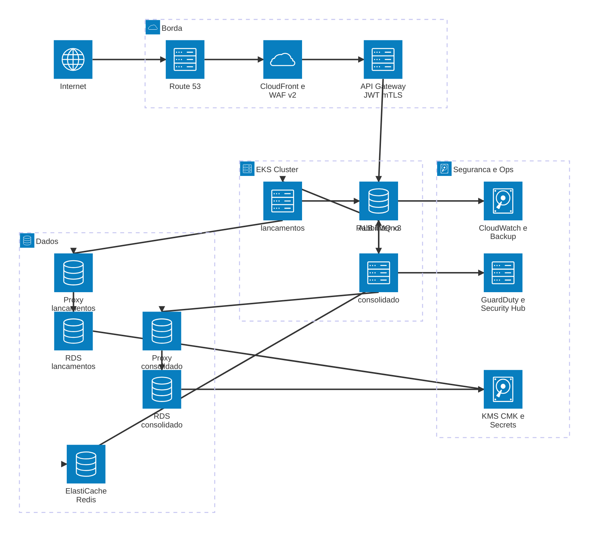

# Implementação em Nuvem — AWS

**Perspectiva:** 🏗️ Arquiteto de Infraestrutura · 🧩 Arquiteto de Soluções  
**Nota:** Este capítulo documenta *como* o sistema é implantado em produção na AWS. As decisões de *o que o sistema faz* — padrão arquitetural, mensageria, contratos — estão nos [ADRs do Sistema](../adr/index.md).

---

## Por que documentar separado?

O sistema foi projetado **cloud-agnostic**: os serviços comunicam via variáveis de ambiente, os contratos são definidos em OpenAPI e AsyncAPI, e o docker-compose local é funcionalmente equivalente ao ambiente de produção. Mudar de provedor de nuvem exigiria ajustar variáveis e manifests, não o código da aplicação.

As decisões de nuvem são portanto uma **camada separada** — opções de implementação dentro de um envelope de requisitos que o sistema define (NFR-02, NFR-04, NFR-08).

---

## Estratégia de Nuvem

**Provedor:** AWS `sa-east-1` (São Paulo) — única região de hyperscaler com data center físico no Brasil, conforme exigência de latência e LGPD. Detalhes em [ADR-008](../adr/ADR-008-cloud-provider.md).

**Modelo de implantação:**

| Serviço local | Recurso AWS |
|---|---|
| `docker compose up` | `terraform apply` + `helm install` |
| `traefik` | CloudFront + WAF v2 + API Gateway HTTP API |
| `postgres:16` | RDS PostgreSQL 16 Multi-AZ + RDS Proxy |
| `redis:7-alpine` | ElastiCache Redis 7 (primary + replica) |
| `rabbitmq:3.13-management` | RabbitMQ self-hosted no EKS (Helm bitnami) |
| imagens locais | Amazon ECR (privado, imutável, scan on push) |

**Infraestrutura como Código:** toda a infraestrutura de produção está em [`/terraform`](../../terraform/README.md) — 21 arquivos `.tf` organizados por responsabilidade. O estado é gerenciado em S3 com locking via DynamoDB.

---

## Camadas da Arquitetura AWS

---

## Documentação desta Seção

| Documento | Conteúdo |
|-----------|----------|
| [Decisões de Nuvem (ADRs)](adrs.md) | ADR-008 a ADR-011 — justificativas das escolhas AWS |
| [Estimativa de Custos](custos.md) | Breakdown por serviço, comparativos e como reproduzir via Infracost |
| [Topologia de Infraestrutura](../infraestrutura/topologia.md) | Diagrama de redes do ambiente local (docker-compose) |

---

## Evolução Planejada

| Fase | Adição |
|------|--------|
| Etapa 8 (Pipeline) | IRSA por pod, Karpenter NodePools, manifestos Kubernetes, CI/CD com Infracost diff em PRs |
| Pós-entrega | Amazon Security Lake (SIEM completo), Shield Advanced, multi-conta (prod/staging/auditoria) |
