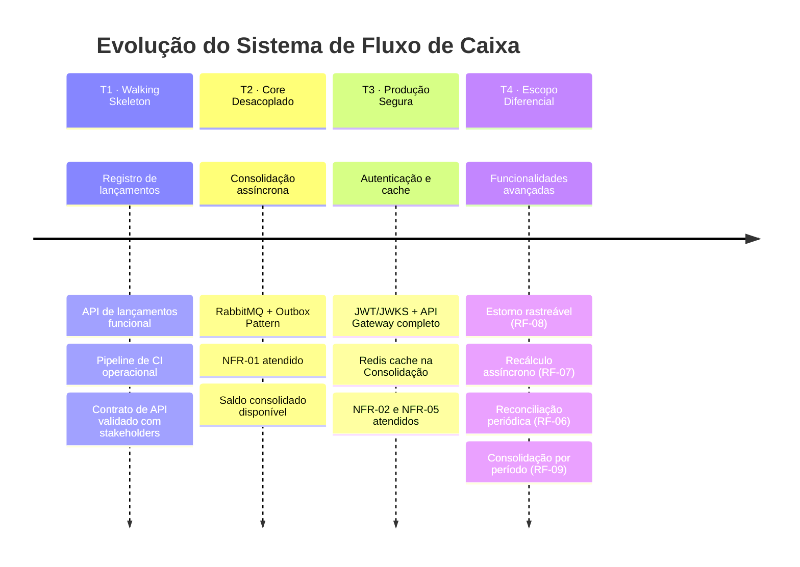
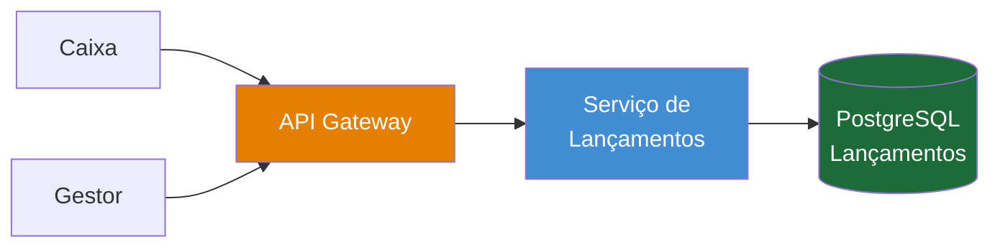
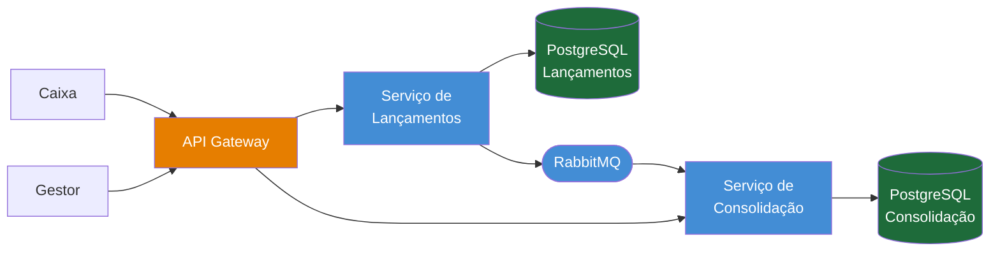
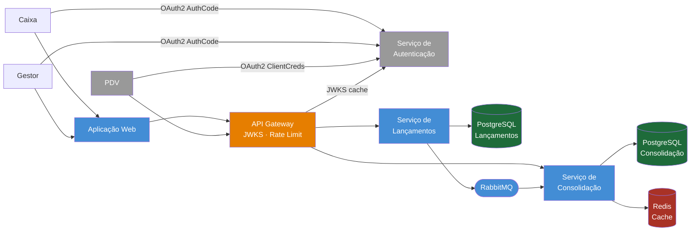

---
tags:
  - engenharia
  - arquitetura
  - planejamento
---

# Plano de Entrega Incremental

**Papéis:** 🧩 Arquiteto de Soluções · 🏗️ Arquiteto de Infraestrutura
**Framework:** TOGAF ADM — Fase F (Migration Planning)

O plano de entrega incremental define os estados de produto pelos quais o sistema passa entre o início do desenvolvimento e o escopo completo. Cada estado é **deployável e entrega valor real** — não é um estado de obra inacabada, mas uma versão funcional deliberadamente delimitada.

Esse planejamento existe porque entregar tudo de uma vez maximiza risco: integra componentes nunca testados juntos, atrasa o primeiro feedback dos usuários e impede aprendizado incremental. A progressão abaixo permite validar contratos, descobrir problemas de domínio e ganhar confiança operacional a cada estágio.

> *Este documento trata da progressão técnica de construção do sistema. A migração do processo de negócio existente (As-Is → To-Be) é coberta pela [Arquitetura de Transição](transicao.md).*

---

## Visão Geral da Progressão

---

## T1 — Walking Skeleton

**Objetivo:** entregar o mínimo deployável que valida o contrato de API com stakeholders e coloca o pipeline de CI em funcionamento.

**O que está incluído:**

| Container | Estado |
|-----------|--------|
| Serviço de Lançamentos | RF-01 (registrar) e RF-02 (consultar) |
| PostgreSQL (Lançamentos) | Schema inicial com tabela `lancamentos` |
| API Gateway | Roteamento básico — sem autenticação ainda |
| docker-compose | Sistema completo rodando localmente |

**O que não está incluído:** Consolidação, broker, cache, autenticação.

**Valor entregue:** o Caixa já pode registrar lançamentos e o Gestor pode consultá-los por período. O saldo não é consolidado automaticamente — pode ser calculado manualmente via RF-02 — mas o fluxo principal de registro está validado.

**NFRs atendidos neste estado:** nenhum NFR de resiliência ou performance — este estado serve para validação de domínio e contrato, não para produção.

---

## T2 — Core Desacoplado

**Objetivo:** introduzir o broker e a Consolidação Diária, tornando o sistema completo em sua funcionalidade core e atendendo o NFR crítico.

**O que está incluído:**

| Container | Estado |
|-----------|--------|
| Message Broker (RabbitMQ) | Fila `lancamentos`, DLQ configurada |
| Outbox Relay | Polling na tabela `outbox`, publicação de `LancamentoRegistrado` |
| Serviço de Consolidação | RF-03 (saldo por dia), RF-04 (handler A + handler B) |
| PostgreSQL (Consolidação) | Tabelas `lancamentos_processados` e `consolidacao_diaria` |

**Incremento em relação a T1:** adição do broker + Outbox Pattern no Lançamentos + Consolidação consumindo eventos.

**Valor entregue:** o Gestor consulta o saldo consolidado do dia. O sistema é resiliente — se a Consolidação cair, o Lançamentos continua operando e os eventos ficam no broker até a recuperação.

**NFRs atendidos:** [NFR-01](../negocio/requisitos.md#nfr-01) (desacoplamento), [NFR-03](../negocio/requisitos.md#nfr-03) (zero perda de lançamentos).

---

## T3 — Produção Segura

**Objetivo:** adicionar as camadas transversais que tornam o sistema seguro e performático o suficiente para carga real.

**O que está incluído:**

| Container | Estado |
|-----------|--------|
| Serviço de Autenticação | OAuth2 — Authorization Code (Caixa/Gestor) + Client Credentials (PDV) |
| API Gateway | JWKS validation, rate limiting ([NFR-07](../negocio/requisitos.md#nfr-07)), roteamento completo |
| Redis (Cache de Saldos) | Cache-Aside na Consolidação para RF-03 |
| Aplicação Web | Frontend funcional para Caixa e Gestor |
| Sistema PDV | Integração via Client Credentials habilitada |

**Incremento em relação a T2:** auth service + JWKS no gateway + Redis + frontend.

**Valor entregue:** sistema production-ready. Toda requisição é autenticada, o saldo consolidado é servido do cache na maioria dos casos, e o rate limiting protege a Consolidação em picos.

**NFRs atendidos:** [NFR-02](../negocio/requisitos.md#nfr-02) (50 req/s), [NFR-05](../negocio/requisitos.md#nfr-05) (autenticação), [NFR-07](../negocio/requisitos.md#nfr-07) (rate limiting).

---

## T4 — Escopo Diferencial 🔹

**Objetivo:** adicionar as funcionalidades que elevam o sistema de um MVP financeiro a um produto robusto para uso real.

**O que está incluído:**

| RF | Funcionalidade |
|----|---------------|
| [RF-08](../negocio/requisitos.md#rf-08) | Estorno rastreável com evento `LancamentoEstornado` e handler B na Consolidação |
| [RF-07](../negocio/requisitos.md#rf-07) | Recálculo assíncrono de totais para recovery da Consolidação |
| [RF-06](../negocio/requisitos.md#rf-06) | Reconciliação periódica para detecção de divergências |
| [RF-09](../negocio/requisitos.md#rf-09) | Consolidação por período e granularidade (dia, semana, mês) |

**NFRs atendidos:** [NFR-09](../negocio/requisitos.md#nfr-09) (auditoria), [NFR-10](../negocio/requisitos.md#nfr-10) (recuperabilidade do estado da Consolidação).

---

## Critérios de Promoção entre Estados

Cada transição deve ser precedida de validação formal antes de prosseguir:

| De → Para | Critério de promoção |
|-----------|---------------------|
| T1 → T2 | Critérios de aceite de RF-01 e RF-02 todos verdes; contrato de API validado com stakeholder |
| T2 → T3 | Critérios de aceite de RF-03 e RF-04 todos verdes; teste de carga confirma resiliência do NFR-01 |
| T3 → T4 | Teste de carga confirma 50 req/s ([NFR-02](../negocio/requisitos.md#nfr-02)); autenticação validada em todos os fluxos |
