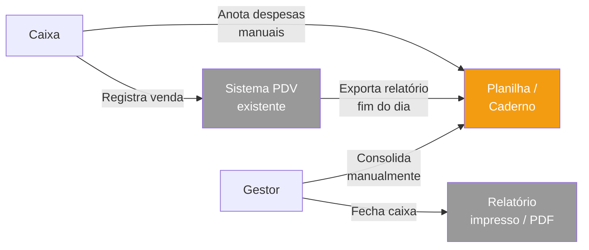
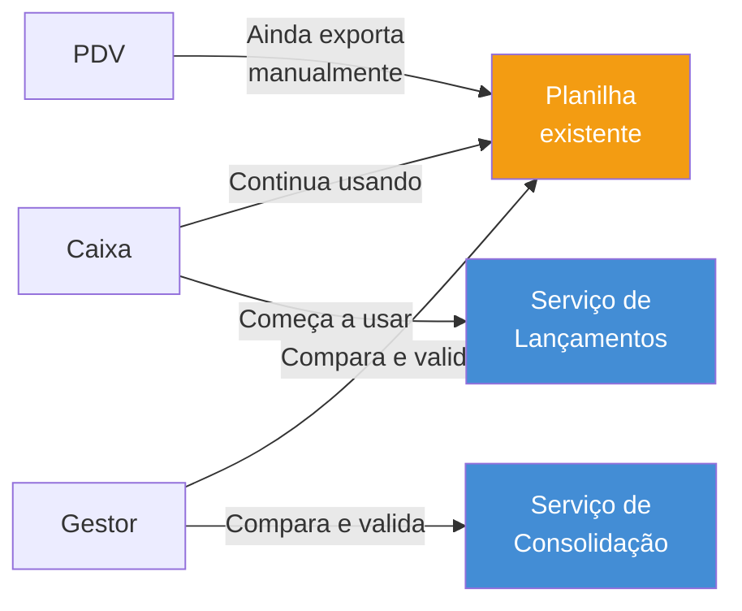
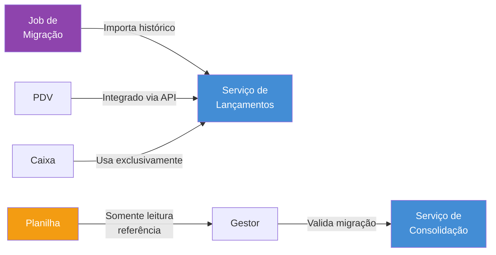

---
tags:
  - engenharia
  - arquitetura
  - togaf
---

# Arquitetura de Transição

**Papéis:** 🧩 Arquiteto de Soluções · 💼 Arquiteto de Negócios · 🏛️ Arquiteto Corporativo
**Framework:** TOGAF ADM — Fase F (Migration Planning)

A arquitetura de transição descreve o caminho entre o estado atual de operação do comerciante e o estado alvo definido neste projeto. Ela existe porque a substituição de um processo operacional em uso nunca pode ser feita de forma abrupta: há dados históricos a migrar, integrações a adaptar e um período de validação em que os dois mundos coexistem.

Esse documento responde às perguntas que uma entrega big-bang não responde: o que acontece com os registros anteriores à implantação? Como o Caixa opera enquanto a migração está em andamento? Quando é seguro desligar o processo antigo?

> *Este documento trata da transição operacional do negócio (As-Is → To-Be). A progressão técnica de construção do software é coberta pelo [Plano de Entrega Incremental](plano-entregas.md).*

---

## Estado Atual (As-Is)

O comerciante opera hoje com um processo manual distribuído entre o sistema de PDV e registros manuais em planilha.

### Mapa do Processo Atual

### Características do Estado Atual

| Aspecto | Situação Atual |
|---------|---------------|
| **Registro de créditos** | Feito pelo PDV a cada venda; exportado manualmente ao fim do dia |
| **Registro de débitos** | Anotado manualmente em planilha ou caderno pelo Caixa |
| **Consolidação diária** | Realizada manualmente pelo Gestor ou contador — sujeita a erro e atraso |
| **Auditoria e rastreabilidade** | Dependente da qualidade dos registros manuais; sem log de alterações |
| **Estornos e correções** | Feitos por rasura ou nova linha na planilha; sem vínculo com o lançamento original |
| **Latência do saldo consolidado** | Disponível somente ao fim do dia, após processo manual |
| **Acesso remoto** | Inexistente — planilha local ou impresso |

### Limitações que justificam a mudança

Os *drivers* [D-01 a D-08](../negocio/drivers.md) documentam as dores operacionais que motivam este projeto. Em síntese:

- **Consolidação tardia:** o Gestor não tem visibilidade do saldo intradiário
- **Erros humanos:** transcrição manual entre PDV e planilha introduz inconsistências
- **Sem rastreabilidade de estornos:** correções não têm histórico auditável
- **Risco de perda de dados:** planilha local sem backup automático ou controle de versão

---

## Estado Alvo (To-Be)

O estado alvo é a arquitetura completa documentada neste projeto — equivalente ao estado T4 do [Plano de Entrega Incremental](plano-entregas.md):

- Dois microserviços desacoplados via broker de mensagens ([ADR-001](../adr/ADR-001-padrao-arquitetural.md), [ADR-002](../adr/ADR-002-message-broker.md))
- Garantia de entrega de lançamentos mesmo com Consolidação indisponível ([NFR-01](../negocio/requisitos.md#nfr-01), [ADR-003](../adr/ADR-003-outbox-pattern.md))
- API Gateway com autenticação JWT/JWKS e rate limiting ([ADR-004](../adr/ADR-004-jwt-validacao-local.md))
- PDV integrado via API REST — sem exportação manual
- Redis cache para alta performance no saldo consolidado ([NFR-02](../negocio/requisitos.md#nfr-02))
- Estorno rastreável com vínculo ao lançamento original ([RF-08](../negocio/requisitos.md#rf-08))

O diagrama C4 L2 do estado alvo está no [workspace Structurizr](../../structurizr/workspace.dsl) e pode ser visualizado com `docker-compose up structurizr`.

---

## Desafios da Transição

| Categoria | Desafio |
|-----------|---------|
| **Dados históricos** | Lançamentos anteriores à implantação existem em planilhas e no PDV; precisam ser importados para que o saldo consolidado do novo sistema seja correto |
| **Integração do PDV** | O PDV atual exporta dados manualmente; precisa ser reconfigurado para chamar a API REST do Serviço de Lançamentos |
| **Mudança de processo** | O Caixa e o Gestor precisam adotar o novo fluxo digital; período de adaptação exige suporte ativo |
| **Cutover sem perda** | O corte entre os dois processos precisa ser controlado para não gerar dupla contagem ou lacuna de registros |

---

## Estados Intermediários de Transição

A transição ocorre em três estados operacionais. Cada estado é estável e pode ser prolongado até que os critérios de saída sejam atendidos.

### Tr1 — Implantação com Operação Paralela

**Objetivo:** o novo sistema entra em produção aceitando novos lançamentos, enquanto o processo antigo continua em paralelo para validação.

**Por que manter o paralelo:** os dados históricos ainda não foram migrados; o saldo consolidado do novo sistema é parcial e não pode ser confiado para decisão financeira. A operação paralela gera dados comparativos para detectar divergências.

**Pré-requisito:** estado T1 do Plano de Entrega Incremental em produção.

**Critério de saída:** reconciliação diária entre planilha e novo sistema apresenta divergência < 0,5% por 5 dias úteis consecutivos.

---

### Tr2 — Migração de Dados e Integração do PDV

**Objetivo:** importar os dados históricos, conectar o PDV via API e descontinuar o processo manual de registro.

**O que muda:**

- Job de migração importa lançamentos históricos da planilha para o Serviço de Lançamentos (ver [Estratégia de Migração de Dados](#estratégia-de-migração-de-dados))
- PDV é reconfigurado para chamar a API REST diretamente (sem exportação manual)
- O processo manual de registro é descontinuado para novas entradas
- A planilha passa a somente-leitura — referência de validação, não fonte de escrita

**Por que descontinuar o paralelo agora:** a integração do PDV via API cria risco de dupla contagem se o processo manual continuar simultâneo.

**Pré-requisito:** estado T2 do Plano de Entrega Incremental em produção.

**Critério de saída:** 100% das entradas do PDV chegando via API por 3 dias úteis consecutivos; saldo consolidado do novo sistema reconciliado e aceito formalmente pelo Gestor.

---

### Tr3 — Corte Total

**Objetivo:** o novo sistema torna-se a única fonte de verdade; o processo antigo é arquivado.

O acesso às planilhas é mantido em modo somente-leitura por 30 dias (janela de rollback), após o que podem ser arquivadas definitivamente.

**Critérios de entrada (todos obrigatórios):**

- [ ] [NFR-01](../negocio/requisitos.md#nfr-01) validado em produção: queda da Consolidação não afeta o registro de Lançamentos
- [ ] [NFR-02](../negocio/requisitos.md#nfr-02) validado: 50 req/s no Serviço de Consolidação sem degradação
- [ ] Integração PDV operando sem erros por ≥ 5 dias úteis
- [ ] Dados históricos migrados e reconciliados com aceite formal do Gestor
- [ ] Caixa e Gestor treinados e usando o sistema sem suporte ativo

**Pré-requisito:** estado T3 do Plano de Entrega Incremental em produção.

---

## Estratégia de Migração de Dados

Os lançamentos históricos existem em formato heterogêneo (planilhas Excel, exportações CSV do PDV). A migração acontece no estado Tr2, em três etapas:

### 1 — Extração e Normalização

Os dados históricos são extraídos de cada fonte e normalizados para o formato do campo `payload` do evento [`LancamentoRegistrado`](contratos.md#lancamentoregistrado). Um script de migração realiza:

- Parsing do CSV/XLSX de cada fonte
- Mapeamento de campos: data de competência, valor, tipo (débito/crédito), descrição
- Geração de IDs determinísticos (UUID v5 baseado em hash dos campos originais) para garantir idempotência — reimportar o mesmo arquivo não cria duplicatas

### 2 — Carga com Validação

Os lançamentos normalizados são inseridos diretamente no banco do Serviço de Lançamentos via script SQL transacionado. Cada lote é inserido em transação; erros interrompem a carga e são reportados para revisão manual.

Após a carga, o Serviço de Lançamentos dispara um recálculo assíncrono ([RF-07](../negocio/requisitos.md#rf-07)) para reconstruir os saldos consolidados de todos os períodos históricos importados.

### 3 — Reconciliação

O Gestor compara o relatório de consolidação do novo sistema com os totais históricos da planilha para cada período. A aceitação formal do Gestor é o critério de promoção de Tr2 para Tr3.

---

## Plano de Rollback

Cada estado de transição tem um plano de rollback definido:

| Estado | Trigger de rollback | Ação |
|--------|--------------------|----|
| **Tr1** | Divergência > 5% por 2 dias consecutivos | Suspender uso do novo sistema; investigar antes de continuar |
| **Tr2** | Perda ou corrupção de dados confirmada na migração | Reverter job de migração; restaurar acesso de escrita às planilhas; corrigir script e reexecutar |
| **Tr3** | Falha crítica em produção nos primeiros 30 dias | Reativar processo manual usando planilhas como referência; registrar no novo sistema as entradas que ocorreram durante o incidente após a recuperação |

O rollback de Tr3 é o mais custoso porque exige conciliação manual das entradas realizadas durante o período de falha. Por isso, os critérios de entrada em Tr3 são rigorosos e não devem ser flexibilizados.

---

## Riscos da Transição

| Risco | Probabilidade | Impacto | Mitigação |
|-------|---------------|---------|-----------|
| Dados históricos inconsistentes na planilha | Alta | Médio | Validação por amostragem antes da migração; aceitar perdas controladas para períodos muito antigos mediante aceite formal do Gestor |
| PDV não suporta integração via API REST | Média | Alto | Avaliar capacidade técnica do PDV antes de iniciar Tr2; se necessário, manter exportação CSV como fallback temporário com script de importação automatizado |
| Resistência do usuário à mudança de processo | Média | Médio | Treinamento presencial; suporte ativo durante todo o estado Tr1 |
| Dupla contagem durante operação paralela | Baixa | Alto | Definição clara de qual sistema é autoridade por tipo de entrada; conciliação diária obrigatória durante Tr1 |

---

## Relação com o Plano de Entrega Incremental

Os dois documentos descrevem perspectivas complementares sobre a mesma jornada:

| Documento | Perspectiva | Audiência principal |
|-----------|-------------|---------------------|
| [Plano de Entrega Incremental](plano-entregas.md) | Progressão técnica — quais features são construídas em cada estado | Equipe de engenharia |
| Este documento | Transição operacional — como o negócio migra do processo atual | Gestor, patrocinadores, arquitetos |

Em termos práticos, os estados se relacionam assim:

| Estado de transição (negócio) | Requer estado técnico (mínimo) |
|-------------------------------|-------------------------------|
| Tr1 — Operação Paralela | T1 — Walking Skeleton |
| Tr2 — Migração e Integração PDV | T2 — Core Desacoplado |
| Tr3 — Corte Total | T3 — Produção Segura |
