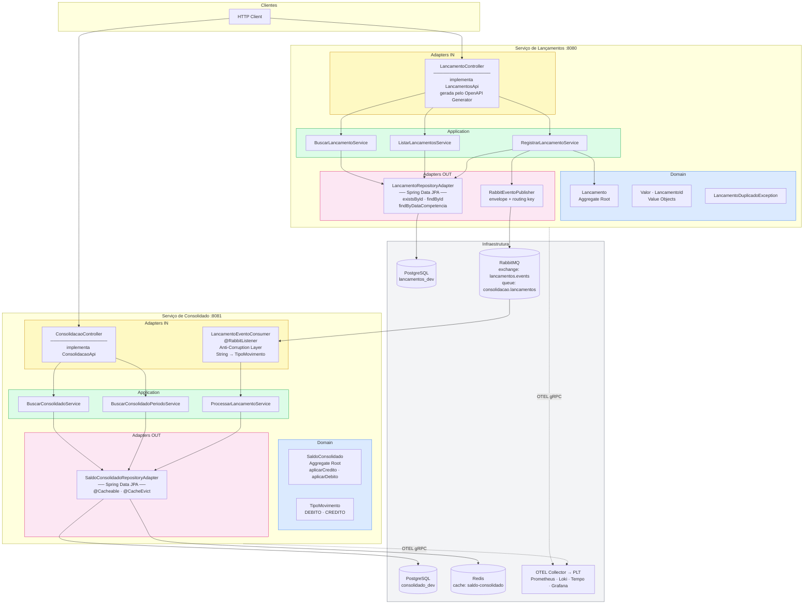

---
tags:
  - implementacao
  - ddd
  - hexagonal
  - design-patterns
---

# Implementação

**Perspectiva:** 🛠️ Engenheiro de Software · 💻 Desenvolvedor  
**Etapa:** 7 — Concluída (2026-05-16) — pendências: Outbox cleanup + DLQ consumer  
**ADRs relacionados:** [ADR-017 — SDD](../adr/ADR-017-spec-driven-development.md) · [ADR-018 — Stack](../adr/ADR-018-stack-implementacao.md)

---

## Visão Geral da Arquitetura Interna

Ambos os serviços seguem **Arquitetura Hexagonal (Ports & Adapters)** com **DDD Tático**. O domain layer não conhece Spring, JPA, RabbitMQ ou qualquer framework — só Java puro. Frameworks vivem nos adapters.



| Cor | Camada | Regra |
|-----|--------|-------|
| 🔵 Azul | Domain | Zero dependências externas — Java puro |
| 🟢 Verde | Application | Orquestra use cases, sem anotações de framework |
| 🟡 Amarelo | Adapters IN | Spring MVC, `@RabbitListener` |
| 🔴 Rosa | Adapters OUT | JPA, Redis, AMQP publisher |

---

## DDD Tático

### Serviço de Lançamentos

| Elemento | Classe | Descrição |
|----------|--------|-----------|
| **Aggregate Root** | `Lancamento` | Identidade via `LancamentoId` (UUID do cliente). Factory methods `criar` e `reconstituir`. Sem setters. |
| **Value Object** | `Valor` | Encapsula `BigDecimal` com validação (positivo, 2 casas). Igualdade por valor via `compareTo`. |
| **Value Object** | `LancamentoId` | Encapsula `UUID`. O UUID do `Idempotency-Key` HTTP vira o ID da entidade — idempotência garantida pela PK. |
| **Domain Exception** | `LancamentoDuplicadoException` | Lançada pelo use case antes do `salvar` — nunca pelo adapter. |
| **Port IN** | `RegistrarLancamentoUseCase` | Define o `Command` record que carrega `idempotencyKey` como `String` (UUID). |
| **Port OUT** | `LancamentoRepository` | Interface no domínio — o adapter JPA implementa. `existePorId` usa `existsById` do Spring Data. |
| **Port OUT** | `EventoPublisher` | Abstração para publicação de evento — o adapter RabbitMQ implementa. |

### Serviço de Consolidado

| Elemento | Classe | Descrição |
|----------|--------|-----------|
| **Aggregate Root** | `SaldoConsolidado` | Identificado por `LocalDate` (um por dia). Métodos `aplicarCredito` e `aplicarDebito` encapsulam a lógica de acumulação com validação. |
| **Value Type** | `TipoMovimento` | Enum próprio do bounded context — não reutiliza o `TipoLancamento` do serviço de lançamentos. Método `de(String)` na Anti-Corruption Layer. |
| **Port IN** | `ProcessarLancamentoUseCase` | `Command` usa `TipoMovimento` (não `String`) — o consumer converte na fronteira. |
| **Port OUT** | `SaldoConsolidadoRepository` | Interface no domínio. O adapter implementa com Spring Data + `@Cacheable`. |

---

## Design Patterns Aplicados

| Pattern | Onde | Por quê |
|---------|------|---------|
| **Ports & Adapters** | Estrutura de ambos os serviços | Isola o domínio de frameworks — testável sem Spring, sem banco, sem broker |
| **Repository** | `LancamentoRepository`, `SaldoConsolidadoRepository` | Interface no domínio, implementação no adapter — o domínio nunca vê JPA |
| **Factory Method** | `Lancamento.criar()`, `SaldoConsolidado.novo()` | Garante invariantes na criação — impossível construir um aggregate inválido |
| **Command** | `RegistrarLancamentoUseCase.Command`, `ProcessarLancamentoUseCase.Command` | Empacota intenção + dados em um objeto imutável; facilita validação e logging |
| **Anti-Corruption Layer** | `LancamentoMapper`, `ConsolidacaoMapper`, `LancamentoEventoConsumer` | Traduz entre o modelo externo (DTO gerado, evento JSON) e o modelo de domínio sem contaminar nenhum dos dois |
| **Idempotency Key as ID** | `LancamentoId` = UUID do `Idempotency-Key` | Zero coluna extra — a PK já é a chave de idempotência; `existsById` substitui query customizada |
| **Cache-Aside** | `@Cacheable` / `@CacheEvict` em `SaldoConsolidadoRepositoryAdapter` | Cache vive no adapter (infraestrutura), não no application service — o domínio ignora que há cache |
| **Outbox** | `EventoPublisher` port + `RabbitEventoPublisher` | Separa o commit da transação da publicação do evento — o relay (pendente) garante entrega exactly-once |

---

## Spec-Driven Development (SDD)

Os controllers não são escritos à mão — eles **implementam interfaces geradas** a partir dos contratos OpenAPI:

```
contracts/openapi/lancamentos.yaml
    ↓  openapi-generator (Gradle, build time)
build/generated/.../LancamentosApi.java   ← nunca editar
    ↓  implementada por
adapter/in/rest/LancamentoController.java ← seu código
```

Se o controller divergir do contrato, **o build falha**. Consulte o [ADR-017](../adr/ADR-017-spec-driven-development.md) para detalhes.

---

## Pirâmide de Testes

| Camada | Tipo | Ferramenta | Isolamento |
|--------|------|-----------|-----------|
| Domain | Unitário | JUnit 5 + AssertJ | Java puro — sem Spring |
| Application | Unitário | JUnit 5 + Mockito | Repositórios e publishers mockados |
| Adapter REST | Slice | `@WebMvcTest` | MockMvc + use cases mockados |
| Adapter Persistence | Slice | `@DataJpaTest` + H2 | JPA real, banco em memória, Flyway desabilitado |
| Adapter Messaging | Unitário | JUnit 5 + Mockito | Consumer e publisher isolados |
| Contexto | Integração | `@SpringBootTest` + H2 | Contexto completo, infra externa mockada |

**Total: 71 testes** — `lancamentos` (42) + `consolidado` (29), todos verdes.

---

## Resiliência e Fallback

**Perspectiva:** ⚙️ Arquiteto de Tecnologia · 🛠️ Engenheiro de Software  
**Status:** Implementado

### Mapa de Pontos de Falha

| Ponto de falha | Impacto atual | Solução planejada |
|----------------|--------------|-------------------|
| RabbitMQ cai durante `POST /registros` | DB salva o lançamento, evento não é publicado — inconsistência | Retry 3× + Circuit Breaker → 503 ao cliente (Outbox na Etapa 8) |
| RabbitMQ lento (timeout) | Threads do lancamentos ficam presas aguardando | Circuit Breaker abre após N falhas — fail-fast |
| Redis cai durante leitura do consolidado | `RedisConnectionFailureException` retorna 500 | `CacheErrorHandler` captura e cai no banco |
| Redis lento | `@Cacheable` bloqueia por tempo indeterminado | TimeLimiter (Resilience4j) — avaliação futura |

---

### Decisão 1 — Resilience4j no Publisher RabbitMQ (`lancamentos`)

**Padrões:** `@Retry` + `@CircuitBreaker` em `RabbitEventoPublisher.publicar()`

```
Requisição
  │
  ├─ @Retry (até 3×, backoff exponencial: 1s → 2s → 4s)
  │     └─ absorve falhas transitórias de rede (maioria dos casos reais)
  │
  └─ @CircuitBreaker (abre após 50% de falha em janela de 10 chamadas)
        └─ fallback: loga WARN + retorna sem erro (lançamento salvo no DB)
```

**Decisão de fallback: Opção B — salvar o lançamento no DB, absorver a falha de publicação.**

*Racional:* existe um mecanismo de **reconciliação** que periodicamente consulta o serviço de lançamentos (soma de débitos e créditos por dia) para detectar e corrigir divergências no consolidado. Portanto, um evento não publicado não implica perda permanente de dados — o consolidado será corrigido na próxima janela de reconciliação. Esta decisão preserva o **NFR-01** (lançamentos disponível independentemente da infra de mensageria) sem abrir mão da consistência eventual.

O Outbox Pattern (Etapa 8) continua sendo a solução definitiva e elimina a necessidade da reconciliação reativa.

**Resilience4j também no `consolidado`:** `@CircuitBreaker` no consumer RabbitMQ para proteger o processamento de lançamentos recebidos — evita que falhas no banco do consolidado bloqueiem o listener e causem requeue infinito.

**Configuração planejada (`application.properties`):**

```properties
# lancamentos — publisher
resilience4j.retry.instances.rabbit-publisher.max-attempts=3
resilience4j.retry.instances.rabbit-publisher.wait-duration=1s
resilience4j.retry.instances.rabbit-publisher.enable-exponential-backoff=true
resilience4j.retry.instances.rabbit-publisher.exponential-backoff-multiplier=2

resilience4j.circuitbreaker.instances.rabbit-publisher.sliding-window-size=10
resilience4j.circuitbreaker.instances.rabbit-publisher.failure-rate-threshold=50
resilience4j.circuitbreaker.instances.rabbit-publisher.wait-duration-in-open-state=30s
resilience4j.circuitbreaker.instances.rabbit-publisher.permitted-number-of-calls-in-half-open-state=3

# consolidado — consumer
resilience4j.circuitbreaker.instances.rabbit-consumer.sliding-window-size=10
resilience4j.circuitbreaker.instances.rabbit-consumer.failure-rate-threshold=50
resilience4j.circuitbreaker.instances.rabbit-consumer.wait-duration-in-open-state=30s
```

---

### Decisão 2 — Fallback Redis → Banco (`consolidado`)

**Mecanismo:** `CachingConfigurer` com `CacheErrorHandler` customizado — Spring Boot nativo, sem dependência extra.

```
@Cacheable
  │
  ├─ Redis UP   → retorna do cache (< 10ms)
  │
  └─ Redis DOWN/lento → CacheErrorHandler captura a exceção
                           ├─ incrementa contador Micrometer (cache_redis_errors_total)
                           ├─ loga WARN com detalhes
                           └─ Spring executa o método → dado vem do banco (mesmo dado, mais lento)
```

**O dado não fica desatualizado** — banco e cache contêm a mesma informação; a diferença é apenas latência (< 10ms no cache vs. ~5–20ms no banco). O `CacheErrorHandler` não expõe nenhum indicador ao caller — o fallback é transparente e observável apenas via métricas.

**TimeLimiter para Redis lento:** além da falha de conexão, Redis lento também degrada o serviço. Um `@TimeLimiter` com timeout de 200ms garante que uma operação de cache nunca bloqueia além disso — expirado o prazo, o fallback para o banco é acionado automaticamente.

---

### Decisão 3 — Alertas

Métricas publicadas automaticamente pelo Resilience4j via Micrometer, mais contador manual para o Redis.

| Alerta | Métrica | Threshold | Severidade | Canal |
|--------|---------|-----------|------------|-------|
| `CircuitBreakerAberto` | `resilience4j_circuitbreaker_state{state="open"}` | > 0 por 0min | **Critical** | Telegram |
| `RetryExausto` | `resilience4j_retry_calls_total{kind="failed_with_retry"}` | rate > 0.1/min | Warning | Telegram |
| `RedisCacheFallbackAtivo` | `cache_redis_errors_total` | rate > 1/min por 2min | Warning | Telegram |

Os alertas de circuit breaker são **críticos sem `for`** — disparam imediatamente. Um circuito aberto em produção requer atenção imediata, não esperar janela de confirmação.

---

### Decisão 4 — Reconciliação Diária e Recuperação Catastrófica (pendente)

**Status:** Decisão tomada, implementação pendente

Dois processos complementares ao Outbox Pattern — o Outbox garante que eventos não se percam, mas não corrige divergências já existentes nem reconstrói o consolidado após perda de dados.

**Reconciliação diária** — job `@Scheduled` no consolidado que, uma vez por dia, consulta o lançamentos e valida os totais:

```
GET /lancamentos/registros/resumo?data=YYYY-MM-DD
→ { total_creditos, total_debitos, total_lancamentos }

Compara com saldo_consolidado da mesma data.
Se diverge → corrige + loga + alerta (Prometheus: saldo_reconciliado_total)
```

Requer endpoint `/registros/resumo` no serviço de lançamentos (não existe ainda).

**Recuperação catastrófica** — comando administrativo que reconstrói todo o histórico do consolidado consultando o lançamentos data a data:

```
POST /consolidacao/admin/reconstruir?data_inicio=YYYY-MM-DD&data_fim=YYYY-MM-DD
→ para cada data: busca lançamentos → recalcula → sobrescreve saldo_consolidado
```

Sem isso, a perda do banco do consolidado exige restauração de backup. Com isso, o consolidado é um **read model** que pode ser sempre reconstruído a partir do lançamentos (source of truth).

---

### Outbox Pattern — Implementado (antecipado da Etapa 8)

O Outbox foi implementado durante a Etapa 7 por decisão de antecipar a solução estratégica — o Resilience4j sozinho ainda deixava uma janela de inconsistência entre o commit do lançamento e a publicação do evento.

**Fluxo atual:**

```
POST /registros
  → @Transactional: persiste Lancamento + OutboxJpaEntity (mesmo commit)
  → 201 Created

OutboxRelay (@Scheduled, a cada 5s)
  → busca outbox WHERE publicado = false
  → @Retry(rabbit-publisher): publica no RabbitMQ
  → marca publicado = true

RabbitMQ → LancamentoEventoConsumer → ProcessarLancamentoService → SaldoConsolidado
```

**Arquivos implementados:**
- `OutboxJpaEntity` — entidade `outbox` com campos `publicado`, `tentativas`, `publicado_em`
- `OutboxRepositoryJpa` — Spring Data JPA com query `buscarPendentes()`
- `OutboxRepositoryAdapter` — implementa `OutboxPort`
- `OutboxRelay` — `@Scheduled(fixedDelay=5000)` + `@Retry(rabbit-publisher)`
- `V2__create_outbox.sql` — migration Flyway com índice parcial `WHERE publicado = false`

O Resilience4j permanece como segunda camada de proteção no relay — o `@Retry` no `OutboxRelay.publicar()` absorve falhas transitórias do RabbitMQ antes de incrementar `tentativas`.

```
Antes da Etapa 7:  POST → DB (lançamento) + Rabbit (tenta, absorve falha) → inconsistência possível
Hoje:              POST → DB (lançamento + outbox atômico) → Relay → Rabbit → consistência garantida
Etapa 8 (v2):      Substituir polling @Scheduled por Debezium CDC → menor latência, sem carga no DB
```

---

## Pendências — Etapa 7

### ✅ Entregues

| Item | Observação |
|------|-----------|
| README reescrito | Instruções completas de execução local, pré-requisitos, `setup.sh`, URLs, k6 |
| Repositório público GitHub | [github.com/gsperim/account-engine-lab](https://github.com/gsperim/account-engine-lab) |
| JWT / Spring Security | `spring-boot-starter-oauth2-resource-server` + `SecurityFilterChain` + JWKS Keycloak; `sub` extraído como `operadorId`; k6 com ROPC funcionando |
| Grafana — painel Taxa de Erro | `or vector(0)` aplicado; painel não exibe "No data" quando não há erros 5xx |

### 🔴 Em aberto (código)

#### Outbox — cleanup não invocado

`OutboxJpaRepository.deletarPublicadosAntes()` existe e está correto, mas **o `OutboxRelay` nunca a chama**. A tabela `outbox` cresce indefinidamente. Falta um segundo `@Scheduled` no relay (frequência diária, lote de 1.000) — estratégia documentada em [arquitetura/dados](../arquitetura/dados.md).

#### DLQ sem consumer

Mensagens que falham no `LancamentoEventoConsumer` vão para `consolidacao.lancamentos.dlq`. A fila está declarada no `RabbitConfig` e o DLX está configurado, mas não existe `@RabbitListener` na DLQ — mensagens ficam presas silenciosamente.

### 🟡 Grafana dashboards — estado atual

As métricas foram corrigidas durante a Etapa 7 (nomes Micrometer vs OTEL, label `job` vs `service`, `outcome` vs `http_status_code`).

| Dashboard | Status | Pendência |
|-----------|--------|-----------|
| Plataforma | ✅ 100% funcional | — |
| Logs Centralizados | ✅ funcional | — |
| Infraestrutura | 🟡 parcial | Latência: requer tráfego k6 para popular |
| Negócio | 🟡 parcial | Lançamentos/minuto e Cache Hit Rate: requer tráfego k6 |
| SLOs | ✅ recording rules funcionando | Burn rate visível com tráfego sustentado |

---

### 🟢 Funcionalidades de negócio pendentes

#### Estorno de lançamento

Não existe endpoint de estorno. O fluxo correto:
```
POST /lancamentos/registros/{id}/estorno
  → valida lançamento existente e não estornado
  → persiste novo lançamento do tipo inverso (débito → crédito compensatório)
  → gera LancamentoEstornado no outbox
  → consolidado inverte o saldo do dia correspondente
```

#### Reconciliação diária

Job `@Scheduled` no consolidado que consulta o lançamentos e valida os totais por dia. Requer endpoint `GET /lancamentos/registros/resumo?data={data}` (não existe) no serviço de lançamentos.

#### Recuperação catastrófica do consolidado

`POST /consolidacao/admin/reconstruir?data_inicio=...&data_fim=...` — reconstrói o histórico consultando o lançamentos data a data. Torna o consolidado um *read model* reconstruível.

#### Idempotência com payload diferente

Mesma `Idempotency-Key` com dados distintos deveria retornar `409` com mensagem clara de conflito, não a resposta do primeiro registro. Requer coluna `payload_hash` na tabela `lancamentos` e comparação no `RegistrarLancamentoService`.

#### `GET /consolidacao/saldo` (período) não testado

O endpoint de período existe no OpenAPI e no controller mas nunca foi exercitado end-to-end. Pode conter bugs de mapeamento de datas.

---

### 🔵 Etapa 8 (próxima fase)

| Item | Descrição |
|------|-----------|
| GitHub Actions CI/CD | Pipeline de build, test e push para ECR | Novo |
| Chaos Engineering | Execução dos 5 experimentos documentados em `docs/implementacao/caos.md` + evidências Grafana | Plano pronto, execução pendente |
| Outbox Pattern v2 | Debezium CDC em vez de polling `@Scheduled` *(diferencial)* | Outbox v1 já implementado na Etapa 7 |
