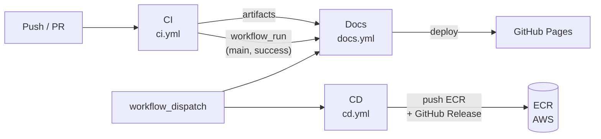
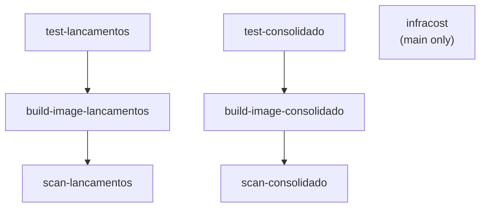
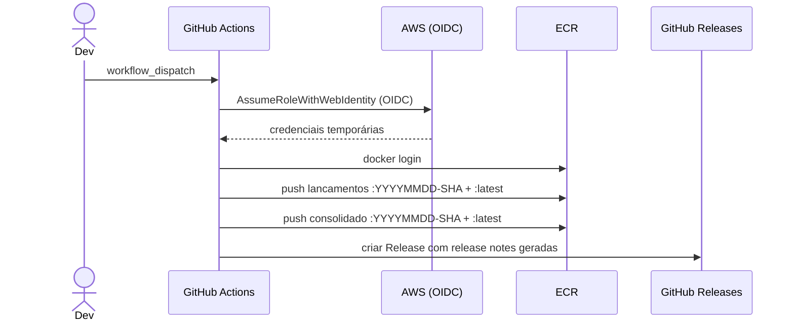

# Pipeline CI/CD

**Perspectiva:** 🔐 DevSecOps · 🏗️ Arquiteto de Infraestrutura  
**Requisitos:** [NFR-06](../negocio/requisitos.md#nfr-06) (zero perda de dados), [NFR-09](../negocio/requisitos.md#nfr-09) (rastreabilidade)  
**Workflows:** [`ci.yml`](https://github.com/gsperim/account-engine-lab/blob/main/.github/workflows/ci.yml) · [`cd.yml`](https://github.com/gsperim/account-engine-lab/blob/main/.github/workflows/cd.yml) · [`docs.yml`](https://github.com/gsperim/account-engine-lab/blob/main/.github/workflows/docs.yml)

---

## Visão Geral

Três workflows independentes com responsabilidades distintas:



| Workflow | Gatilho | Objetivo |
|----------|---------|---------|
| **CI** | Push em qualquer branch · PR para main/develop · manual | Qualidade — testes, cobertura, imagem, segurança, custo |
| **CD** | Manual (`workflow_dispatch`) | Release — build final e push para ECR + GitHub Release |
| **Docs** | Push em main (paths relevantes) · CI concluído em main · manual | Publicação — MkDocs + C4 + relatórios no GitHub Pages |

---

## CI — `ci.yml`

### Grafo de jobs



`infracost` corre em paralelo com os demais — sem dependência de testes ou build.

### Jobs

#### `test-lancamentos` / `test-consolidado`

| Passo | Detalhe |
|-------|---------|
| Setup | Java 21 Temurin · cache Gradle |
| Testes | `./gradlew test --no-daemon` |
| Relatório de testes | Upload `test-results-{serviço}` — retenção 7 dias |
| Cobertura JaCoCo | `jacocoTestReport` executado como `finalizedBy` do `test`; upload `coverage-{serviço}` — retenção 30 dias |

O código gerado pelo OpenAPI Generator (`**/generated/**`) é excluído do relatório de cobertura.

#### `build-image-lancamentos` / `build-image-consolidado`

Build sem push (`push: false`) para validar que a imagem compila. Cache GHA (`type=gha`) compartilhado com o job de scan e com o CD.

**Dockerfile — multi-stage:**

| Stage | Base | Conteúdo |
|-------|------|---------|
| `builder` | `eclipse-temurin:21-jdk-jammy` | Gradle wrapper, dependências, `bootJar`, extração de layers |
| `runtime` | `gcr.io/distroless/java21-debian12:nonroot` | Apenas os layers da aplicação — JDK descartado |

A imagem final não contém shell, gerenciador de pacotes nem usuário root — superfície de ataque mínima.

#### `scan-lancamentos` / `scan-consolidado`

```
Trivy → CRITICAL/HIGH → exit 1 se encontrar
CVEs ignorados → .trivyignore (OS da distroless com fix pendente na imagem base)
```

#### `infracost`

Roda **apenas em `main`** (`if: github.ref == 'refs/heads/main'`). Com `continue-on-error: true` — falha silenciosa não bloqueia o CI.

| Passo | Detalhe |
|-------|---------|
| Setup Terraform | `hashicorp/setup-terraform@v3` · versão `~1.8` · `terraform_wrapper: false` |
| `terraform init` | Baixa módulos (`vpc`, `eks`, `karpenter`, `kms`) e providers |
| `infracost breakdown` | `--config-file infracost.yml --format html --show-skipped` · roda dentro de `terraform/` |
| Upload | Artifact `infracost-report` (`index.html`) — retenção 30 dias |

**Pré-requisito:** secret `INFRACOST_API_KEY` configurado no repositório (chave gratuita em [dashboard.infracost.io](https://dashboard.infracost.io)).

---

## CD — `cd.yml`

Execução **exclusivamente manual** (`workflow_dispatch`). Requer o secret `AWS_DEPLOY_ROLE_ARN` e o environment `production` configurado no repositório.

### Sequência



**Versão:** informada como input do `workflow_dispatch` em formato SemVer (`MAJOR.MINOR.PATCH`). O workflow valida o formato antes de prosseguir — qualquer string inválida aborta o job.

| Artefato | Formato | Exemplo |
|----------|---------|---------|
| Tag Git — Lançamentos | `lancamentos/vMAJOR.MINOR.PATCH` | `lancamentos/v0.1.0` |
| Tag Git — Consolidação | `consolidacao/vMAJOR.MINOR.PATCH` | `consolidacao/v0.1.0` |
| Tag ECR | `vMAJOR.MINOR.PATCH` + `latest` | `v0.1.0` |
| GitHub Release | `vMAJOR.MINOR.PATCH` | `v0.1.0` |

Cada serviço tem tag Git independente conforme definido no `CONTRIBUTING.md` (seção Versionamento). A tag `latest` no ECR sempre aponta para o último push.

**Autenticação:** OIDC sem credenciais de longa duração armazenadas — o GitHub Actions assume a role IAM via `aws-actions/configure-aws-credentials@v4`. Nenhuma `AWS_ACCESS_KEY_ID` nos secrets.

---

## Docs — `docs.yml`

### Gatilhos

| Evento | Condição |
|--------|---------|
| `push` em `main` | Paths: `docs/**`, `mkdocs.yml`, `requirements.txt`, `structurizr/**`, `docs.yml` |
| `workflow_run` (CI) | Apenas quando CI conclui com **success** em `main` |
| `workflow_dispatch` | Manual — sempre disponível |

O gatilho `workflow_run` garante que os relatórios de testes, cobertura e Infracost publicados no Pages sejam sempre do último CI verde.

### Conteúdo publicado

| Seção | Origem | URL |
|-------|--------|-----|
| Documentação (MkDocs) | Build local | `/` |
| Diagramas C4 (Structurizr) | `structurizr-site-generatr` | `/c4/` |
| Relatórios de testes — Lançamentos | Artifact CI `test-results-lancamentos` | `/tests/lancamentos/` |
| Relatórios de testes — Consolidado | Artifact CI `test-results-consolidado` | `/tests/consolidado/` |
| Cobertura JaCoCo — Lançamentos | Artifact CI `coverage-lancamentos` | `/coverage/lancamentos/` |
| Cobertura JaCoCo — Consolidado | Artifact CI `coverage-consolidado` | `/coverage/consolidado/` |
| Estimativa de custo (Infracost) | Artifact CI `infracost-report` | `/infracost/` |

Quando um artifact não está disponível (CI ainda não rodou em main, ou Infracost sem key), uma página de aviso é publicada no lugar — sem 404.

### Exportação Structurizr

O `structurizr/cli` está descontinuado. O workflow usa `ghcr.io/avisi-cloud/structurizr-site-generatr` com `--user "$(id -u):$(id -g)"` para evitar o problema de permissão de escrita em volume montado em CI. Apenas `workspace.dsl`, `workspace.json`, `theme.json` e `overview.md` são copiados — sem o symlink `docs/` — mantendo a exportação C4 como experiência separada do MkDocs.

---

## Secrets e variáveis necessários

| Secret | Usado em | Obrigatório |
|--------|---------|:-----------:|
| `INFRACOST_API_KEY` | CI · job `infracost` | ⬜ (job falha silenciosamente sem ela) |
| `AWS_DEPLOY_ROLE_ARN` | CD | ✅ para release |

O GitHub Pages é configurado via **GitHub Actions source** no repositório — sem branch `gh-pages`.

---

## Adições futuras planejadas

| Item | Observação |
|------|-----------|
| Deploy automático no EKS | Adicionar `kubectl apply` ou Helm no CD após `push: branches: [main]` |
| Manifests Kubernetes | Deployments, Services, HPA, NetworkPolicy — pendentes de Etapa 9 |
| Infracost diff em PRs | Comentário automático com impacto de custo por PR que altere Terraform |
| SonarCloud | JaCoCo já gera XML — integração aditiva sem reescrever testes |
