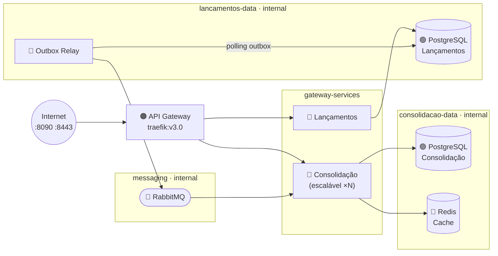
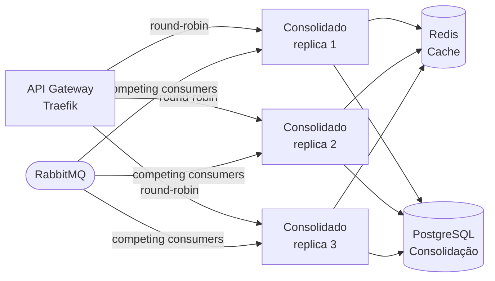
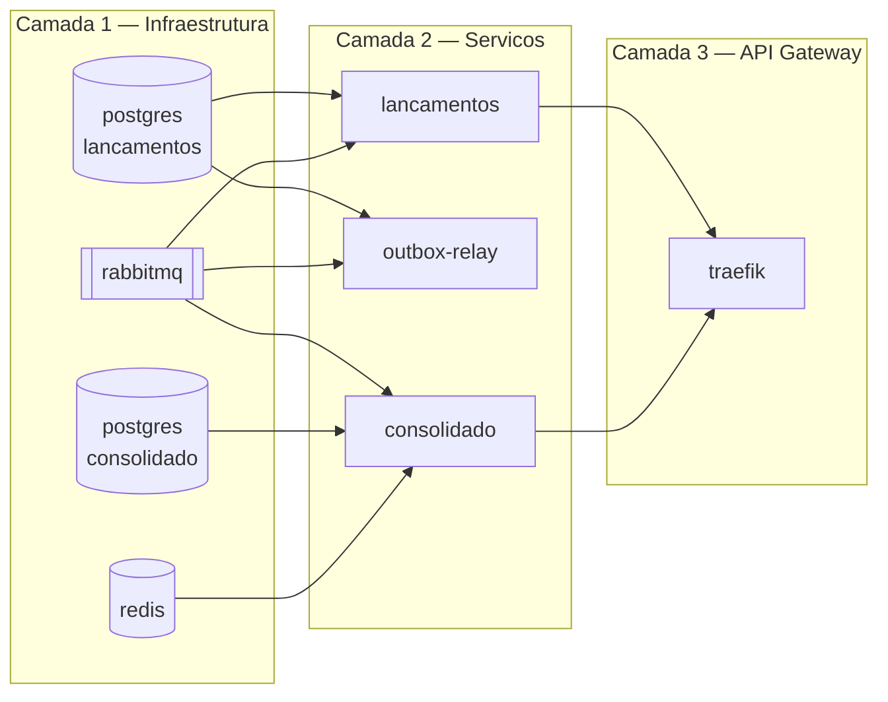

---
tags:
  - infraestrutura
  - plataforma
  - docker
---

# Infraestrutura e Plataforma

**Papéis:** 🏗️ Arquiteto de Infraestrutura · ⚙️ Arquiteto de Tecnologia
**Framework:** ArchiMate — Technology Layer

Esta seção define como o sistema é executado: quais containers compõem o ambiente, como estão isolados em rede, como escalam horizontalmente e como persistem seus dados. A execução local completa via `docker-compose up` é um requisito do desafio e é atendida aqui.

---

## Princípios de Infraestrutura

| Princípio | Aplicação |
|-----------|-----------|
| **Gateway como único ponto de entrada** | Apenas o API Gateway tem porta publicada para o host; todos os demais serviços vivem em redes internas |
| **Isolamento de dados por serviço** | Cada banco de dados está em uma rede `internal` acessível apenas pelos serviços do seu domínio |
| **Infraestrutura como código** | `docker-compose.yml` é a fonte de verdade do ambiente; nenhum estado é mantido fora dos volumes declarados |
| **Health checks obrigatórios** | Todo serviço tem healthcheck; dependências só são declaradas satisfeitas após health check verde |
| **Variáveis de ambiente via `.env`** | Nenhum segredo hardcoded; o `.env.example` documenta todas as variáveis esperadas |

---

## Topologia de Rede



---

## Inventário de Containers

| Container | Imagem | Redes | Porta no host |
|-----------|--------|-------|---------------|
| `traefik` | `traefik:v3.0` | `gateway-services` | `8090:80`, `8443:443`, `8091:8080` |
| `lancamentos` | build `./services/lancamentos` *(Etapa 7)* | `gateway-services`, `lancamentos-data` | — |
| `outbox-relay` | build `./services/lancamentos` *(Etapa 7)* | `lancamentos-data`, `messaging` | — |
| `consolidado` | build `./services/consolidado` *(Etapa 7)* | `gateway-services`, `consolidacao-data`, `messaging` | — |
| `postgres-lancamentos` | `postgres:16` | `lancamentos-data` | — |
| `postgres-consolidado` | `postgres:16` | `consolidacao-data` | — |
| `redis` | `redis:7-alpine` | `consolidacao-data` | — |
| `rabbitmq` | `rabbitmq:3.13-management` | `messaging` | `15672:15672` *(dev)* |
| `docs` | `squidfunk/mkdocs-material` | — | `8000:8000` |
| `structurizr` | `structurizr/structurizr` | — | `8080:8080` |

---

## Segmentação de Redes

Quatro redes isolam os componentes por função:

| Rede | `internal` | Membros | Propósito |
|------|-----------|---------|-----------|
| `gateway-services` | Não | api-gateway, lancamentos, consolidado | Tráfego HTTP entre o gateway e os serviços |
| `lancamentos-data` | **Sim** | lancamentos, outbox-relay, postgres-lancamentos | Isolamento do banco de Lançamentos |
| `consolidacao-data` | **Sim** | consolidado, postgres-consolidado, redis | Isolamento do banco e cache de Consolidação |
| `messaging` | **Sim** | outbox-relay, rabbitmq, consolidado | Tráfego do broker — sem saída para internet |

Redes marcadas como `internal: true` no docker-compose não têm rota de saída para a internet — os containers podem se comunicar entre si, mas não fazem requests externos. Isso impede que um banco de dados ou o Redis tentem fazer chamadas externas (vetor de exfiltração).

O `postgres-lancamentos` não está na rede `consolidacao-data` — e vice-versa. Isso garante o *database per service* em nível de rede: um serviço não consegue se conectar ao banco do outro mesmo que tente.

---

## Escalabilidade Horizontal

O Serviço de Consolidação é o único candidato a escala horizontal por ser o que recebe o maior volume de consultas ([NFR-02](../negocio/requisitos.md#nfr-02) — 50 req/s).

Para escalar:

```bash
docker-compose up --scale consolidado=3
```

**Por que isso funciona:**

1. O Traefik descobre novas réplicas automaticamente via Docker socket e labels — sem TTL de DNS, a cada container que sobe o Traefik atualiza o pool de upstream em tempo real
2. O Redis é compartilhado entre todas as réplicas — o cache-aside funciona independente de qual réplica atende a requisição
3. O RabbitMQ com *competing consumers*: múltiplas réplicas do Consolidado consomem a mesma fila, cada mensagem é processada por exatamente uma réplica
4. O banco de dados é único — sem sharding necessário neste volume



---

## Capacidade vs. Rate Limiting — dois conceitos distintos

### Capacidade do sistema (NFR-02)

O [NFR-02](../negocio/requisitos.md#nfr-02) exige que o Serviço de Consolidação suporte **no mínimo 50 req/s em agregado** — esse é o piso de capacidade do sistema, não um teto. Essa capacidade é garantida por:

1. **Redis cache (cache-aside):** a maioria das consultas de saldo retorna do cache sem tocar o banco — a cada cache hit, o banco fica ocioso para absorver mais carga
2. **Escalabilidade horizontal:** `docker-compose up --scale consolidado=3` distribui a carga entre réplicas via Traefik — novas réplicas são descobertas automaticamente por Docker label, sem reiniciar o gateway
3. **Gerenciamento de conexões nativo:** o Traefik mantém pools de conexão persistente por upstream, eliminando o custo de handshake TCP por requisição

Com cache bem aquecido, o sistema serve bem acima de 50 req/s antes de precisar de réplicas adicionais.

### Rate limiting por origem (NFR-07)

O [NFR-07](../negocio/requisitos.md#nfr-07) pede proteção contra abuso. O Traefik implementa rate limiting **por IP** via middlewares, independente da capacidade agregada do sistema:

| Middleware | Limite por IP | Burst | Propósito |
|------------|--------------|-------|-----------|
| `rate-limit-lancamentos` | 30 req/s | 50 | PDV pode enviar rajadas legítimas; limite bloqueia scripts de abuso |
| `rate-limit-consolidado` | 10 req/s | 20 | Dashboard polling a cada 100ms já é uso extremo; limite bloqueia scrapers |

Esses limites **não impedem** o sistema de atender 50 req/s em agregado: cinquenta origens distintas fazendo 1 req/s cada somam 50 req/s no total, nenhuma delas aciona o rate limiting. O bloqueio acontece quando **uma única origem** tenta consumir uma fração desproporcionalmente grande da capacidade.

Requisições acima do burst recebem `HTTP 429 Too Many Requests` imediatamente, sem enfileirar.

---

## Persistência e Volumes

| Volume | Serviço | Dado persistido |
|--------|---------|----------------|
| `postgres-lancamentos-data` | postgres-lancamentos | Lançamentos, tabela outbox |
| `postgres-consolidado-data` | postgres-consolidado | Consolidação diária, lançamentos processados |
| `redis-data` | redis | Cache (AOF — durável a reinicializações) |
| `rabbitmq-data` | rabbitmq | Filas e mensagens em trânsito |

O Redis está configurado com `--appendonly yes` — o log AOF garante que mensagens em cache não sejam perdidas em reinicialização. Em caso de limpeza deliberada:

```bash
docker-compose down -v   # remove containers E volumes
```

---

## Ordem de Inicialização

O docker-compose garante a ordem via `depends_on` com `condition: service_healthy`:



O Traefik só recebe tráfego quando `lancamentos` e `consolidado` estão `healthy` — evitando que o gateway sirva tráfego para serviços ainda inicializando. A Camada 1 não tem dependências externas; a Camada 2 aguarda a Camada 1; a Camada 3 aguarda toda a Camada 2.

---

## Variáveis de Ambiente

Todas as credenciais e endereços são lidos de variáveis de ambiente. O arquivo `.env.example` na raiz do projeto documenta todas as variáveis com valores padrão seguros para desenvolvimento.

```bash
cp .env.example .env
docker-compose up
```

Em produção, as variáveis são injetadas pelo orquestrador (Kubernetes Secrets, AWS Secrets Manager, etc.) — nunca hardcoded ou versionadas.

---

## Execução Local

```bash
# Subir todo o ambiente
docker-compose up

# Subir só a infraestrutura (sem serviços de app — antes de implementar)
docker-compose up api-gateway postgres-lancamentos postgres-consolidado redis rabbitmq

# Escalar Consolidação para 3 réplicas
docker-compose up --scale consolidado=3

# Ver logs em tempo real
docker-compose logs -f lancamentos consolidado

# Destruir tudo (incluindo volumes)
docker-compose down -v
```

| URL | Serviço |
|-----|---------|
| `http://localhost:8090` | API Gateway — HTTP |
| `https://localhost:8443` | API Gateway — HTTPS (`curl -k` com cert auto-assinado; use mkcert para cert confiável) |
| `http://localhost:8091` | Traefik Dashboard — rotas e middlewares ativos |
| `http://localhost:15672` | RabbitMQ Management UI |
| `http://localhost:8000` | Documentação MkDocs |
| `http://localhost:8080` | Diagramas C4 (Structurizr) |

---

## Evolução para Produção

O docker-compose é o ambiente local e de CI. Em produção, a mesma topologia é mapeada para Kubernetes:

| docker-compose | Kubernetes |
|----------------|-----------|
| `service` | `Deployment` + `Service` |
| `networks` | `NetworkPolicy` |
| `volumes` | `PersistentVolumeClaim` |
| `--scale consolidado=3` | `HorizontalPodAutoscaler` |
| `.env` | `Secret` + `ConfigMap` |
| `healthcheck` | `livenessProbe` + `readinessProbe` |
| `depends_on` | `initContainers` |

O `docker-compose.yml` e os manifestos Kubernetes compartilham as mesmas imagens — a diferença é apenas o runtime. A decisão de runtime está formalizada no [ADR-006](../adr/ADR-006-container-runtime.md).
