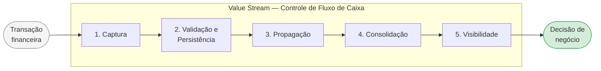
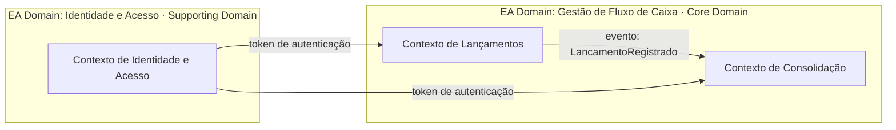

---
tags:
  - negocio
  - ddd
---

# Domínios, Value Stream e Capacidades de Negócio

**Papéis:** 💼 Arquiteto de Negócios · 🧩 Arquiteto de Soluções · 🏛️ Arquiteto Corporativo

---

## Perspectivas utilizadas neste documento

| Perspectiva | Framework | O que responde |
|-------------|-----------|---------------|
| **EA Domain** | ArchiMate / TOGAF | Como a organização agrupa suas capacidades e responsabilidades em nível de portfólio |
| **DDD Strategic Design** | Domain-Driven Design — Strategic Patterns | Onde investir esforço, como traçar fronteiras de modelos e como times se organizam em torno do domínio |
| **DDD Tático** | Domain-Driven Design — Tactical Patterns | Como implementar o modelo dentro de cada Bounded Context (Aggregates, Entities, Value Objects, Domain Events) |

> **DDD Tático** não é tratado aqui — pertence à **Etapa 7 (Implementação)**, onde o modelo interno de cada serviço será detalhado.

---

## 1. Domínios Funcionais — EA Domain

> **Framework:** ArchiMate Business Layer · TOGAF Capability-Based Planning
>
> Agrupamentos organizacionais de capacidades e processos relacionados. Respondem à pergunta: *como a organização divide suas responsabilidades em nível de portfólio?* São a base para alocação de times, orçamentos e decisões de make-or-buy.

| Domínio Funcional | Responsabilidade |
|-------------------|-----------------|
| **Gestão de Fluxo de Caixa** | Registro de movimentações financeiras e consolidação de saldos diários |
| **Identidade e Acesso** | Autenticação, autorização e gestão de credenciais dos usuários |
| **Plataforma e Infraestrutura** | Provisionamento, observabilidade, CI/CD e operação da plataforma |

---

## 2. Classificação Estratégica — DDD Strategic Design

> **Framework:** Domain-Driven Design — Strategic Patterns
>
> Classifica os domínios funcionais por relevância estratégica. Responde à pergunta: *onde concentrar o maior esforço de design e investimento?* Orienta decisões de build vs. buy e priorização de times.

| Domínio Funcional | Classificação DDD | Decisão |
|-------------------|------------------|---------|
| **Gestão de Fluxo de Caixa** | Core Domain | Construir — é o diferencial do produto; modelos ricos e design cuidadoso |
| **Identidade e Acesso** | Supporting Domain | Comprar ou adaptar — suporta o core, mas não é diferenciador |
| **Plataforma e Infraestrutura** | Generic Domain | Comprar ou usar serviço gerenciado — commodity |

---

## 3. Value Stream — Strategy Layer

> **Framework:** ArchiMate Strategy Layer
>
> Descreve como o valor flui da trigger até a entrega ao comerciante. Conecta os drivers de negócio (Motivation View) às capabilities (Business Layer). Cada stage é habilitado por uma ou mais capabilities.

| Stage | Descrição | Capability habilitadora | Risco |
|-------|-----------|------------------------|-------|
| **1. Captura** | Comerciante registra movimentação financeira (débito ou crédito) | Registro de Movimentações | — |
| **2. Validação e Persistência** | Lançamento é validado e armazenado com garantia de persistência | Registro de Movimentações | Dado inválido ou perda na persistência |
| **3. Propagação** | Evento `LancamentoRegistrado` é publicado para outros contextos | *(Integração — suporte)* | **Ponto crítico:** falha síncrona aqui quebra a cadeia → origem do [NFR-01](requisitos.md#nfr-01) |
| **4. Consolidação** | Saldo diário é recalculado e atualizado de forma eventual | Consolidação de Saldo | Atraso na consistência eventual |
| **5. Visibilidade** | Comerciante consulta o saldo consolidado e toma decisão de negócio | Consolidação de Saldo | Indisponibilidade sob carga → origem do [NFR-02](requisitos.md#nfr-02) |

> O desacoplamento assíncrono entre os stages 2 e 3 é a decisão arquitetural central deste sistema.

---

## 4. Bounded Contexts — DDD Strategic Design

> **Framework:** Domain-Driven Design — Context Mapping
>
> Fronteiras explícitas dentro das quais um modelo de domínio é consistente e sem ambiguidade. Respondem à pergunta: *onde os modelos mudam de significado?* Um domínio funcional pode conter múltiplos Bounded Contexts.

### Contexto de Lançamentos

**Responsabilidade:** Receber, validar e persistir lançamentos financeiros. Publicar eventos de domínio.

**Agregado raiz:** `Lançamento`
**Eventos publicados:** `LancamentoRegistrado`
**Ubiquitous Language:** débito, crédito, lançamento, valor, data de competência, descrição

> *Modelo interno (Entities, Value Objects, Domain Services) → Etapa 7*

---

### Contexto de Consolidação Diária

**Responsabilidade:** Consumir eventos de lançamento e manter o saldo consolidado por dia. Disponibilizar via API de consulta.

**Agregado raiz:** `ConsolidacaoDiaria`
**Eventos consumidos:** `LancamentoRegistrado`
**Ubiquitous Language:** saldo, consolidação, data de referência, total de débitos, total de créditos

> *Modelo interno (Entities, Value Objects, Domain Services) → Etapa 7*

---

### Contexto de Identidade e Acesso *(Supporting)*

**Responsabilidade:** Autenticação e autorização. Implementado com solução existente (Keycloak, Auth0 ou similar).

---

## 5. Capability Map — EA Domain

> **Framework:** ArchiMate Business Layer · TOGAF Capability-Based Planning
>
> Lista o que a organização precisa ser capaz de fazer para suportar o Value Stream. Capabilities são estáveis; processos e tecnologias que as implementam mudam.

<table style="width:100%; border-collapse: collapse; font-size: 0.9em;">
  <tr>
    <td colspan="7" align="center" style="background:#1d4ed8; color:#fff; font-weight:bold; padding:10px; border:2px solid #1e3a8a;">
      Gestão de Fluxo de Caixa — Core Domain
    </td>
  </tr>
  <tr>
    <td colspan="4" align="center" style="background:#3b82f6; color:#fff; font-weight:bold; padding:8px; border:2px solid #1e3a8a;">
      Registro de Movimentações Contexto de Lançamentos
    </td>
    <td colspan="3" align="center" style="background:#3b82f6; color:#fff; font-weight:bold; padding:8px; border:2px solid #1e3a8a;">
      Consolidação de Saldo Contexto de Consolidação Diária
    </td>
  </tr>
  <tr>
    <td align="center" style="background:#dbeafe; color:#1e3a8a; font-weight:bold; padding:8px; border:2px solid #1e3a8a;">Registrar débito</td>
    <td align="center" style="background:#dbeafe; color:#1e3a8a; font-weight:bold; padding:8px; border:2px solid #1e3a8a;">Registrar crédito</td>
    <td align="center" style="background:#dbeafe; color:#1e3a8a; font-weight:bold; padding:8px; border:2px solid #1e3a8a;">Validar lançamento</td>
    <td align="center" style="background:#dbeafe; color:#1e3a8a; font-weight:bold; padding:8px; border:2px solid #1e3a8a;">Consultar lançamentos por período</td>
    <td align="center" style="background:#dbeafe; color:#1e3a8a; font-weight:bold; padding:8px; border:2px solid #1e3a8a;">Processar eventos de lançamento</td>
    <td align="center" style="background:#dbeafe; color:#1e3a8a; font-weight:bold; padding:8px; border:2px solid #1e3a8a;">Calcular saldo diário</td>
    <td align="center" style="background:#dbeafe; color:#1e3a8a; font-weight:bold; padding:8px; border:2px solid #1e3a8a;">Disponibilizar relatório de saldo consolidado</td>
  </tr>
</table>