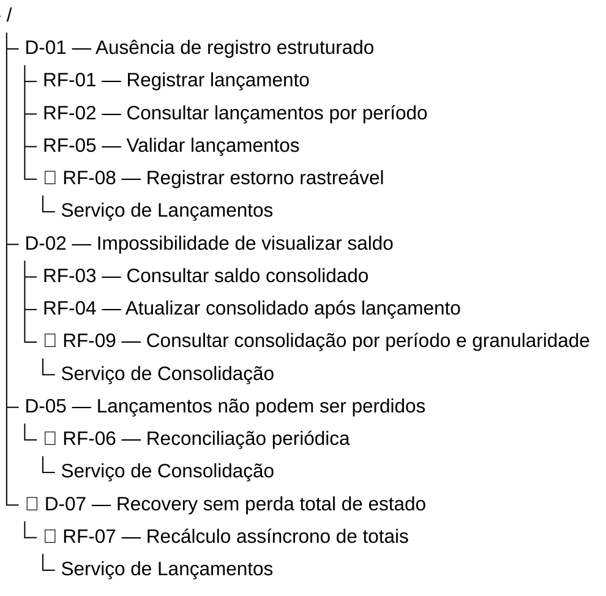
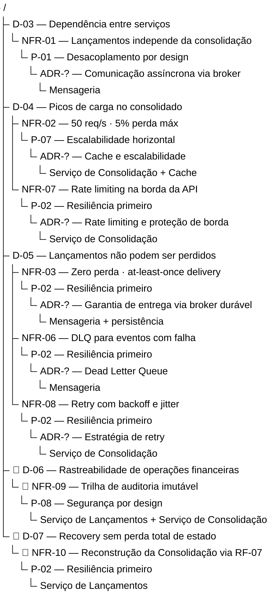

---
tags:
  - negocio
  - requisitos
---

# Requisitos Funcionais e Não Funcionais

**Papel:** 💼 Arquiteto de Negócios · 🧩 Arquiteto de Soluções
**Framework:** ArchiMate — Motivation View (Requirement, Constraint)

---

## Sumário de Requisitos Funcionais

| ID | Descrição resumida | Serviço | Driver |
|----|-------------------|---------|--------|
| RF-01 | Registrar lançamento (débito ou crédito) | Lançamentos | [D-01](drivers.md#d-01) |
| RF-02 | Consultar lançamentos por período | Lançamentos | [D-01](drivers.md#d-01) |
| RF-03 | Consultar saldo consolidado de um dia | Consolidação | [D-02](drivers.md#d-02) |
| RF-04 | Atualizar saldo consolidado após cada lançamento | Consolidação | [D-02](drivers.md#d-02), [D-05](drivers.md#d-05) |
| RF-05 | Validar e rejeitar lançamentos inválidos | Lançamentos | [D-01](drivers.md#d-01) |
| 🔹 RF-06 | Reconciliar totais do consolidado com os lançamentos | Consolidação | [D-05](drivers.md#d-05) |
| 🔹 RF-07 | Solicitar recálculo assíncrono de totais por período | Lançamentos | [D-07](drivers.md#d-07) |
| 🔹 RF-08 | Registrar estorno rastreável de lançamento | Lançamentos | [D-01](drivers.md#d-01) |
| 🔹 RF-09 | Consultar consolidação por período e granularidade | Consolidação | [D-02](drivers.md#d-02) |

> 🔹 Requisitos marcados com este símbolo são **escopo diferencial** — vão além do enunciado original do desafio e refletem maturidade arquitetural em sistemas financeiros reais.

---

## Requisitos Funcionais Detalhados

### RF-01 — Registrar Lançamento { #rf-01 }

**Serviço:** Lançamentos · **Driver:** [D-01](drivers.md#d-01)

**Campos de entrada:**

| Campo | Tipo | Obrigatório | Regras |
|-------|------|-------------|--------|
| `tipo` | enum | Sim | Valores aceitos: `debito`, `credito` |
| `valor` | decimal | Sim | Maior que zero; até duas casas decimais |
| `data_competencia` | date | Sim | Formato ISO 8601 (`YYYY-MM-DD`); aceita datas passadas e futuras |
| `descricao` | string | Sim | Entre 3 e 255 caracteres |

**Campos de saída (sucesso):**

| Campo | Tipo | Descrição |
|-------|------|-----------|
| `id` | uuid | Identificador único gerado pelo sistema |
| `tipo` | enum | Tipo confirmado |
| `valor` | decimal | Valor confirmado |
| `data_competencia` | date | Data de competência confirmada |
| `descricao` | string | Descrição confirmada |
| `criado_em` | datetime | Timestamp UTC de criação do registro |

**Regras de negócio:**
- Lançamentos são **imutáveis** após confirmação — não podem ser editados nem excluídos. Para corrigir um lançamento, registra-se um lançamento compensatório.
- O sistema deve publicar o evento `LancamentoRegistrado` somente após a persistência confirmada.
- A confirmação ao cliente (HTTP 201) deve ocorrer somente após persistência bem-sucedida.

**Casos de borda:**

| Situação | Comportamento esperado |
|----------|----------------------|
| `valor` = 0 | Rejeitar — HTTP 422 |
| `valor` negativo | Rejeitar — HTTP 422 |
| `tipo` fora do enum | Rejeitar — HTTP 422 |
| `data_competencia` futura | Aceitar — lançamento agendado é válido |
| `data_competencia` muito antiga | Aceitar — sem restrição de janela temporal |
| `descricao` com menos de 3 caracteres | Rejeitar — HTTP 422 |
| Falha na publicação do evento | Registrar lançamento e garantir reentrega via mecanismo de retry/outbox |

**Critérios de aceite:**
- [ ] Dado um lançamento válido, deve retornar HTTP 201 com o recurso criado
- [ ] Dado qualquer campo obrigatório ausente, deve retornar HTTP 422 com mensagem descritiva
- [ ] Dado `valor` ≤ 0, deve retornar HTTP 422
- [ ] Dado `tipo` inválido, deve retornar HTTP 422
- [ ] O evento `LancamentoRegistrado` deve ser publicado após cada registro bem-sucedido
- [ ] Uma falha no broker não deve impedir o registro do lançamento

---

### RF-02 — Consultar Lançamentos por Período { #rf-02 }

**Serviço:** Lançamentos · **Driver:** [D-01](drivers.md#d-01)

**Campos de entrada:**

| Campo | Tipo | Obrigatório | Regras |
|-------|------|-------------|--------|
| `data_inicio` | date | Sim | Formato ISO 8601 |
| `data_fim` | date | Sim | Formato ISO 8601; deve ser ≥ `data_inicio` |
| `tipo` | enum | Não | Filtro opcional: `debito` ou `credito` |
| `pagina` | integer | Não | Padrão: 1 |
| `tamanho` | integer | Não | Padrão: 20; máximo: 100 |

**Campos de saída:**

| Campo | Tipo | Descrição |
|-------|------|-----------|
| `itens` | array | Lista de lançamentos |
| `total` | integer | Total de registros no período |
| `pagina` | integer | Página atual |
| `tamanho` | integer | Tamanho da página |

**Regras de negócio:**
- Ordenação padrão: `data_competencia` crescente, `criado_em` crescente como desempate.

**Casos de borda:**

| Situação | Comportamento esperado |
|----------|----------------------|
| Período sem lançamentos | Retornar HTTP 200 com `itens: []` e `total: 0` |
| `data_inicio` > `data_fim` | Rejeitar — HTTP 422 |
| Período muito amplo (anos) | Aceitar — paginação garante desempenho |

**Critérios de aceite:**
- [ ] Dado um período válido, deve retornar HTTP 200 com a lista paginada
- [ ] Dado período sem lançamentos, deve retornar HTTP 200 com lista vazia (não 404)
- [ ] Dado `data_inicio` > `data_fim`, deve retornar HTTP 422
- [ ] O filtro por `tipo` deve funcionar em combinação com o período

---

### RF-03 — Consultar Saldo Consolidado Diário { #rf-03 }

**Serviço:** Consolidação · **Driver:** [D-02](drivers.md#d-02)

**Campos de entrada:**

| Campo | Tipo | Obrigatório | Regras |
|-------|------|-------------|--------|
| `data` | date | Sim | Formato ISO 8601 |

**Campos de saída:**

| Campo | Tipo | Descrição |
|-------|------|-----------|
| `data` | date | Data de referência consultada |
| `total_creditos` | decimal | Soma de todos os créditos do dia |
| `total_debitos` | decimal | Soma de todos os débitos do dia |
| `saldo` | decimal | `total_creditos` − `total_debitos`; pode ser negativo |
| `atualizado_em` | datetime | Timestamp UTC da última atualização do consolidado |

**Regras de negócio:**
- O saldo pode ser negativo — não há restrição de saldo mínimo.
- O consolidado é **eventual** — pode haver atraso entre um lançamento registrado e sua refletividade no saldo consultado.

**Casos de borda:**

| Situação | Comportamento esperado |
|----------|----------------------|
| Data sem lançamentos | Retornar HTTP 200 com todos os valores zerados (não 404) |
| Data futura | Retornar HTTP 200 com valores zerados |
| Consolidado ainda não processado para a data | Retornar HTTP 200 com os dados disponíveis até o momento |

**Critérios de aceite:**
- [ ] Dado uma data com lançamentos, deve retornar HTTP 200 com os totais corretos
- [ ] Dado uma data sem lançamentos, deve retornar HTTP 200 com zeros (não 404)
- [ ] O saldo deve ser igual a `total_creditos` − `total_debitos`
- [ ] Dado `data` ausente, deve retornar HTTP 422

---

### RF-04 — Atualizar Consolidado após Lançamento { #rf-04 }

**Serviço:** Consolidação · **Driver:** [D-02](drivers.md#d-02), [D-05](drivers.md#d-05)

**Trigger:** Evento `LancamentoRegistrado` recebido via broker

**Comportamento:**
- Ao receber o evento, deve recalcular e persistir o saldo do dia correspondente à `data_competencia` do lançamento.
- O processamento deve ser **idempotente** — processar o mesmo evento mais de uma vez não deve alterar o resultado.
- O processamento deve garantir **at-least-once delivery** — nenhum evento pode ser descartado sem processamento.

**Regras de negócio:**
- A indisponibilidade do Serviço de Consolidação Diária não deve gerar perda de eventos — o broker retém as mensagens até o serviço estar disponível novamente.
- O consolidado de uma data deve sempre refletir a soma de **todos** os lançamentos daquela `data_competencia`, incluindo os registrados retroativamente.

**Estratégia de idempotência — Recálculo idempotente (recomendada):**

O Serviço de Consolidação Diária mantém uma tabela local de lançamentos processados. O campo `id` do evento é o UUID gerado pelo Serviço de Lançamentos no momento do registro ([RF-01](#rf-01)) e incluído no payload do evento `LancamentoRegistrado`. Esse UUID é usado como chave primária na tabela local:

```sql
-- Tentativa de inserção do lançamento recebido via evento
INSERT INTO lancamentos_processados (id, tipo, valor, data_competencia)
VALUES (:event_id, :tipo, :valor, :data)
ON CONFLICT (id) DO NOTHING;

-- Recálculo do saldo: sempre por agregação sobre todos os registros da data
UPDATE consolidacao_diaria
SET total_creditos = (SELECT COALESCE(SUM(valor), 0) FROM lancamentos_processados
                      WHERE data_competencia = :data AND tipo = 'credito'),
    total_debitos  = (SELECT COALESCE(SUM(valor), 0) FROM lancamentos_processados
                      WHERE data_competencia = :data AND tipo = 'debito'),
    atualizado_em  = NOW()
WHERE data = :data;
```

A idempotência emerge naturalmente do design: se o evento for entregue mais de uma vez, o `INSERT ... ON CONFLICT DO NOTHING` resulta em `0 rows affected` e o `UPDATE` recalcula o mesmo valor já existente. Não é necessário detectar explicitamente se o evento está sendo reprocessado.

**Critérios de aceite:**
- [ ] Dado um evento `LancamentoRegistrado` recebido, o saldo do dia correspondente deve ser atualizado
- [ ] Dado o mesmo evento processado duas vezes, o saldo não deve ser duplicado (idempotência)
- [ ] Dado o serviço indisponível temporariamente, os eventos devem ser processados após a recuperação

---

### RF-05 — Validar Lançamentos { #rf-05 }

**Serviço:** Lançamentos · **Driver:** [D-01](drivers.md#d-01)

Detalhado como parte das regras e casos de borda do [RF-01](#rf-01). A validação ocorre antes da persistência e é síncrona — o cliente recebe a resposta de erro imediatamente.

**Regras consolidadas de validação:**

| Campo | Condição de rejeição | Código HTTP |
|-------|---------------------|-------------|
| `tipo` | Ausente ou fora do enum | 422 |
| `valor` | Ausente, zero ou negativo | 422 |
| `data_competencia` | Ausente ou formato inválido | 422 |
| `descricao` | Ausente ou com menos de 3 caracteres | 422 |

**Critérios de aceite:**
- [ ] Toda rejeição deve retornar HTTP 422 com mensagem que identifica o campo inválido
- [ ] Múltiplos campos inválidos devem ser reportados em uma única resposta

---

## Requisitos Funcionais Detalhados — Escopo Diferencial

> 🔹 Os requisitos abaixo não constam no enunciado original do desafio. São contribuições que demonstram maturidade arquitetural para sistemas financeiros reais: rastreabilidade de correções, recuperação de desastres, integridade contínua e análise de tendências.

### RF-06 — Reconciliação Periódica 🔹 { #rf-06 }

**Serviço:** Consolidação · **Driver:** [D-05](drivers.md#d-05)

**Trigger:** Agendamento diário automático ou invocação manual via `POST /consolidacao/reconciliacao`

**Comportamento:**
- Para cada data com registros em `lancamentos_processados`, recalcular o saldo esperado via `SELECT SUM`
- Comparar o resultado com o valor em `consolidacao_diaria`
- Emitir alerta operacional (log estruturado nível `ERROR` + métrica) para cada divergência encontrada

**Regras de negócio:**
- Dias sem lançamentos retornam saldo zero — não são considerados divergência
- A reconciliação não altera dados — apenas detecta e alerta; correção é feita via [RF-07](#rf-07)

**Critérios de aceite:**
- [ ] Dado saldos consistentes, a reconciliação deve completar sem alertas
- [ ] Dado uma divergência real, deve gerar alerta com a data afetada e os valores divergentes
- [ ] Dado dias sem lançamentos, não deve gerar alertas falsos positivos
- [ ] A reconciliação deve ser idempotente — re-execução não gera alertas duplicados

---

### RF-07 — Recálculo Assíncrono de Totais 🔹 { #rf-07 }

**Serviço:** Lançamentos · **Driver:** [D-07](drivers.md#d-07)

**Campos de entrada:**

| Campo | Tipo | Obrigatório | Regras |
|-------|------|-------------|--------|
| `data_inicio` | date | Sim | Formato ISO 8601 |
| `data_fim` | date | Sim | Formato ISO 8601; deve ser ≥ `data_inicio` |

**Campos de saída (imediato — HTTP 202):**

| Campo | Tipo | Descrição |
|-------|------|-----------|
| `job_id` | uuid | Identificador da solicitação de recálculo |
| `status` | string | `aceito` — processamento ocorre de forma assíncrona |

**Comportamento:**
- Para cada dia com lançamentos no intervalo, calcular `SUM(creditos)` e `SUM(debitos)` e publicar um evento `TotaisDiarioCalculado` no broker
- O Serviço de Consolidação Diária consome os eventos e reconstrói seu estado com os mesmos mecanismos idempotentes do [RF-04](#rf-04)
- Dias sem lançamentos no intervalo não geram eventos

**Regras de negócio:**
- Eventos são publicados em ordem cronológica crescente
- Re-solicitação do mesmo intervalo é idempotente — a Consolidação absorve sem duplicar valores

**Critérios de aceite:**
- [ ] Dado um intervalo válido, deve retornar HTTP 202 imediatamente com `job_id`
- [ ] Dado `data_inicio` > `data_fim`, deve retornar HTTP 422
- [ ] Para cada dia com lançamentos no intervalo, deve ser publicado exatamente um evento `TotaisDiarioCalculado`
- [ ] Dias sem lançamentos não devem gerar eventos

---

### RF-08 — Registrar Estorno Rastreável 🔹 { #rf-08 }

**Serviço:** Lançamentos · **Driver:** [D-01](drivers.md#d-01)

**Campos de entrada:**

| Campo | Tipo | Obrigatório | Regras |
|-------|------|-------------|--------|
| `id_lancamento_original` | uuid | Sim | Deve existir e não pode ser um estorno |
| `motivo` | string | Sim | Entre 3 e 255 caracteres |

**Campos de saída (sucesso):**

| Campo | Tipo | Descrição |
|-------|------|-----------|
| `id` | uuid | Identificador do estorno |
| `tipo` | enum | Tipo inverso ao original: `credito` vira `debito` e vice-versa |
| `valor` | decimal | Mesmo valor do lançamento original |
| `data_competencia` | date | Mesma data de competência do original |
| `estorno_de` | uuid | ID do lançamento original — vínculo explícito e rastreável |
| `motivo` | string | Motivo registrado |
| `criado_em` | datetime | Timestamp UTC do estorno |

**Regras de negócio:**
- Valor e data de competência são sempre idênticos ao original — estorno parcial não é permitido
- Um lançamento que já é um estorno não pode ser estornado novamente
- O estorno publica o evento `LancamentoEstornado` após persistência confirmada

**Critérios de aceite:**
- [ ] Dado um lançamento de crédito estornado, deve criar um débito com o mesmo valor na mesma data de competência
- [ ] O campo `estorno_de` deve apontar para o `id` do lançamento original
- [ ] Dado tentativa de estornar um estorno, deve retornar HTTP 422
- [ ] Dado `id_lancamento_original` inexistente, deve retornar HTTP 404

---

### RF-09 — Consultar Consolidação por Período e Granularidade 🔹 { #rf-09 }

**Serviço:** Consolidação · **Driver:** [D-02](drivers.md#d-02)

**Campos de entrada:**

| Campo | Tipo | Obrigatório | Regras |
|-------|------|-------------|--------|
| `data_inicio` | date | Sim | Formato ISO 8601 |
| `data_fim` | date | Sim | Formato ISO 8601; deve ser ≥ `data_inicio` |
| `granularidade` | enum | Não | `dia` (padrão), `semana`, `mes` |

**Campos de saída:**

| Campo | Tipo | Descrição |
|-------|------|-----------|
| `periodos` | array | Lista de períodos consolidados |
| `periodos[].periodo` | string | Identificação do período (ex: `2024-01-15`, `2024-W03`, `2024-01`) |
| `periodos[].total_creditos` | decimal | Soma de créditos no período |
| `periodos[].total_debitos` | decimal | Soma de débitos no período |
| `periodos[].saldo` | decimal | `total_creditos` − `total_debitos` |

**Regras de negócio:**
- `semana` segue o padrão ISO 8601 (semana começa na segunda-feira)
- Períodos sem lançamentos retornam zeros — não são omitidos da resposta

**Critérios de aceite:**
- [ ] Dado granularidade `dia`, deve retornar um registro por dia no intervalo
- [ ] Dado granularidade `semana`, deve retornar um registro por semana ISO
- [ ] Dado granularidade `mes`, deve retornar um registro por mês
- [ ] Dado `data_inicio` > `data_fim`, deve retornar HTTP 422

---

## Requisitos Não Funcionais

| ID | Requisito | Categoria | Métrica / Meta | Driver |
|----|-----------|-----------|---------------|--------|
| <span id="nfr-01"></span>NFR-01 | O Serviço de Lançamentos não pode ficar indisponível se o Serviço de Consolidação Diária cair | Resiliência | Disponibilidade do Lançamentos independe da Consolidação | [D-03](drivers.md#d-03) |
| <span id="nfr-02"></span>NFR-02 | O Serviço de Consolidação Diária deve suportar picos de carga | Performance | 50 req/s com no máximo 5% de perda | [D-04](drivers.md#d-04) |
| <span id="nfr-03"></span>NFR-03 | Lançamentos registrados não podem ser perdidos em cenários de falha | Confiabilidade | Zero perda de lançamentos confirmados (at-least-once delivery) | [D-05](drivers.md#d-05) |
| <span id="nfr-04"></span>NFR-04 | O sistema deve ser observável | Observabilidade | Logs estruturados, métricas e traces em 100% das requisições | [D-04](drivers.md#d-04) |
| <span id="nfr-05"></span>NFR-05 | Comunicação entre serviços deve ser autenticada e autorizada | Segurança | Zero comunicação sem autenticação válida | — |
| <span id="nfr-06"></span>NFR-06 | Eventos que falham após esgotamento de retentativas devem ser preservados para análise | Confiabilidade | Dead Letter Queue (DLQ) configurada; zero descarte silencioso de eventos | [D-05](drivers.md#d-05) |
| <span id="nfr-07"></span>NFR-07 | O Serviço de Consolidação Diária deve proteger-se contra sobrecarga de requisições | Resiliência | Rate limiting na borda da API; excedentes recebem HTTP 429 | [D-04](drivers.md#d-04), [NFR-02](#nfr-02) |
| <span id="nfr-08"></span>NFR-08 | Falhas transientes não devem resultar em perda definitiva de operações | Confiabilidade | Retry com exponential backoff e jitter; máximo configurável de tentativas | [D-05](drivers.md#d-05) |
| <span id="nfr-09"></span>🔹 NFR-09 | Toda operação de escrita deve gerar trilha de auditoria imutável | Compliance | 100% das escritas com registro de identidade, timestamp UTC e recurso afetado | [D-06](drivers.md#d-06) |
| <span id="nfr-10"></span>🔹 NFR-10 | O estado da Consolidação Diária deve ser reconstruível a partir do zero | Resiliência | Reconstrução completa via [RF-07](#rf-07) sem acesso direto ao banco do Lançamentos | [D-07](drivers.md#d-07) |

---

## Restrições

| ID | Restrição | Origem |
|----|-----------|--------|
| C-01 | A solução deve ser executável localmente via `docker-compose` | Requisito obrigatório do desafio |
| C-02 | O repositório deve ser público no GitHub com toda a documentação | Requisito obrigatório do desafio |
| C-03 | A linguagem de implementação é livre | Requisito do desafio |
| <span id="c-04"></span>🔹 C-04 | Dados pessoais e financeiros devem obedecer à LGPD (Lei 13.709/2018): prazo de retenção conforme regulação, direito de exclusão via anonimização quando dados não puderem ser apagados | [D-08](drivers.md#d-08) |

--- 

## Rastreabilidade

### Requisitos Funcionais



### Requisitos Não Funcionais


