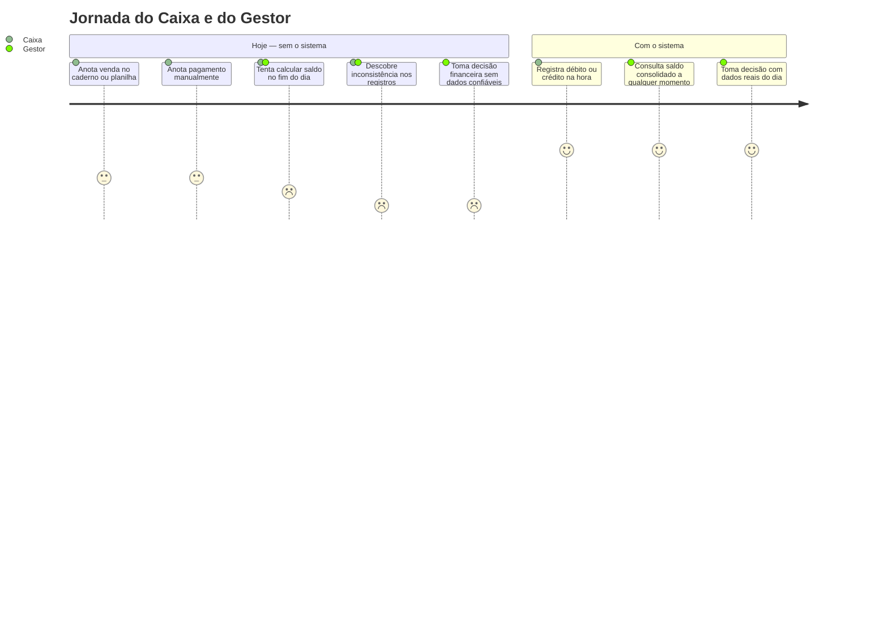
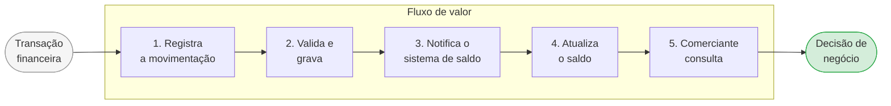

# Visão Executiva — Domínio de Negócio

**Papel:** 💼 Arquiteto de Negócios · 🏛️ Arquiteto Corporativo  
**Audiência:** Executivos, Product Owners, times de negócio

---

## O problema que estamos resolvendo

Um comerciante encerra o dia sem saber ao certo quanto dinheiro tem disponível. Ao longo do dia, registra vendas e pagamentos em anotações separadas — caderno, planilha, sistema legado — e só consegue enxergar o saldo real quando reconcilia tudo manualmente, geralmente à noite.

Isso gera dois problemas concretos:

- **Decisões tardias:** sem visibilidade em tempo real, o comerciante descobre o saldo negativo quando já é tarde para agir
- **Risco de perda de dados:** registros manuais se perdem, ficam duplicados ou inconsistentes

---

## O que o sistema faz

O sistema resolve os dois problemas com uma abordagem simples:

1. **Cada movimentação é registrada imediatamente** — débito ou crédito, com valor e data
2. **O saldo do dia é calculado automaticamente** e fica disponível para consulta a qualquer momento

O comerciante passa a tomar decisões com base em dados reais do dia, não em estimativas do fim do dia.

---

## A decisão de negócio mais importante

O sistema foi projetado em dois módulos independentes por uma razão de negócio clara:

> **O registro de lançamentos nunca pode parar — mesmo que a tela de saldo esteja fora do ar.**

Para um comerciante, perder um lançamento é pior do que não conseguir consultar o saldo. Um débito não registrado gera inconsistência financeira permanente. Um saldo temporariamente desatualizado é apenas um inconveniente.

Por isso, os dois módulos são desacoplados: uma falha na consulta de saldo não afeta em nada o registro de novos lançamentos.

---

## Como o valor chega ao comerciante

Cada passo é independente. Se o passo 4 estiver lento, os passos 1, 2 e 3 continuam funcionando normalmente.

---

## O que o sistema é capaz de fazer

<table style="width:100%; border-collapse: collapse; font-size: 0.9em;">
  <tr>
    <td colspan="7" align="center" style="background:#1d4ed8; color:#fff; font-weight:bold; padding:10px; border:2px solid #1e3a8a;">
      Controle de Fluxo de Caixa
    </td>
  </tr>
  <tr>
    <td colspan="4" align="center" style="background:#3b82f6; color:#fff; font-weight:bold; padding:8px; border:2px solid #1e3a8a;">
      Registro de Movimentações O que o caixa faz
    </td>
    <td colspan="3" align="center" style="background:#3b82f6; color:#fff; font-weight:bold; padding:8px; border:2px solid #1e3a8a;">
      Consulta de Saldo O que o gestor vê
    </td>
  </tr>
  <tr>
    <td align="center" style="background:#dbeafe; color:#1e3a8a; font-weight:bold; padding:8px; border:2px solid #1e3a8a;">Registrar débito</td>
    <td align="center" style="background:#dbeafe; color:#1e3a8a; font-weight:bold; padding:8px; border:2px solid #1e3a8a;">Registrar crédito</td>
    <td align="center" style="background:#dbeafe; color:#1e3a8a; font-weight:bold; padding:8px; border:2px solid #1e3a8a;">Validar lançamento</td>
    <td align="center" style="background:#dbeafe; color:#1e3a8a; font-weight:bold; padding:8px; border:2px solid #1e3a8a;">Consultar histórico</td>
    <td align="center" style="background:#dbeafe; color:#1e3a8a; font-weight:bold; padding:8px; border:2px solid #1e3a8a;">Ver total de entradas e saídas</td>
    <td align="center" style="background:#dbeafe; color:#1e3a8a; font-weight:bold; padding:8px; border:2px solid #1e3a8a;">Ver saldo líquido do dia</td>
    <td align="center" style="background:#dbeafe; color:#1e3a8a; font-weight:bold; padding:8px; border:2px solid #1e3a8a;">Acompanhar atualização em tempo real</td>
  </tr>
</table>

---

## O que foi definido nesta fase

| O que | Decisão |
|-------|---------|
| **Prioridade do sistema** | Registro de movimentações é o núcleo do negócio — recebe o maior cuidado de design |
| **Autenticação** | Solução de mercado existente (não construímos do zero) |
| **Infraestrutura** | Serviço gerenciado — commodity, sem diferencial competitivo |
| **Lançamentos são imutáveis** | Um lançamento confirmado nunca é alterado; correções geram novos lançamentos |
| **Saldo pode estar levemente desatualizado** | Aceitável — o importante é que nenhum lançamento seja perdido |

---

## Compromissos assumidos com o negócio

| Compromisso | O que significa na prática |
|-------------|---------------------------|
| Registro sempre disponível | Mesmo com falha parcial no sistema, o caixa continua operando |
| Zero perda de lançamentos | Nenhuma movimentação confirmada desaparece, mesmo em falhas |
| Saldo suporta picos | O sistema aguenta o volume de consultas em dias de alta movimentação |
| Auditável | Toda movimentação registrada é rastreável — quem, quando, quanto |

---

> Para a visão técnica detalhada desta fase, consulte: [Drivers e Stakeholders](drivers.md), [Requisitos Funcionais e Não Funcionais](requisitos.md), [Domínios, Value Stream e Bounded Contexts](dominios.md) e [Principles Catalog](principios.md).
