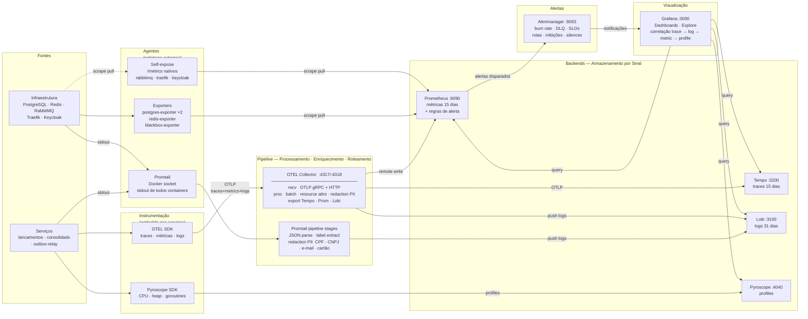
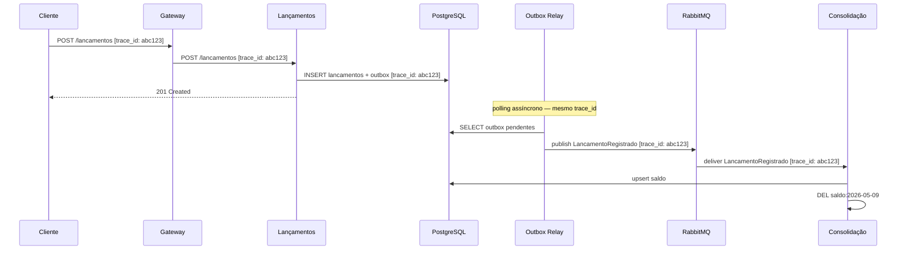
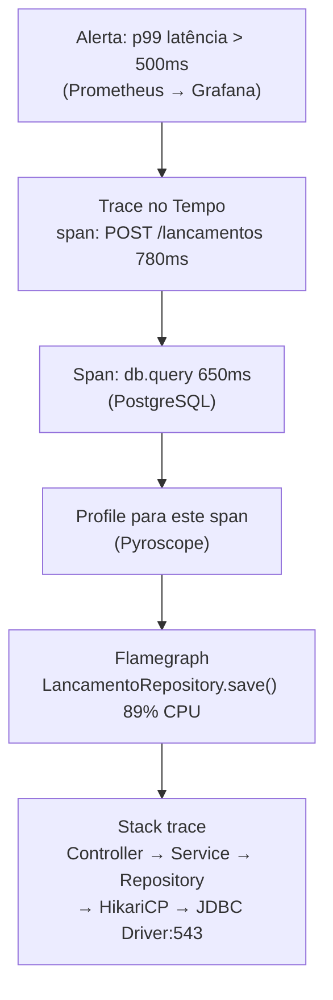

---
tags:
  - observabilidade
  - slo
  - monitoramento
---

# Observabilidade e Monitoramento

**Perspectiva:** 👁️ Arquiteto de Observabilidade · 🔐 DevSecOps  
**Framework:** C4 L2 (deployment view com componentes de observabilidade)  
**Requisitos:** [NFR-04](../negocio/requisitos.md#nfr-04), [NFR-02](../negocio/requisitos.md#nfr-02), [NFR-06](../negocio/requisitos.md#nfr-06)  
**Decisão:** [ADR-015](../adr/ADR-015-observabilidade.md)

---

## Arquitetura do Pipeline — Componentes por Papel



| Papel | Componentes | Responsabilidade |
|-------|-------------|-----------------|
| **Fontes** | Serviços de aplicação, infraestrutura | Geram os dados — não sabem para onde vão |
| **Instrumentação** | OTEL SDK, Pyroscope SDK | Captura embutida no processo — zero impacto no domínio |
| **Agentes** | Promtail, exporters, self-expose | Coletam de fora do processo — sem mudança de código |
| **Pipeline** | OTEL Collector, Promtail stages | Processa, enriquece, redacta PII e roteia por sinal |
| **Backends** | Prometheus, Loki, Tempo, Pyroscope | Armazenam por tipo de dado — cada um otimizado para seu sinal |
| **Alertas** | Alertmanager | Agrega, deduplica e roteia notificações |
| **Visualização** | Grafana | Correlação entre todos os sinais numa única UI |

> O OTEL Collector é o único componente que vê todos os três sinais de aplicação (traces, métricas, logs). É ali que o mascaramento de PII e o enriquecimento com atributos de ambiente acontecem de forma centralizada — sem tocar o código dos serviços.

## Stack

| Porta local | Container | Papel | Pilar |
|-------------|-----------|-------|-------|
| `:3000` | `obs-grafana` | UI unificada — dashboards, Explore, correlação | Visualização |
| `:9090` | `obs-prometheus` | Métricas + avaliação de regras de alerta | Métricas |
| `:9093` | `obs-alertmanager` | Roteamento de alertas → Telegram / Slack / PagerDuty | Alertas |
| `:3100` | `obs-loki` | Logs | Logs |
| `:3200` | `obs-tempo` | Traces distribuídos | Traces |
| `:4040` | `obs-pyroscope` | Continuous profiling (drill-down até linha de código) | Profiles |
| `:4317 / :4318` | `obs-otel-collector` | Pipeline OTLP — recebe, processa, roteia | Pipeline |
| `:9115` | `obs-blackbox` | Probes sintéticos de uptime (7 endpoints monitorados) | Uptime |
| `:9001` | `dev-portainer` | Gestão visual dos containers | Dev |

---

## Pilar 1 — Logs Estruturados

Todos os logs devem ser emitidos em **JSON estruturado** com campos obrigatórios:

```json
{
  "timestamp":     "2026-05-09T14:30:00.123Z",
  "level":         "INFO",
  "service":       "lancamentos",
  "trace_id":      "4bf92f3577b34da6a3ce929d0e0e4736",
  "span_id":       "00f067aa0ba902b7",
  "message":       "lançamento registrado",
  "lancamento_id": "7f3b9a10-1c2d-4e5f-8a9b-0c1d2e3f4a5b",
  "tipo":          "credito",
  "valor":         150.00,
  "operador_id":   "usr_7f3b9a10",
  "duracao_ms":    12
}
```

**Campos obrigatórios em toda linha de log:**

| Campo | Tipo | Origem |
|-------|------|--------|
| `timestamp` | ISO 8601 UTC | Framework de log |
| `level` | DEBUG/INFO/WARN/ERROR | Aplicação |
| `service` | string | Variável `OTEL_SERVICE_NAME` |
| `trace_id` | hex 32 chars | OTEL SDK — injetado automaticamente dentro de spans |
| `span_id` | hex 16 chars | OTEL SDK — injetado automaticamente dentro de spans |
| `message` | string | Aplicação |

!!! warning "Redação de PII"
    Antes de persistir no Loki, todos os logs passam por mascaramento de CPF, CNPJ, e-mail e cartão de crédito — tanto via OTEL Collector (logs OTLP) quanto via Promtail (stdout Docker). Ver [ADR-016](../adr/ADR-016-redacao-pii-logs.md).

**Eventos que sempre geram log:**

| Evento | Nível | Serviço |
|--------|-------|---------|
| Lançamento registrado | INFO | Lançamentos |
| Estorno registrado | INFO | Lançamentos |
| Validação rejeitada ([RF-05](../negocio/requisitos.md#rf-05)) | WARN | Lançamentos |
| Evento publicado no broker | DEBUG | Lançamentos |
| Evento consumido do broker | DEBUG | Consolidação |
| Saldo recalculado | INFO | Consolidação |
| Evento movido para DLQ | ERROR | Consolidação |
| Cache hit / miss | DEBUG | Consolidação |

---

## Pilar 2 — Métricas

### Métricas de negócio

| Métrica | Tipo | Labels | Descrição |
|---------|------|--------|-----------|
| `lancamentos_registrados_total` | Counter | `tipo`, `status` | Total de lançamentos registrados |
| `lancamentos_valor_total` | Counter | `tipo` | Valor acumulado em BRL |
| `eventos_publicados_total` | Counter | `tipo_evento` | Eventos publicados pelo Outbox Relay |
| `eventos_consumidos_total` | Counter | `tipo_evento`, `status` | Eventos processados pela Consolidação |
| `eventos_dlq_total` | Counter | `fila` | Eventos que foram para DLQ |
| `consolidacao_cache_hits_total` | Counter | — | Cache hits no Redis |
| `consolidacao_cache_misses_total` | Counter | — | Cache misses no Redis |

### Métricas de infraestrutura (OTEL SDK automático)

| Métrica | Descrição |
|---------|-----------|
| `http_server_duration` | Histograma de latência por endpoint e status |
| `http_server_request_count` | Total de requisições HTTP |
| `db_client_connections_*` | Pool de conexões PostgreSQL |
| `process_runtime_*` | CPU, memória, GC |

---

## Pilar 3 — Traces Distribuídos

Cada requisição gera um trace que atravessa todos os componentes. O `trace_id` é propagado via header `traceparent` (W3C Trace Context) em HTTP e como header de mensagem AMQP.

### Fluxo de um lançamento — trace completo



O mesmo `trace_id` percorre toda a cadeia — do HTTP request ao evento assíncrono — permitindo reconstruir o caminho completo no Tempo e correlacionar com os logs do Loki.

---

## Pilar 4 — Continuous Profiling

Logs, métricas e traces identificam *que* está lento e *onde*. Profiles respondem *por quê*: qual função, qual linha de código, quanto de CPU ou memória.

**Componente:** Pyroscope (`:4040`) — backend de continuous profiling da Grafana, integrado nativamente ao Grafana como datasource.

### Fluxo de drill-down: trace → linha de código



Ao clicar em **"Profile for this span"** no Tempo, o Grafana abre o Pyroscope filtrado pelo mesmo intervalo de tempo do span — mostrando o flamegraph de exatamente o que a aplicação estava executando durante aquela requisição lenta.

### Integração com o OTEL SDK

O Pyroscope usa um SDK separado por linguagem que envia profiles continuamente — sem aguardar uma requisição específica:

| Linguagem | SDK | O que coleta |
|-----------|-----|-------------|
| Java | `io.pyroscope:agent` | CPU (async-profiler), heap, wall-clock |
| Python | `pyroscope-io` | CPU, memory |
| Go | `github.com/grafana/pyroscope-go` | CPU (pprof), goroutines, mutex |
| Node.js | `@pyroscope/nodejs` | CPU, heap |

O SDK injeta o `profile_id` correlacionado com o `trace_id` do OTEL — isso é o que permite a navegação direta de um span para o flamegraph correspondente.

**Configuração mínima (exemplo Java):**

```java
// Na inicialização do serviço
PyroscopeAgent.start(
    new Config.Builder()
        .setApplicationName("lancamentos")
        .setProfilingEvent(EventType.ITIMER)
        .setServerAddress("http://pyroscope:4040")
        .setLabels(Map.of(
            "environment", System.getenv("ENVIRONMENT"),
            "version",     System.getenv("APP_VERSION")
        ))
        .build()
);
```

A decisão da linguagem de implementação (Etapa 7) determina qual SDK será usado — a configuração do Pyroscope e do Grafana já estão prontas.

### Futuro: OTEL Profiling Signal

O OpenTelemetry está padronizando um sinal nativo de profiling (especificação em beta). Quando estabilizar, o pipeline será:

```
OTEL SDK (profiling) → OTEL Collector → Pyroscope
```

…eliminando o SDK separado do Pyroscope e unificando toda a telemetria no mesmo pipeline.

---

## SLOs

### Serviço de Lançamentos

| ID | SLI | SLO | Janela |
|----|-----|-----|--------|
| SLO-01 | Taxa de sucesso `POST /lancamentos` | ≥ 99,5% | 30 dias rolling |
| SLO-02 | Latência p99 `POST /lancamentos` | < 500 ms | 30 dias rolling |
| SLO-03 | Taxa de sucesso `GET /lancamentos` | ≥ 99,0% | 30 dias rolling |

### Serviço de Consolidação

| ID | SLI | SLO | Janela |
|----|-----|-----|--------|
| SLO-04 | Taxa de sucesso `GET /consolidacao/{data}` | ≥ 99,0% | 30 dias rolling |
| SLO-05 | Latência p99 `GET /consolidacao/{data}` (cache hit) | < 100 ms | 30 dias rolling |
| SLO-06 | Throughput sem degradação ([NFR-02](../negocio/requisitos.md#nfr-02)) | ≥ 50 req/s com < 5% erros | Janela 1h de pico |

### Pipeline de Eventos

| ID | SLI | SLO | Janela |
|----|-----|-----|--------|
| SLO-07 | Tempo `LancamentoRegistrado` → saldo atualizado | < 30 s (p99) | 7 dias rolling |
| SLO-08 | Eventos na DLQ | 0 eventos/hora | Contínuo |

**Error budget:** cada SLO define o budget implícito. SLO-01 (99,5%) permite ~3,6h de falhas em 30 dias. Ao consumir o budget, novos deploys são pausados até recuperação.

---

## Estratégia de Alertas

| Severidade | Critério | Canal (dev) | Canal (prod) | Resposta |
|------------|----------|------------|-------------|---------|
| **Critical** | Burn rate > 14,4× do SLO (budget consumido em < 1h) | Telegram 🔴 | PagerDuty + Slack | Imediata — pausar deploys |
| **Warning** | Burn rate > 1× (consumindo budget acima do normal) | Telegram ⚠️ | Slack `#alertas-infra` | Investigar no turno |
| **Info** | Anomalia sem impacto em SLO ainda | Telegram ℹ️ | Slack `#alertas-info` | Monitorar |

> **Dev:** Telegram ativo — bot `@PerimArchChalenger_bot` configurado em `observability/alertmanager.yml` (arquivo fora do git por conter token). Receivers: `telegram-warning` (padrão), `telegram-critical`, `telegram-info`.  
> **Produção:** adicionar receivers Slack + PagerDuty no `alertmanager.yml` com `SLACK_WEBHOOK_URL` e `PAGERDUTY_INTEGRATION_KEY`.

**Verificar alertas disparados:**

| Onde | Como |
|------|------|
| Grafana | Alerting → Alert rules → filtrar por `Mimir / Prometheus` |
| Grafana | Alerting → Active notifications |
| Alertmanager UI | `http://localhost:9093` → aba Alerts |
| Métricas | `alertmanager_notifications_total{integration="telegram"}` no Prometheus |

**Regras críticas (PromQL):**

```promql
# Taxa de erro acima do SLO-01
sum(rate(http_server_request_count{service="lancamentos",http_status_code=~"5.."}[5m]))
/
sum(rate(http_server_request_count{service="lancamentos"}[5m])) > 0.005

# DLQ com mensagens — SLO-08
rabbitmq_queue_messages{queue=~".*dlq.*"} > 0

# Latência p99 degradando — SLO-05
histogram_quantile(0.99,
  sum(rate(http_server_duration_bucket{service="consolidado"}[5m])) by (le)
) > 0.1

# Redis com evictions (pressão de memória)
increase(redis_evicted_keys_total[5m]) > 0
```

---

## Contrato de Health Endpoints

**Requisito para Etapa 7:** todo serviço deve expor dois endpoints padronizados usados pelo Blackbox Exporter (probes sintéticos), pelo Kubernetes (liveness/readiness probes) e pelo docker-compose `healthcheck`.

### `GET /health/live` — Liveness

O processo está vivo? Nunca checa dependências externas — se o processo responde, retorna 200.

```json
HTTP 200
{ "status": "UP" }
```

### `GET /health/ready` — Readiness

O serviço está pronto para receber tráfego? Checa conexões com PostgreSQL e RabbitMQ.

```json
HTTP 200 — pronto
{
  "status": "UP",
  "checks": {
    "database": "UP",
    "broker":   "UP"
  }
}

HTTP 503 — não pronto (kubernetes não roteia tráfego)
{
  "status": "DOWN",
  "checks": {
    "database": "DOWN",
    "broker":   "UP"
  }
}
```

| Probe | Endpoint | Falha → | K8s comportamento |
|-------|----------|---------|-------------------|
| Liveness | `/health/live` | Reinicia o container | Evita containers zumbis |
| Readiness | `/health/ready` | Remove do load balancer | Evita tráfego em container inicializando |

---

## Logs de Eventos de Segurança

O Keycloak emite eventos de segurança nos logs do container — capturados pelo Promtail e enviados ao Loki automaticamente. **Configuração já aplicada via [`keycloak/realm-fluxocaixa.json`](../../keycloak/realm-fluxocaixa.json) — nenhuma ação manual no Admin Console necessária.**

| Campo configurado | Valor | Efeito |
|-------------------|-------|--------|
| `eventsEnabled` | `true` | Captura eventos de usuário |
| `adminEventsEnabled` | `true` | Captura ações administrativas |
| `adminEventsDetailsEnabled` | `true` | Inclui payload das mudanças |
| `eventsListeners` | `["jboss-logging"]` | Redireciona para stdout → Promtail → Loki |
| `eventsExpiration` | `604800` (7 dias) | Retenção interna no Keycloak |

**Eventos capturados:** `LOGIN`, `LOGIN_ERROR`, `LOGOUT`, `CODE_TO_TOKEN`, `CLIENT_LOGIN`, `REFRESH_TOKEN`, `INTROSPECT_TOKEN`, `REGISTER`, `RESET_PASSWORD`, `TOKEN_EXCHANGE` — e variantes `_ERROR` de cada um.

O formato de saída do `jboss-logging` inclui `sessionId` automaticamente:

```
WARN [org.keycloak.events] type=LOGIN_ERROR, realmId=fluxocaixa,
  clientId=frontend-app, userId=null, ipAddress=192.168.1.1,
  sessionId=a3f8..., error=invalid_user_credentials, username=caixa.demo
```

!!! warning "Re-import do realm"
    O Keycloak usa estratégia `IGNORE_EXISTING` no import — se o realm já existia antes desta configuração, ela não será aplicada automaticamente. Para forçar o re-import, recrie o volume:
    ```bash
    docker compose stop gw-keycloak
    docker volume rm desafio-carrefour_keycloak-data
    docker compose up -d gw-keycloak
    ```

No Grafana, consulte os eventos de segurança:

```logql
# Todos os eventos de segurança do Keycloak
{service="keycloak"} |= "org.keycloak.events"

# Apenas falhas de login
{service="keycloak"} |= "LOGIN_ERROR"

# Falhas por IP (detectar força bruta)
{service="keycloak"} |= "LOGIN_ERROR" | regexp `ipAddress=(?P<ip>[0-9.]+)` | line_format "{{.ip}}"

# Ações administrativas
{service="keycloak"} |= "ADMIN" |= "operationType"
```

---

## Dashboards disponíveis

| Dashboard | Tags | O que mostra | Dados disponíveis |
|-----------|------|-------------|------------------|
| [Plataforma](http://localhost:3000/d/plataforma-fluxo-de-caixa) | `plataforma` | Uptime (7 probes), PostgreSQL, Redis, RabbitMQ, Traefik | ✅ Agora |
| [Logs Centralizados](http://localhost:3000/d/logs-fluxo-de-caixa) | `logs` | Volume por serviço, erros, stream filtrado, correlação por trace_id | ✅ Agora |
| [Infraestrutura](http://localhost:3000/d/infraestrutura-e28094-fluxo-de-caixa) | `infra` | Throughput, taxa de erro, latência p50/p95/p99 por serviço | 🟡 Parcial |
| [Negócio](http://localhost:3000/d/negocio-e28094-fluxo-de-caixa) | `negocio` | Lançamentos/hora, BRL acumulado, DLQ, cache hit rate | 🟡 Parcial |
| [SLOs](http://localhost:3000/d/slos-e28094-fluxo-de-caixa) | `slo` | Burn rate, error budget consumido por SLO | ✅ Funcional |

> 🟡 Parcial = painel Taxa de Erro corrigido (`or vector(0)`); painéis de latência e lançamentos requerem tráfego k6 para popular.

---

## Como usar localmente

```bash
# Subir o stack completo
docker compose up -d

# Ver status de todos os containers
docker ps --format "table {{.Names}}\t{{.Status}}"

# Verificar targets do Prometheus (deve mostrar 14 UP)
curl -s http://localhost:9090/api/v1/targets | \
  python3 -c "import sys,json; [print(t['health'], t['labels']['job']) \
  for t in json.load(sys.stdin)['data']['activeTargets']]"
```

Após subir, acesse:

- **Grafana:** `http://localhost:3000` — 5 dashboards provisionados, datasources: Prometheus, Loki, Tempo, Pyroscope, Alertmanager
- **Prometheus:** `http://localhost:9090` — 14 targets ativos
- **Alertmanager:** `http://localhost:9093` — receivers Telegram configurados
- **Portainer:** `http://localhost:9001` — gestão visual dos 21 containers
- **RabbitMQ:** `http://localhost:15672` — usuário `fluxocaixa` / senha no `.env`

**Logs já disponíveis no Loki** (via Promtail) assim que os containers sobem:

```logql
# Todos os logs da stack
{service=~".+"}

# Logs do Keycloak
{service="keycloak"}

# Logs do RabbitMQ
{service="rabbitmq"}

# Apenas erros
{service=~".+"} |= "ERROR"
```

No Grafana, a correlação entre pilares já está configurada:

1. `Explore` → `Loki` → buscar `{service="keycloak"}` — logs imediatos sem OTEL SDK
2. `Explore` → `Tempo` → buscar traces por `service.name` — disponível após Etapa 7
3. Clicar em um trace → "Logs for this span" → Loki filtrado por `trace_id`
4. "Metrics for this span" → Prometheus no período do trace
5. "Profile for this span" → Pyroscope flamegraph (linha de código)
