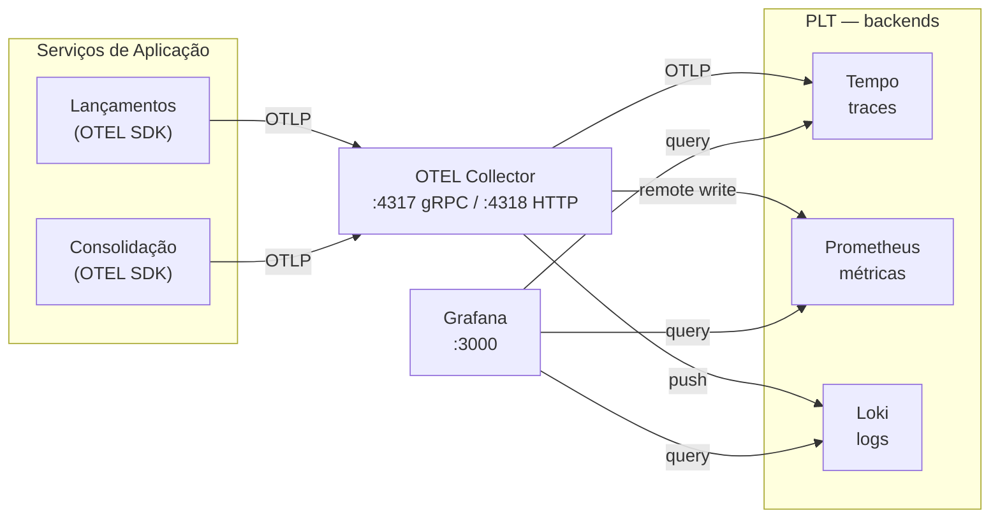
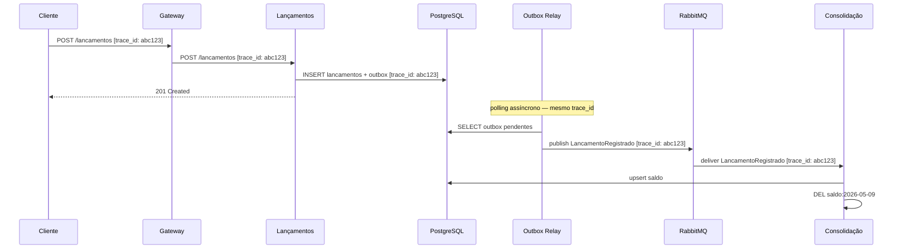

---
tags:
  - observabilidade
  - slo
  - monitoramento
---

# Observabilidade e Monitoramento

**Perspectiva:** 👁️ Arquiteto de Observabilidade · 🔐 DevSecOps  
**Framework:** C4 L2 (deployment view com componentes de observabilidade)  
**Requisitos:** [NFR-04](../negocio/requisitos.md#nfr-04), [NFR-02](../negocio/requisitos.md#nfr-02), [NFR-06](../negocio/requisitos.md#nfr-06)  
**Decisão:** [ADR-015](../adr/ADR-015-observabilidade.md)

---

## Stack



| Porta local | Componente | Função |
|-------------|-----------|--------|
| `:3000` | Grafana | UI unificada — traces, métricas, logs, alertas |
| `:4317` | OTEL Collector (gRPC) | Recebe telemetria dos serviços |
| `:4318` | OTEL Collector (HTTP) | Recebe telemetria (alternativa gRPC) |
| `:9090` | Prometheus | Query de métricas (e remote write receiver) |
| `:3100` | Loki | Ingestão e query de logs |
| `:3200` | Tempo | Ingestão e query de traces |

---

## Pilar 1 — Logs Estruturados

Todos os logs devem ser emitidos em **JSON estruturado** com campos obrigatórios:

```json
{
  "timestamp":     "2026-05-09T14:30:00.123Z",
  "level":         "INFO",
  "service":       "lancamentos",
  "trace_id":      "4bf92f3577b34da6a3ce929d0e0e4736",
  "span_id":       "00f067aa0ba902b7",
  "message":       "lançamento registrado",
  "lancamento_id": "7f3b9a10-1c2d-4e5f-8a9b-0c1d2e3f4a5b",
  "tipo":          "credito",
  "valor":         150.00,
  "operador_id":   "usr_7f3b9a10",
  "duracao_ms":    12
}
```

**Campos obrigatórios em toda linha de log:**

| Campo | Tipo | Origem |
|-------|------|--------|
| `timestamp` | ISO 8601 UTC | Framework de log |
| `level` | DEBUG/INFO/WARN/ERROR | Aplicação |
| `service` | string | Variável `OTEL_SERVICE_NAME` |
| `trace_id` | hex 32 chars | OTEL SDK — injetado automaticamente dentro de spans |
| `span_id` | hex 16 chars | OTEL SDK — injetado automaticamente dentro de spans |
| `message` | string | Aplicação |

**Eventos que sempre geram log:**

| Evento | Nível | Serviço |
|--------|-------|---------|
| Lançamento registrado | INFO | Lançamentos |
| Estorno registrado | INFO | Lançamentos |
| Validação rejeitada ([RF-05](../negocio/requisitos.md#rf-05)) | WARN | Lançamentos |
| Evento publicado no broker | DEBUG | Lançamentos |
| Evento consumido do broker | DEBUG | Consolidação |
| Saldo recalculado | INFO | Consolidação |
| Evento movido para DLQ | ERROR | Consolidação |
| Cache hit / miss | DEBUG | Consolidação |

---

## Pilar 2 — Métricas

### Métricas de negócio

| Métrica | Tipo | Labels | Descrição |
|---------|------|--------|-----------|
| `lancamentos_registrados_total` | Counter | `tipo`, `status` | Total de lançamentos registrados |
| `lancamentos_valor_total` | Counter | `tipo` | Valor acumulado em BRL |
| `eventos_publicados_total` | Counter | `tipo_evento` | Eventos publicados pelo Outbox Relay |
| `eventos_consumidos_total` | Counter | `tipo_evento`, `status` | Eventos processados pela Consolidação |
| `eventos_dlq_total` | Counter | `fila` | Eventos que foram para DLQ |
| `consolidacao_cache_hits_total` | Counter | — | Cache hits no Redis |
| `consolidacao_cache_misses_total` | Counter | — | Cache misses no Redis |

### Métricas de infraestrutura (OTEL SDK automático)

| Métrica | Descrição |
|---------|-----------|
| `http_server_duration` | Histograma de latência por endpoint e status |
| `http_server_request_count` | Total de requisições HTTP |
| `db_client_connections_*` | Pool de conexões PostgreSQL |
| `process_runtime_*` | CPU, memória, GC |

---

## Pilar 3 — Traces Distribuídos

Cada requisição gera um trace que atravessa todos os componentes. O `trace_id` é propagado via header `traceparent` (W3C Trace Context) em HTTP e como header de mensagem AMQP.

### Fluxo de um lançamento — trace completo



O mesmo `trace_id` percorre toda a cadeia — do HTTP request ao evento assíncrono — permitindo reconstruir o caminho completo no Tempo e correlacionar com os logs do Loki.

---

## SLOs

### Serviço de Lançamentos

| ID | SLI | SLO | Janela |
|----|-----|-----|--------|
| SLO-01 | Taxa de sucesso `POST /lancamentos` | ≥ 99,5% | 30 dias rolling |
| SLO-02 | Latência p99 `POST /lancamentos` | < 500 ms | 30 dias rolling |
| SLO-03 | Taxa de sucesso `GET /lancamentos` | ≥ 99,0% | 30 dias rolling |

### Serviço de Consolidação

| ID | SLI | SLO | Janela |
|----|-----|-----|--------|
| SLO-04 | Taxa de sucesso `GET /consolidacao/{data}` | ≥ 99,0% | 30 dias rolling |
| SLO-05 | Latência p99 `GET /consolidacao/{data}` (cache hit) | < 100 ms | 30 dias rolling |
| SLO-06 | Throughput sem degradação ([NFR-02](../negocio/requisitos.md#nfr-02)) | ≥ 50 req/s com < 5% erros | Janela 1h de pico |

### Pipeline de Eventos

| ID | SLI | SLO | Janela |
|----|-----|-----|--------|
| SLO-07 | Tempo `LancamentoRegistrado` → saldo atualizado | < 30 s (p99) | 7 dias rolling |
| SLO-08 | Eventos na DLQ | 0 eventos/hora | Contínuo |

**Error budget:** cada SLO define o budget implícito. SLO-01 (99,5%) permite ~3,6h de falhas em 30 dias. Ao consumir o budget, novos deploys são pausados até recuperação.

---

## Estratégia de Alertas

| Severidade | Critério | Canal | Resposta |
|------------|----------|-------|---------|
| **Critical** | Burn rate > 14,4× do SLO (budget consumido em < 1h) | PagerDuty | Imediata — pausar deploys |
| **Warning** | Burn rate > 1× (consumindo budget acima do normal) | Slack `#alertas-infra` | Investigar no turno |
| **Info** | Anomalia sem impacto em SLO ainda | Slack `#alertas-info` | Monitorar |

**Regras críticas (PromQL):**

```promql
# Taxa de erro acima do SLO-01
sum(rate(http_server_request_count{service="lancamentos",http_status_code=~"5.."}[5m]))
/
sum(rate(http_server_request_count{service="lancamentos"}[5m])) > 0.005

# DLQ com mensagens — SLO-08
rabbitmq_queue_messages{queue=~".*dlq.*"} > 0

# Latência p99 degradando — SLO-05
histogram_quantile(0.99,
  sum(rate(http_server_duration_bucket{service="consolidado"}[5m])) by (le)
) > 0.1

# Redis com evictions (pressão de memória)
increase(redis_evicted_keys_total[5m]) > 0
```

---

## Como usar localmente

```bash
# Subir o stack de observabilidade
docker compose up otel-collector prometheus loki tempo grafana -d

# Verificar saúde dos componentes
docker compose ps otel-collector prometheus loki tempo grafana
```

Após subir, acesse:

- **Grafana:** `http://localhost:3000` — datasources já provisionados (Prometheus, Loki, Tempo)
- **Prometheus:** `http://localhost:9090`

No Grafana, a correlação entre pilares já está configurada:

1. `Explore` → `Tempo` → buscar traces por `service.name`
2. Clicar em um trace → ver os spans
3. "Logs for this span" → abre Loki filtrado pelo `trace_id`
4. "Metrics for this span" → abre Prometheus no período do trace
