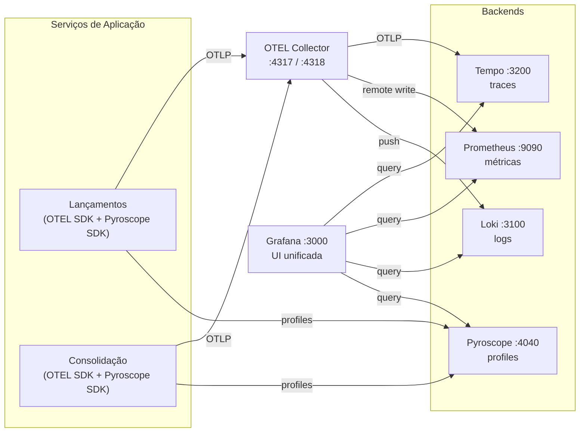
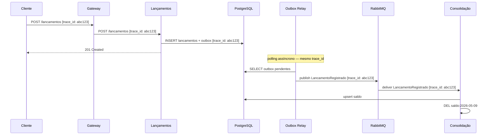
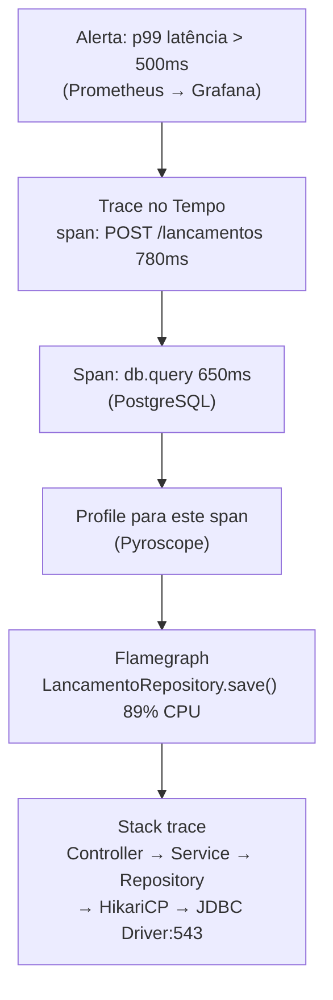

---
tags:
  - observabilidade
  - slo
  - monitoramento
---

# Observabilidade e Monitoramento

**Perspectiva:** 👁️ Arquiteto de Observabilidade · 🔐 DevSecOps  
**Framework:** C4 L2 (deployment view com componentes de observabilidade)  
**Requisitos:** [NFR-04](../negocio/requisitos.md#nfr-04), [NFR-02](../negocio/requisitos.md#nfr-02), [NFR-06](../negocio/requisitos.md#nfr-06)  
**Decisão:** [ADR-015](../adr/ADR-015-observabilidade.md)

---

## Stack



| Porta local | Componente | Pilar |
|-------------|-----------|-------|
| `:3000` | Grafana | UI unificada — correlação entre todos os pilares |
| `:4317 / :4318` | OTEL Collector | Pipeline de traces, métricas e logs |
| `:9090` | Prometheus | Métricas |
| `:3100` | Loki | Logs |
| `:3200` | Tempo | Traces |
| `:4040` | Pyroscope | Profiles (drill-down até linha de código) |

---

## Pilar 1 — Logs Estruturados

Todos os logs devem ser emitidos em **JSON estruturado** com campos obrigatórios:

```json
{
  "timestamp":     "2026-05-09T14:30:00.123Z",
  "level":         "INFO",
  "service":       "lancamentos",
  "trace_id":      "4bf92f3577b34da6a3ce929d0e0e4736",
  "span_id":       "00f067aa0ba902b7",
  "message":       "lançamento registrado",
  "lancamento_id": "7f3b9a10-1c2d-4e5f-8a9b-0c1d2e3f4a5b",
  "tipo":          "credito",
  "valor":         150.00,
  "operador_id":   "usr_7f3b9a10",
  "duracao_ms":    12
}
```

**Campos obrigatórios em toda linha de log:**

| Campo | Tipo | Origem |
|-------|------|--------|
| `timestamp` | ISO 8601 UTC | Framework de log |
| `level` | DEBUG/INFO/WARN/ERROR | Aplicação |
| `service` | string | Variável `OTEL_SERVICE_NAME` |
| `trace_id` | hex 32 chars | OTEL SDK — injetado automaticamente dentro de spans |
| `span_id` | hex 16 chars | OTEL SDK — injetado automaticamente dentro de spans |
| `message` | string | Aplicação |

**Eventos que sempre geram log:**

| Evento | Nível | Serviço |
|--------|-------|---------|
| Lançamento registrado | INFO | Lançamentos |
| Estorno registrado | INFO | Lançamentos |
| Validação rejeitada ([RF-05](../negocio/requisitos.md#rf-05)) | WARN | Lançamentos |
| Evento publicado no broker | DEBUG | Lançamentos |
| Evento consumido do broker | DEBUG | Consolidação |
| Saldo recalculado | INFO | Consolidação |
| Evento movido para DLQ | ERROR | Consolidação |
| Cache hit / miss | DEBUG | Consolidação |

---

## Pilar 2 — Métricas

### Métricas de negócio

| Métrica | Tipo | Labels | Descrição |
|---------|------|--------|-----------|
| `lancamentos_registrados_total` | Counter | `tipo`, `status` | Total de lançamentos registrados |
| `lancamentos_valor_total` | Counter | `tipo` | Valor acumulado em BRL |
| `eventos_publicados_total` | Counter | `tipo_evento` | Eventos publicados pelo Outbox Relay |
| `eventos_consumidos_total` | Counter | `tipo_evento`, `status` | Eventos processados pela Consolidação |
| `eventos_dlq_total` | Counter | `fila` | Eventos que foram para DLQ |
| `consolidacao_cache_hits_total` | Counter | — | Cache hits no Redis |
| `consolidacao_cache_misses_total` | Counter | — | Cache misses no Redis |

### Métricas de infraestrutura (OTEL SDK automático)

| Métrica | Descrição |
|---------|-----------|
| `http_server_duration` | Histograma de latência por endpoint e status |
| `http_server_request_count` | Total de requisições HTTP |
| `db_client_connections_*` | Pool de conexões PostgreSQL |
| `process_runtime_*` | CPU, memória, GC |

---

## Pilar 3 — Traces Distribuídos

Cada requisição gera um trace que atravessa todos os componentes. O `trace_id` é propagado via header `traceparent` (W3C Trace Context) em HTTP e como header de mensagem AMQP.

### Fluxo de um lançamento — trace completo



O mesmo `trace_id` percorre toda a cadeia — do HTTP request ao evento assíncrono — permitindo reconstruir o caminho completo no Tempo e correlacionar com os logs do Loki.

---

## Pilar 4 — Continuous Profiling

Logs, métricas e traces identificam *que* está lento e *onde*. Profiles respondem *por quê*: qual função, qual linha de código, quanto de CPU ou memória.

**Componente:** Pyroscope (`:4040`) — backend de continuous profiling da Grafana, integrado nativamente ao Grafana como datasource.

### Fluxo de drill-down: trace → linha de código



Ao clicar em **"Profile for this span"** no Tempo, o Grafana abre o Pyroscope filtrado pelo mesmo intervalo de tempo do span — mostrando o flamegraph de exatamente o que a aplicação estava executando durante aquela requisição lenta.

### Integração com o OTEL SDK

O Pyroscope usa um SDK separado por linguagem que envia profiles continuamente — sem aguardar uma requisição específica:

| Linguagem | SDK | O que coleta |
|-----------|-----|-------------|
| Java | `io.pyroscope:agent` | CPU (async-profiler), heap, wall-clock |
| Python | `pyroscope-io` | CPU, memory |
| Go | `github.com/grafana/pyroscope-go` | CPU (pprof), goroutines, mutex |
| Node.js | `@pyroscope/nodejs` | CPU, heap |

O SDK injeta o `profile_id` correlacionado com o `trace_id` do OTEL — isso é o que permite a navegação direta de um span para o flamegraph correspondente.

**Configuração mínima (exemplo Java):**

```java
// Na inicialização do serviço
PyroscopeAgent.start(
    new Config.Builder()
        .setApplicationName("lancamentos")
        .setProfilingEvent(EventType.ITIMER)
        .setServerAddress("http://pyroscope:4040")
        .setLabels(Map.of(
            "environment", System.getenv("ENVIRONMENT"),
            "version",     System.getenv("APP_VERSION")
        ))
        .build()
);
```

A decisão da linguagem de implementação (Etapa 7) determina qual SDK será usado — a configuração do Pyroscope e do Grafana já estão prontas.

### Futuro: OTEL Profiling Signal

O OpenTelemetry está padronizando um sinal nativo de profiling (especificação em beta). Quando estabilizar, o pipeline será:

```
OTEL SDK (profiling) → OTEL Collector → Pyroscope
```

…eliminando o SDK separado do Pyroscope e unificando toda a telemetria no mesmo pipeline.

---

## SLOs

### Serviço de Lançamentos

| ID | SLI | SLO | Janela |
|----|-----|-----|--------|
| SLO-01 | Taxa de sucesso `POST /lancamentos` | ≥ 99,5% | 30 dias rolling |
| SLO-02 | Latência p99 `POST /lancamentos` | < 500 ms | 30 dias rolling |
| SLO-03 | Taxa de sucesso `GET /lancamentos` | ≥ 99,0% | 30 dias rolling |

### Serviço de Consolidação

| ID | SLI | SLO | Janela |
|----|-----|-----|--------|
| SLO-04 | Taxa de sucesso `GET /consolidacao/{data}` | ≥ 99,0% | 30 dias rolling |
| SLO-05 | Latência p99 `GET /consolidacao/{data}` (cache hit) | < 100 ms | 30 dias rolling |
| SLO-06 | Throughput sem degradação ([NFR-02](../negocio/requisitos.md#nfr-02)) | ≥ 50 req/s com < 5% erros | Janela 1h de pico |

### Pipeline de Eventos

| ID | SLI | SLO | Janela |
|----|-----|-----|--------|
| SLO-07 | Tempo `LancamentoRegistrado` → saldo atualizado | < 30 s (p99) | 7 dias rolling |
| SLO-08 | Eventos na DLQ | 0 eventos/hora | Contínuo |

**Error budget:** cada SLO define o budget implícito. SLO-01 (99,5%) permite ~3,6h de falhas em 30 dias. Ao consumir o budget, novos deploys são pausados até recuperação.

---

## Estratégia de Alertas

| Severidade | Critério | Canal | Resposta |
|------------|----------|-------|---------|
| **Critical** | Burn rate > 14,4× do SLO (budget consumido em < 1h) | PagerDuty | Imediata — pausar deploys |
| **Warning** | Burn rate > 1× (consumindo budget acima do normal) | Slack `#alertas-infra` | Investigar no turno |
| **Info** | Anomalia sem impacto em SLO ainda | Slack `#alertas-info` | Monitorar |

**Regras críticas (PromQL):**

```promql
# Taxa de erro acima do SLO-01
sum(rate(http_server_request_count{service="lancamentos",http_status_code=~"5.."}[5m]))
/
sum(rate(http_server_request_count{service="lancamentos"}[5m])) > 0.005

# DLQ com mensagens — SLO-08
rabbitmq_queue_messages{queue=~".*dlq.*"} > 0

# Latência p99 degradando — SLO-05
histogram_quantile(0.99,
  sum(rate(http_server_duration_bucket{service="consolidado"}[5m])) by (le)
) > 0.1

# Redis com evictions (pressão de memória)
increase(redis_evicted_keys_total[5m]) > 0
```

---

## Contrato de Health Endpoints

**Requisito para Etapa 7:** todo serviço deve expor dois endpoints padronizados usados pelo Blackbox Exporter (probes sintéticos), pelo Kubernetes (liveness/readiness probes) e pelo docker-compose `healthcheck`.

### `GET /health/live` — Liveness

O processo está vivo? Nunca checa dependências externas — se o processo responde, retorna 200.

```json
HTTP 200
{ "status": "UP" }
```

### `GET /health/ready` — Readiness

O serviço está pronto para receber tráfego? Checa conexões com PostgreSQL e RabbitMQ.

```json
HTTP 200 — pronto
{
  "status": "UP",
  "checks": {
    "database": "UP",
    "broker":   "UP"
  }
}

HTTP 503 — não pronto (kubernetes não roteia tráfego)
{
  "status": "DOWN",
  "checks": {
    "database": "DOWN",
    "broker":   "UP"
  }
}
```

| Probe | Endpoint | Falha → | K8s comportamento |
|-------|----------|---------|-------------------|
| Liveness | `/health/live` | Reinicia o container | Evita containers zumbis |
| Readiness | `/health/ready` | Remove do load balancer | Evita tráfego em container inicializando |

---

## Logs de Eventos de Segurança

O Keycloak emite eventos de segurança (logins com falha, emissão de tokens, brute force detectado) nos logs do container — capturados pelo Promtail e enviados ao Loki automaticamente.

Para correlacionar eventos de autenticação com traces de requisição, configure o Keycloak para incluir o `session_id` nos logs de eventos:

```
Admin Console → fluxocaixa → Events → Config
  ✅ Save Events: ON
  ✅ Save Admin Events: ON
  Event Types: LOGIN_ERROR, BRUTE_FORCE, TOKEN_ISSUE, LOGOUT
```

No Grafana, consulte os eventos de segurança diretamente:

```logql
{service="keycloak"} |= "LOGIN_ERROR" | json
```

---

## Como usar localmente

```bash
# Subir o stack completo de observabilidade
docker compose up otel-collector prometheus loki promtail tempo grafana \
                  pyroscope alertmanager blackbox -d

# Verificar saúde dos componentes
docker compose ps otel-collector prometheus loki promtail tempo grafana \
                  pyroscope alertmanager blackbox
```

Após subir, acesse:

- **Grafana:** `http://localhost:3000` — datasources já provisionados (Prometheus, Loki, Tempo, Pyroscope)
- **Prometheus:** `http://localhost:9090` — 13 targets ativos
- **Alertmanager:** `http://localhost:9093`

**Logs já disponíveis no Loki** (via Promtail) assim que os containers sobem:

```logql
# Todos os logs da stack
{service=~".+"}

# Logs do Keycloak
{service="keycloak"}

# Logs do RabbitMQ
{service="rabbitmq"}

# Apenas erros
{service=~".+"} |= "ERROR"
```

No Grafana, a correlação entre pilares já está configurada:

1. `Explore` → `Loki` → buscar `{service="keycloak"}` — logs imediatos sem OTEL SDK
2. `Explore` → `Tempo` → buscar traces por `service.name` — disponível após Etapa 7
3. Clicar em um trace → "Logs for this span" → Loki filtrado por `trace_id`
4. "Metrics for this span" → Prometheus no período do trace
5. "Profile for this span" → Pyroscope flamegraph (linha de código)
