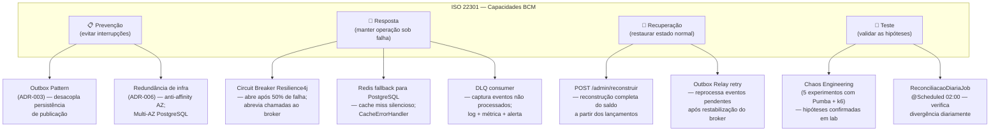

---
tags:
  - seguranca
  - resiliencia
  - continuidade
  - iso22301
  - iso31000
---

# Continuidade Operacional e Gestão de Riscos

**Perspectiva:** 🏗️ Arquiteto de Infraestrutura · ⚙️ Arquiteto de Tecnologia  
**Frameworks:** ISO 22301 (Continuidade de Negócios) · ISO 31000 (Gestão de Riscos)  
**Requisitos:** [NFR-01](../negocio/requisitos.md#nfr-01), [NFR-02](../negocio/requisitos.md#nfr-02), [NFR-03](../negocio/requisitos.md#nfr-03)

---

## ISO 22301 — Business Continuity Management

A ISO 22301 exige que organizações identifiquem ameaças às operações críticas, estabeleçam capacidade de resposta e recuperação, e **testem periodicamente** essa capacidade. Este documento mapeia os controles do sistema para os requisitos da norma.

### Operações Críticas e Objetivos de Recuperação

| Operação | RTO | RPO | Mecanismo |
|----------|-----|-----|-----------|
| Registro de lançamentos | **< 30 s** | **zero** | Outbox Pattern garante persistência antes de qualquer publicação; o serviço retorna 201 mesmo com broker indisponível |
| Consulta de saldo consolidado | **< 60 s** | **< 1 evento** | Redis cache + fallback para PostgreSQL; Circuit Breaker previne cascata |
| Atualização do saldo após lançamento | **eventual** (< 30 min aceitável) | **zero** | At-least-once delivery via RabbitMQ; Outbox Relay reprocessa pendentes após restabilização do broker |
| Recuperação catastrófica do consolidado | **< 2 h** | **zero** | `POST /admin/reconstruir` — recalcula o saldo completo iterando os lançamentos históricos |

> **RPO = zero** para lançamentos: nenhum lançamento é perdido porque a persistência no banco ocorre **antes** da publicação no broker. O Outbox Relay garante entrega mesmo que o broker fique indisponível por horas.

---

### Mapeamento de Controles ISO 22301 → Artefatos

---

### Experimentos Chaos Engineering como Evidência BCM

A norma ISO 22301 exige **evidências de teste** dos planos de continuidade. Os 5 experimentos executados com Pumba + k6 (ver [Chaos Engineering](../implementacao/caos.md)) constituem essas evidências:

| Experimento | Cenário | Resultado | Controle BCM validado |
|-------------|---------|-----------|----------------------|
| 1 | Redis indisponível | `http_req_failed < 5%` ✅ | Fallback para banco — RTO ~0 |
| 2 | RabbitMQ parado | Lançamentos: 201, circuito abre ✅ | Outbox Pattern — RPO = zero |
| 3 | Redis com 500ms de latência | `0.29%` de falha ✅ | Timeout + fallback — RTO ~0 |
| 4 | Consolidado parado | Lançamentos indiferentes ✅ | Independência NFR-01 — RTO não aplicável |
| 5 | Redis + RabbitMQ combinados | `0.05%` de falha global ✅ | Degradação previsível e recuperável |

**Frequência de teste recomendada:** trimestral para os experimentos 1–3 (Redis/RabbitMQ); semestral para o experimento 5 (falha combinada).

---

## ISO 31000 — Gestão de Riscos Operacionais { #registro-de-riscos }

### Registro de Riscos

| ID | Ameaça | Probabilidade | Impacto | Controle existente | Risco residual |
|----|--------|:---:|:---:|-------------------|:---:|
| R-01 | Falha do RabbitMQ | Médio | Alto | Outbox Pattern + Circuit Breaker (Exp. 2 ✅) | Baixo |
| R-02 | Falha do Redis | Médio | Médio | `CacheErrorHandler` — fallback silencioso (Exp. 1 ✅) | Muito baixo |
| R-03 | Falha do Consolidado | Médio | Baixo para lançamentos | Independência por design — NFR-01 (Exp. 4 ✅) | Muito baixo |
| R-04 | Corrupção do saldo consolidado | Baixo | Alto | Reconciliação diária `@Scheduled` 02:00 + `POST /admin/reconstruir` | Baixo |
| R-05 | Perda de lançamento em trânsito | Muito baixo | Crítico | Outbox append-only + at-least-once delivery (Exp. 5 ✅) | Muito baixo |
| R-06 | Reprocessamento duplicado de evento | Baixo | Alto | `INSERT … ON CONFLICT DO NOTHING` em `lancamentos_processados` | Muito baixo |
| R-07 | Comprometimento de credenciais de serviço | Baixo | Alto | Secrets Manager + rotação automática 30 dias (PostgreSQL) | Baixo |
| R-08 | CVE crítico em dependência | Médio | Alto | Trivy em cada CI run — bloqueia pipeline em CRITICAL/HIGH | Baixo |
| R-09 | Tráfego malicioso / DDoS | Médio | Alto | WAF v2 + Shield + Rate Limit por IP (CloudFront / Traefik) | Baixo |
| R-10 | Divergência de saldo não detectada | Baixo | Alto | `ReconciliacaoDiariaJob` + métrica `saldo_reconciliado_divergencias_total` | Muito baixo |

### Critérios de Avaliação

| Dimensão | Escala |
|----------|--------|
| **Probabilidade** | Muito baixo / Baixo / Médio / Alto / Muito alto |
| **Impacto** | Operacional (lentidão) → Financeiro (perda de dado) → Regulatório (não conformidade) |
| **Risco residual** | Probabilidade × Impacto após os controles existentes |

### Apetite ao Risco

> O sistema tolera **degradação parcial com disponibilidade mantida** (ex.: consolidado lento, mas acessível; lançamentos aceitos mesmo sem broker). Não tolera **perda de lançamento** ou **saldo incorreto persistido sem detecção**. Os controles R-05 e R-10 refletem diretamente esse apetite.

---

## Política de Retenção e Recuperação

| Artefato | Retenção local | Retenção produção | Mecanismo |
|----------|---------------|------------------|-----------|
| Lançamentos (PostgreSQL) | Indefinida (append-only) | Indefinida + backup automático | AWS Backup cross-region, WORM 3 dias |
| Saldo consolidado (PostgreSQL) | Indefinida | Indefinida + Multi-AZ | Reconstruível via `POST /admin/reconstruir` |
| Cache Redis | TTL 60 s (hoje) / 1 h (histórico) | AOF + snapshot | Reconstruído automaticamente ao reiniciar |
| Logs de observabilidade (Loki) | 7 dias (local) | 30 dias (CloudWatch) | S3 → IA após 90 dias |
| Outbox (eventos pendentes) | Retidos até publicação confirmada + 7 dias | Idem | `OutboxRelay.limparPublicados()` — `@Scheduled(cron="0 0 3 * * *")` |
| Eventos em DLQ | Retidos | 14 dias (SQS DLQ) | Manual via backoffice (roadmap) |
