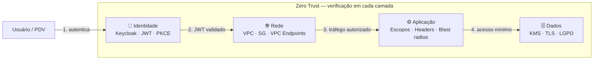
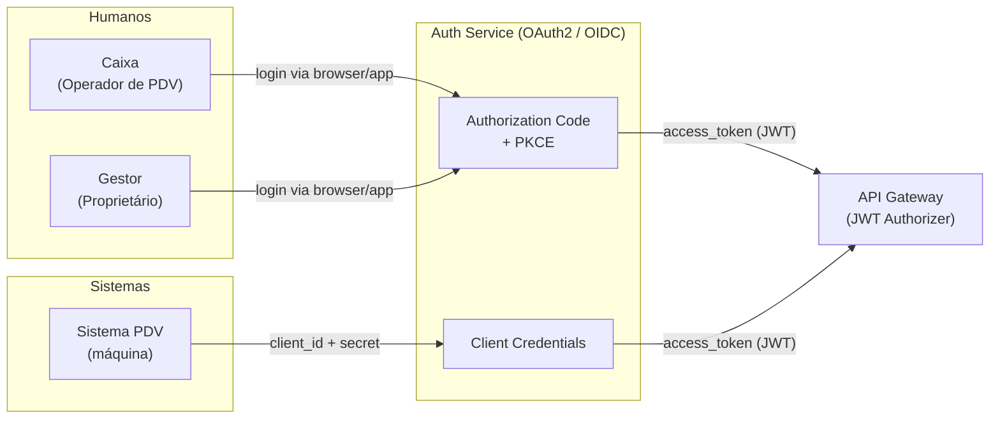
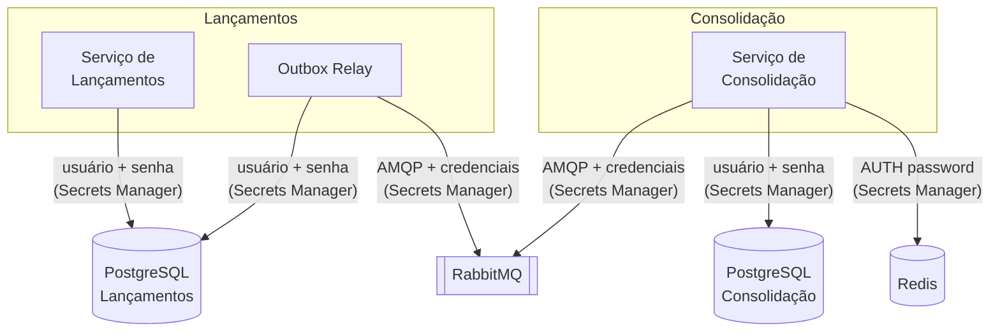
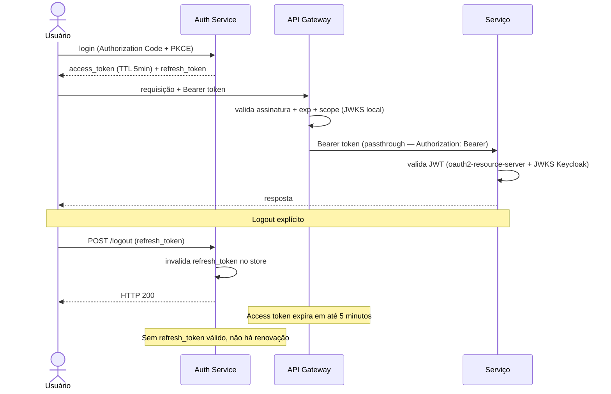

---
tags:
  - seguranca
  - autenticacao
  - autorizacao
---

# Segurança

**Perspectiva:** 🔒 Arquiteto de Segurança · 🔐 DevSecOps  
**Framework:** ArchiMate — Motivation View (risk & compliance) + C4 L2  
**Requisitos:** [NFR-05](../negocio/requisitos.md#nfr-05), [NFR-09](../negocio/requisitos.md#nfr-09), [C-04](../negocio/requisitos.md#c-04)

A segurança é endereçada em duas camadas complementares:

- **Camada de sistema** (este documento) — identidade, autorização por recurso, proteção dos dados do negócio, superfície de ataque
- **Camada de infraestrutura AWS** (já documentada) — WAF, mTLS, KMS, GuardDuty, CloudTrail, Security Hub → [ADR-010](../adr/ADR-010-seguranca.md)

---

## Alinhamento com Zero Trust

Zero Trust é o modelo onde nenhum usuário, dispositivo ou rede é confiável por padrão — mesmo dentro do perímetro. O princípio central é **"nunca confie, sempre verifique"**.

O sistema foi projetado com os cinco pilares do Zero Trust desde a concepção:

| Pilar | Decisões que o implementam | Lacuna / limitação |
|-------|--------------------------|-------------------|
| **Identidade** | JWT validado em toda requisição ([ADR-004](../adr/ADR-004-jwt-validacao-local.md)) · Keycloak como IdP ([ADR-014](../adr/ADR-014-identity-provider.md)) · Access token TTL 5min + refresh rotation ([ADR-013](../adr/ADR-013-revogacao-tokens.md)) · Escopos mínimos por ator | Revogação com janela de até 5min (trade-off aceito — [ADR-013](../adr/ADR-013-revogacao-tokens.md)) |
| **Dispositivo** | mTLS na borda CloudFront ([ADR-010](../adr/ADR-010-seguranca.md)) · WAF v2 filtra tráfego malicioso · IMDSv2 nos nós EKS | Sem verificação de postura do dispositivo cliente (aceitável — sistema B2B interno) |
| **Rede** | VPC com subnets privadas · SGs com allow-list mínima · VPC Endpoints para serviços AWS · Redes Docker internas isoladas localmente | NAT Gateway como saída necessária para imagens externas |
| **Aplicação** | Serviços validam JWT localmente (oauth2-resource-server + JWKS Keycloak) · Autorização por role por endpoint via SecurityFilterChain · Credenciais por serviço (sem credencial compartilhada) · Outbox Relay com blast radius limitado | Sem service mesh (Istio/Linkerd) — mTLS intra-pod não implementado; SGs compensam |
| **Dados** | KMS CMK para PostgreSQL, Redis e backups ([ADR-010](../adr/ADR-010-seguranca.md)) · TLS em todos os canais de produção · LGPD compliance por design (sem PII nas tabelas financeiras) | Sem DLP (Data Loss Prevention) — aceitável para o volume e perfil de risco atual |



> **Zero Trust não é um produto** — é a consequência de decisões de design que tratam cada requisição como não confiável até prova em contrário. As decisões documentadas neste projeto implementam esse modelo sem depender de nenhuma ferramenta específica de "ZT".

---

## Modelo de Identidade

### Atores e Fluxos OAuth2

O sistema suporta dois fluxos OAuth2 distintos conforme o tipo de ator:



| Fluxo | Atores | Quando usar |
|-------|--------|-------------|
| **Authorization Code + PKCE** | Caixa, Gestor | Usuários humanos via navegador ou app mobile — protege contra interceptação do código |
| **Client Credentials** | Sistema PDV | Integração máquina-a-máquina sem usuário humano — client_id + secret gerenciados pelo Secrets Manager |

### Claims e Escopos JWT

Todo access token carrega os seguintes claims relevantes para autorização. O exemplo abaixo representa um token real emitido pelo Keycloak para o usuário `caixa.demo`:

```json
{
  "sub":                "3f2b9c10-e7d4-4a1b-9f3e-446655440000",
  "iss":                "http://gw-keycloak:8080/realms/fluxocaixa",
  "aud":                ["frontend-app"],
  "exp":                1746800300,
  "iat":                1746800000,
  "jti":                "550e8400-e29b-41d4-a716-446655440000",
  "preferred_username": "caixa.demo",
  "role":               "caixa",
  "scope":              "openid lancamentos:write lancamentos:read consolidacao:read"
}
```

| Claim | Finalidade | Observação |
|-------|-----------|------------|
| `sub` | UUID do operador no Keycloak — gravado como `operadorId` em cada lançamento ([NFR-09](../negocio/requisitos.md#nfr-09)) | Incluído via scope `basic` (mapper `oidc-sub-mapper`) |
| `preferred_username` | Username do operador — fallback de `operadorId` quando `sub` está ausente | Incluído via scope `basic` |
| `role` | Papel do ator: `caixa`, `gestor`, `admin` (usuários humanos) ou `pdv` (hardcoded no cliente) | Mapeado pelo `jwtAuthenticationConverter` para `ROLE_CAIXA`, `ROLE_GESTOR`, etc. |
| `scope` | Escopos concedidos — presença verificada nos dois serviços via Spring Security | Escopos do sistema são **opcionais** — devem ser solicitados explicitamente no fluxo de autenticação |
| `iss` | Issuer do realm Keycloak — validado automaticamente pelo `oauth2-resource-server` | Formato: `http://<host>/realms/<realm-name>` |
| `aud` | Client ID que solicitou o token | Sem audience mapper configurado — padrão Keycloak |
| `exp` | Expiração — TTL de **5 minutos** (300 s configurados no realm) | — |
| `jti` | JWT ID único — presente no token, não usado ativamente pelo sistema | Revogação por `jti` foi descartada em [ADR-013](../adr/ADR-013-revogacao-tokens.md) |

#### Como `role` chega ao token

O mecanismo difere conforme o tipo de ator:

| Ator | Client | Mecanismo no realm | Resultado no token |
|------|--------|-------------------|--------------------|
| Caixa / Gestor / Admin | `frontend-app` | `oidc-usermodel-attribute-mapper` — lê o atributo `role` do usuário Keycloak | `"role": "caixa"` (valor do atributo) |
| Sistema PDV | `pdv-service` | `oidc-hardcoded-claim-mapper` — valor fixo no cliente, sem usuário | `"role": "pdv"` (sempre) |

#### Como o serviço usa os claims

O `jwtAuthenticationConverter` em ambos os serviços converte:
- `scope` → authorities `SCOPE_lancamentos:write`, `SCOPE_lancamentos:read`, etc.
- `role` → authority `ROLE_CAIXA`, `ROLE_GESTOR`, `ROLE_PDV`, `ROLE_ADMIN`

O `LancamentoController` extrai `operadorId` chamando `jwt.getSubject()`, com fallback para `jwt.getClaimAsString("preferred_username")` caso `sub` esteja ausente.

### Escopos do Sistema

Os escopos abaixo são configurados como **optional scopes** no Keycloak e devem ser solicitados explicitamente no parâmetro `scope` do fluxo de autenticação.

| Escopo | Descrição | Disponível para |
|--------|-----------|----------------|
| `lancamentos:write` | Registrar lançamentos e estornos | `frontend-app`, `pdv-service` |
| `lancamentos:read` | Consultar lançamentos por período | `frontend-app`, `pdv-service` |
| `consolidacao:read` | Consultar saldo consolidado e por período | `frontend-app` |
| `consolidacao:admin` | Reconciliação periódica e reconstrução de saldo | `frontend-app` |

---

## Matriz de Autorização

| Endpoint | Caixa | Gestor | PDV (CC) | Admin |
|----------|:-----:|:------:|:--------:|:-----:|
| `POST /lancamentos` | ✅ | ❌ | ✅ | ❌ |
| `POST /lancamentos/{id}/estorno` | ✅ | ❌ | ❌ | ❌ |
| `GET /lancamentos` | ✅ | ✅ | ❌ | ✅ |
| `GET /consolidacao/{data}` | ❌ | ✅ | ❌ | ✅ |
| `GET /consolidacao/periodo` | ❌ | ✅ | ❌ | ✅ |
| `POST /lancamentos/recalcular` | ❌ | ❌ | ❌ | ✅ |
| `POST /consolidacao/reconciliacao` | ❌ | ❌ | ❌ | ✅ |

**Regra de autorização — defense-in-depth em duas camadas:**

| Verificação | Gateway | Serviço | Mecanismo |
|-------------|:-------:|:-------:|-----------|
| Assinatura JWT válida | ✅ | ✅ | JWKS do Keycloak — gateway e serviço validam independentemente |
| Token não expirado (`exp`) | ✅ | ✅ | Verificação local do claim em cada camada |
| Escopo presente (`scope`) | ✅ | ✅ | Comparação do claim com o escopo exigido pela rota |
| Role autorizado para a operação | ❌ | ✅ | `SecurityFilterChain` + `jwtAuthenticationConverter` no serviço |
| Extração de `operadorId` | ❌ | ✅ | `jwt.getSubject()` — claim `sub` do JWT |

Ambos os serviços são **OAuth2 Resource Servers** (`spring-boot-starter-oauth2-resource-server`): validam o JWT localmente contra o JWKS do Keycloak a cada requisição. O gateway valida na borda; o serviço valida novamente como camada de defesa independente — um bypass ou comprometimento do gateway não compromete a autorização no serviço.

---

## Autenticação Serviço a Serviço

Os serviços internos não recebem tokens JWT de usuário — eles se autenticam entre si e com a infraestrutura via credenciais dedicadas.



| Conexão | Mecanismo | Ambiente local | Produção |
|---------|-----------|---------------|---------|
| Serviço → PostgreSQL | Username + password | Variável de ambiente via `.env` | RDS Proxy + IAM Authentication |
| Relay / Consumer → RabbitMQ | AMQP credenciais | Variável de ambiente | Secrets Manager — rotação automática |
| Consolidação → Redis | AUTH password | Variável de ambiente | Secrets Manager + KMS |
| Traefik → Serviços | Sem autenticação | Rede Docker isolada | VPC interna — sem acesso externo |

**Por que sem mTLS interno (local)?** O ambiente local usa redes Docker isoladas (`lancamentos-data`, `consolidacao-data`) — os containers não são acessíveis externamente. Em produção, o tráfego intra-pod no EKS usa a CNI da VPC com SGs dedicados, mantendo o isolamento sem overhead de certificados laterais.

---

## Ciclo de Vida do Token e Revogação

Decisão completa em [ADR-013](../adr/ADR-013-revogacao-tokens.md). Resumo:

| Parâmetro | Valor |
|-----------|-------|
| Access token TTL | **5 minutos** |
| Refresh token TTL | **24 horas** (configurável) |
| Refresh rotation | A cada uso — refresh anterior invalidado |
| Blacklist Redis | **Não implementada** — ver ADR-013 |



**Por que não há blacklist Redis:** adicionar uma consulta Redis por requisição violaria a separação de responsabilidades (auth é função do gateway, não do serviço) e anularia a vantagem principal do JWT — validação local sem I/O. A janela de 5 minutos após logout é o trade-off aceito para este perfil de risco. Alternativas avaliadas e descartadas estão documentadas no ADR-013.

---

## Proteção de Dados

### Em Trânsito

| Caminho | Local | Produção |
|---------|-------|---------|
| Cliente → API Gateway | HTTPS via Traefik (cert auto-signed) | HTTPS via CloudFront + ACM |
| API Gateway → Serviços | HTTP (rede interna Docker) | HTTPS via ALB interno (certificado privado) |
| Serviços → PostgreSQL | Plain TCP (rede isolada Docker) | TLS obrigatório via RDS + RDS Proxy |
| Relay/Consumer → RabbitMQ | AMQP plain (rede isolada) | AMQPS (TLS) — porta 5671 |
| Serviços → Redis | Plain TCP (rede isolada) | TLS via ElastiCache + KMS |
| CloudFront → API Gateway | HTTPS + header `X-Origin-Verify` | — |

### Em Repouso

| Dado | Local | Produção |
|------|-------|---------|
| PostgreSQL | Sem encryption (dev only) | RDS encryption + KMS CMK |
| Redis | Sem encryption (dev only) | ElastiCache encryption + KMS CMK |
| Secrets (senhas, tokens) | Arquivo `.env` (não commitado) | AWS Secrets Manager + KMS CMK |
| Logs de auditoria | stdout local | CloudWatch Logs + KMS CMK |
| Backups | Não aplicável | AWS Backup cross-region + WORM lock 3 dias |

---

## Superfície de Ataque e Controles

### Exposição Externa

| Ponto de exposição | Ameaça | Controle |
|-------------------|--------|---------|
| `POST /lancamentos` | Requisições não autenticadas, flood | JWT validation ([ADR-004](../adr/ADR-004-jwt-validacao-local.md)) + rate limiting ([NFR-07](../negocio/requisitos.md#nfr-07)) + WAF (prod) |
| `GET /consolidacao/*` | Enumeração de saldos por data | JWT + escopo `consolidacao:read` — apenas Gestor/Admin |
| `POST /lancamentos/{id}/estorno` | Estorno fraudulento | JWT + escopo `lancamentos:write` + validação de negócio ([RF-08](../negocio/requisitos.md#rf-08): duplo estorno bloqueado) |
| Endpoint JWKS (`/.well-known/jwks.json`) | Substituição de chave pública | Auth service controla o endpoint — serviços fazem cache, não aceitam chaves de terceiros |

### Superfície Interna

| Componente | Ameaça | Controle |
|-----------|--------|---------|
| PostgreSQL | Acesso direto de pods não autorizados | SG dedicado — aceita conexão apenas do RDS Proxy; localmente, rede Docker isolada sem porta exposta ao host |
| RabbitMQ | Consumer malicioso publicando eventos falsos | Credenciais por serviço — Relay tem permissão de publish; Consumer tem permissão de consume only |
| Redis | Leitura/escrita de cache por serviço não autorizado | Auth password obrigatório; rede isolada sem acesso externo |
| Outbox Relay | Comprometimento → publicação de eventos falsos | Blast radius limitado: Relay só publica eventos gerados pela própria tabela `outbox` do Lançamentos |
| `descricao` (campo livre) | Inserção de PII não estruturado | Validação no frontend + rejeição de padrões CPF/CNPJ no backend ([RF-05](../negocio/requisitos.md#rf-05)) |

### Injeção e Inputs Maliciosos

| Vetor | Controle |
|-------|---------|
| SQL Injection | Queries parametrizadas via ORM/prepared statements — sem concatenação de strings SQL |
| Payload oversized | Content-Length limit no API Gateway (ex: 64 KB para lançamentos) |
| Formato inválido | Validação de schema na camada de aplicação antes de qualquer persistência |
| Replay de evento | Idempotência via PK em `lancamentos_processados` — evento duplicado é absorvido sem efeito |

---

## Trilha de Auditoria

**Requisito:** [NFR-09](../negocio/requisitos.md#nfr-09) — toda operação de escrita deve gerar trilha imutável com identidade, timestamp UTC e recurso afetado.

A trilha de auditoria opera em três camadas complementares:

| Camada | Artefato | O que registra |
|--------|----------|---------------|
| **Dados financeiros** | Tabela `lancamentos` | Campos de rastreabilidade imutáveis embutidos em cada registro |
| **Ações de negócio** | Tabela `audit_log` | Ação realizada, operador, recurso afetado e contexto estruturado |
| **Observabilidade** | Logs estruturados + tracing | Contexto de execução, trace distribuído, correlação com RabbitMQ |

### Dados imutáveis em `lancamentos`

O Serviço de Lançamentos é implementado como *OAuth2 Resource Server*: valida o JWT localmente e extrai a identidade do operador diretamente do token, sem depender de headers injetados pelo gateway.

```java
// LancamentoController.extrairOperadorId()
var sub = jwt.getSubject();                          // claim "sub" (UUID Keycloak)
if (sub != null && !sub.isBlank()) return sub;
return jwt.getClaimAsString("preferred_username");   // fallback
```

Cada registro na tabela `lancamentos` carrega:

| Campo | Conteúdo | Imutável |
|-------|----------|:--------:|
| `id` | UUID único gerado pelo banco | ✅ |
| `operador_id` | `sub` do JWT — UUID do operador no Keycloak | ✅ |
| `idempotency_key` | UUID fornecido pelo cliente no header `Idempotency-Key` | ✅ |
| `payload_hash` | SHA-256 do payload da requisição | ✅ |
| `criado_em` | Timestamp UTC via `@CreationTimestamp` — não atualizável | ✅ |
| `estorno_de` | UUID do lançamento original (quando este registro é um estorno) | ✅ |
| `estornado_por` | UUID do estorno associado (preenchido pelo handler de estorno) | ⬜ (único campo atualizável) |

A tabela é **append-only**: sem `UPDATE` nem `DELETE` sobre registros confirmados. Estornos geram um novo lançamento — nunca modificam o original. Retenção: **5 anos** (obrigação fiscal — Lei 9.613/98), ver [política de retenção](../arquitetura/dados.md#política-de-retenção).

### Tabela `audit_log` — ações de negócio

Registra *o que o operador fez*, com contexto de negócio por operação. Persistida de forma assíncrona pelo `AuditEventListener` após o commit da transação principal — o response HTTP já foi enviado quando o registro é gravado. Falha no audit é logada e nunca propaga para a operação de negócio.

```
AuditPublisher (port) → AuditPublisherAdapter → ApplicationEvent
    → AuditEventListener @TransactionalEventListener(AFTER_COMMIT) @Async
        → audit_log (PostgreSQL)
```

| `acao` | `recurso_id` | `contexto` (JSON) | Origem |
|--------|-------------|-------------------|--------|
| `lancamento.registrado` | UUID do lançamento | `{"tipo": "CREDITO", "valor": "150.00"}` | `RegistrarLancamentoService` |
| `estorno.registrado` | UUID do estorno | `{"original_id": "...", "valor": "150.00"}` | `EstornarLancamentoService` |

Retenção: **5 anos** — contém `operador_id` (dado pessoal vinculado ao registro financeiro), ver [política de retenção](../arquitetura/dados.md#política-de-retenção).

### Logs estruturados como trilha operacional

Cada requisição gera um log estruturado JSON com os campos:

```json
{
  "@timestamp":    "2026-05-17T03:37:04.681Z",
  "level":         "INFO",
  "event":         "lancamento.registrado",
  "traceId":       "4b5f9a1e2d3c8b7a",
  "spanId":        "9e1f2a3b",
  "correlation_id": "550e8400-e29b-41d4-a716-446655440000",
  "http_method":   "POST",
  "http_path":     "/registros",
  "message":       "lançamento registrado id=3f2b9c10 valor=150.00 tipo=CREDITO"
}
```

Esses logs são coletados pelo Promtail, indexados no Loki e correlacionados ao trace no Tempo via `traceId`. Retenção: 7 dias local (Loki) · 30 dias CloudWatch · 90+ dias em S3.

### Evidências capturadas por operação

| Operação | Em `lancamentos` | Em `audit_log` | Em log |
|----------|-----------------|----------------|--------|
| Registro de lançamento | `id`, `operador_id`, `criado_em`, `idempotency_key`, `payload_hash` | `lancamento.registrado` + tipo/valor | `event: lancamento.registrado` |
| Estorno | `id` novo + `estorno_de` → original; original recebe `estornado_por` | `estorno.registrado` + original_id/valor | `event: estorno.registrado` |
| Tentativa duplicada (mesma key, payload diferente) | HTTP 409 — registro original preservado | — (não chega ao use case) | `event: idempotency.conflito` |
| Replay idempotente (mesma key, mesmo payload) | HTTP 200 — registro original retornado | — (não chega ao use case) | `event: idempotency.replay` |

### Rastreabilidade distribuída (tracing)

Cada operação de lançamento registra um `correlation_id` no MDC via `LoggingContextFilter` e propaga o `traceId` pelo RabbitMQ até o Serviço de Consolidação. É possível rastrear o caminho completo de um lançamento — do request HTTP até a atualização do saldo consolidado — no Grafana Tempo via `traceId`.

---

## Rate Limiting

**Requisito:** [NFR-07](../negocio/requisitos.md#nfr-07) — proteção contra sobrecarga de requisições.

### Thresholds por camada

| Camada | Escopo | Limite | Resposta ao exceder |
|--------|--------|--------|-------------------|
| **CloudFront** (prod) | Por IP | 1.000 req/min | HTTP 429 + Retry-After |
| **WAF v2** (prod) | Por IP | 500 req/5min | HTTP 429 bloqueado na borda |
| **API Gateway / Traefik** | Por IP | 60 req/min global | HTTP 429 |
| **API Gateway / Traefik** | Por IP + rota `POST /lancamentos` | 30 req/min | HTTP 429 |
| **API Gateway / Traefik** | Por IP + rota `GET /consolidacao/*` | 100 req/min | HTTP 429 |

**Justificativa dos thresholds:**

- `POST /lancamentos` limitado a 30 req/min por IP — um Caixa legítimo raramente registra mais de 1 lançamento a cada 2 segundos; acima disso é provável abuso ou integração mal configurada
- `GET /consolidacao/*` mais permissivo (100 req/min) pois é somente leitura e serve do cache Redis na maioria dos casos
- O limite global de 60 req/min cobre rotas não especificadas como fallback

Traefik configura os limites via middleware `RateLimit` por rota. Em produção, o API Gateway HTTP API delega à camada CloudFront + WAF para as primeiras proteções.

---

## Rotação de Secrets

**Contexto:** credenciais de banco de dados, RabbitMQ e Redis são gerenciadas pelo AWS Secrets Manager em produção ([ADR-010](../adr/ADR-010-seguranca.md)).

| Secret | Frequência de rotação | Mecanismo |
|--------|----------------------|-----------|
| Senha PostgreSQL (Lançamentos) | **30 dias** | Rotação automática via Lambda do Secrets Manager — sem downtime (RDS Proxy absorve a troca) |
| Senha PostgreSQL (Consolidação) | **30 dias** | Idem |
| Senha RabbitMQ (Relay + Consumer) | **90 dias** | Rotação manual com rolling restart dos pods |
| Senha Redis | **90 dias** | Rotação manual — Redis suporta dois passwords simultâneos durante a janela de troca |
| Chaves assimétricas do Keycloak (RS256) | **365 dias** | Rotação via console Keycloak — par novo adicionado ao JWKS antes da expiração do par antigo; serviços renovam cache automaticamente via `kid` lookup |

**Por que PostgreSQL rota com mais frequência:** é o dado mais sensível (lançamentos financeiros). O RDS Proxy elimina o custo operacional da rotação — as conexões existentes não são derrubadas durante a troca de senha.

**Por que as chaves Keycloak não rotam mensalmente:** rotação de chaves assimétricas exige janela de coexistência (o JWKS deve conter o par antigo até todos os tokens emitidos com ele expirarem — máximo 5 minutos com o TTL atual). A rotação anual com janela de 10 minutos é suficiente para o perfil de risco.

---

## Mapeamento ISO 27001 { #mapeamento-iso-27001 }

Os controles abaixo mapeam os Controles do Anexo A da **ISO/IEC 27001:2022** para as decisões e artefatos implementados neste sistema. Controles não listados estão fora do escopo do sistema (ex.: segurança física, gestão de ativos de RH).

| Controle ISO 27001 | Descrição | Status | Artefato |
|--------------------|-----------|:------:|---------|
| **A.5.15** — Controle de acesso | Regras de acesso definidas por identidade e função | ✅ | Matriz de autorização · escopos JWT · Keycloak RBAC |
| **A.5.16** — Gerenciamento de identidade | Identidades únicas por ator — sem credenciais compartilhadas | ✅ | Keycloak realm + `operadorId` = `sub` claim |
| **A.5.17** — Autenticação | Mecanismos de autenticação robustos por tipo de ator | ✅ | PKCE (humanos) + Client Credentials (máquinas) · [ADR-014](../adr/ADR-014-identity-provider.md) |
| **A.5.23** — Segurança em serviços de nuvem | Controles de segurança nos serviços AWS utilizados | ✅ | IAM + IRSA + Secrets Manager + KMS · [ADR-010](../adr/ADR-010-seguranca.md) |
| **A.8.2** — Direitos de acesso privilegiados | Separação de privilégios entre roles (`caixa`, `gestor`, `admin`) | ✅ | `SecurityConfig.securityFilterChain()` |
| **A.8.5** — Autenticação segura | Proteção contra acesso não autenticado a todos os endpoints | ✅ | JWT obrigatório em todas as rotas · [ADR-004](../adr/ADR-004-jwt-validacao-local.md) |
| **A.8.7** — Proteção contra malware | Scan de vulnerabilidades em imagens de container | ✅ | Trivy no `ci.yml` — bloqueia CRITICAL/HIGH |
| **A.8.12** — Prevenção de vazamento de dados | PII e tokens não gravados em logs | ✅ | [ADR-016](../adr/ADR-016-redacao-pii-logs.md) |
| **A.8.13** — Backup de informações | Dados com backup e retenção definidos | ✅ | AWS Backup cross-region + política de retenção · [dados.md](../arquitetura/dados.md) |
| **A.8.16** — Monitoramento de atividades | Logs estruturados com rastreabilidade de operações | ✅ | Loki + Grafana + Prometheus + Tempo |
| **A.8.17** — Sincronização de relógio | Timestamps UTC em todos os componentes | ✅ | `OffsetDateTime` + ISO 8601 + NTP via AWS |
| **A.8.20** — Segurança de redes | Segmentação de rede e controle de tráfego | ✅ | Redes Docker isoladas (local) · VPC + SGs (prod) |
| **A.8.23** — Filtragem de conteúdo web | WAF com regras OWASP em produção | ✅ | AWS WAF v2 + CloudFront · [ADR-010](../adr/ADR-010-seguranca.md) |
| **A.8.24** — Uso de criptografia | Criptografia em repouso e em trânsito | ✅ | KMS CMK + TLS obrigatório em produção |
| **A.8.25** — Ciclo de vida de desenvolvimento seguro | Segurança integrada desde o design | ✅ | Spec-first ([ADR-017](../adr/ADR-017-spec-driven-development.md)) + testes de segurança no CI |
| **A.8.26** — Requisitos de segurança de aplicação | NFRs de segurança documentados e rastreados | ✅ | [NFR-05](../negocio/requisitos.md#nfr-05), [NFR-06](../negocio/requisitos.md#nfr-06), [NFR-09](../negocio/requisitos.md#nfr-09) |
| **A.8.28** — Codificação segura | Queries parametrizadas, sem deserialização arbitrária | ✅ | JPA prepared statements + Jackson tipos explícitos |
