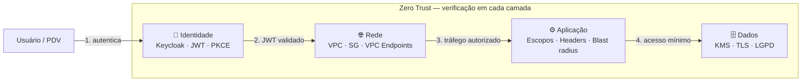
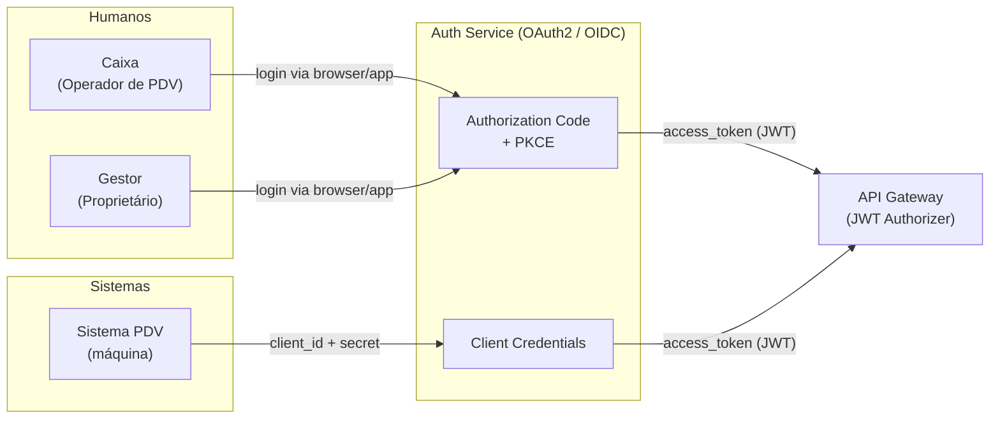
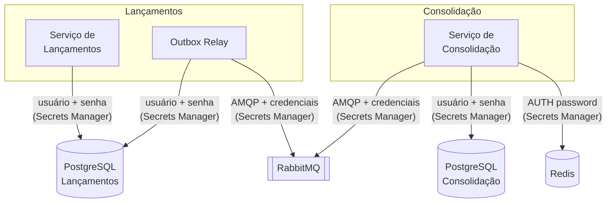
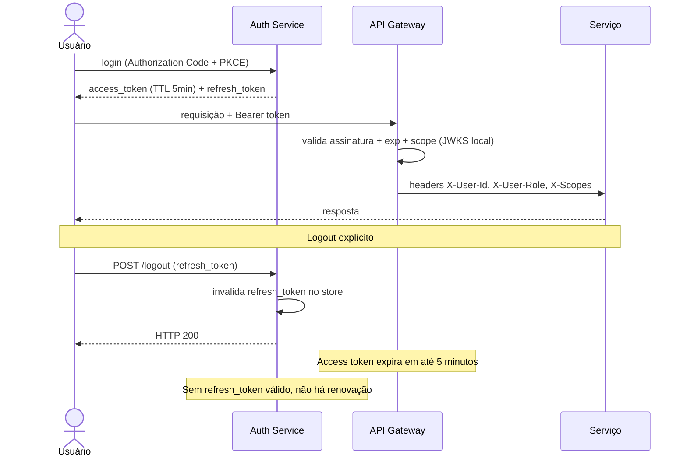

---
tags:
  - seguranca
  - autenticacao
  - autorizacao
---

# Segurança

**Perspectiva:** 🔒 Arquiteto de Segurança · 🔐 DevSecOps  
**Framework:** ArchiMate — Motivation View (risk & compliance) + C4 L2  
**Requisitos:** [NFR-05](../negocio/requisitos.md#nfr-05), [NFR-09](../negocio/requisitos.md#nfr-09), [C-04](../negocio/requisitos.md#c-04)

A segurança é endereçada em duas camadas complementares:

- **Camada de sistema** (este documento) — identidade, autorização por recurso, proteção dos dados do negócio, superfície de ataque
- **Camada de infraestrutura AWS** (já documentada) — WAF, mTLS, KMS, GuardDuty, CloudTrail, Security Hub → [ADR-010](../adr/ADR-010-seguranca.md)

---

## Alinhamento com Zero Trust

Zero Trust é o modelo onde nenhum usuário, dispositivo ou rede é confiável por padrão — mesmo dentro do perímetro. O princípio central é **"nunca confie, sempre verifique"**.

O sistema foi projetado com os cinco pilares do Zero Trust desde a concepção:

| Pilar | Decisões que o implementam | Lacuna / limitação |
|-------|--------------------------|-------------------|
| **Identidade** | JWT validado em toda requisição ([ADR-004](../adr/ADR-004-jwt-validacao-local.md)) · Keycloak como IdP ([ADR-014](../adr/ADR-014-identity-provider.md)) · Access token TTL 5min + refresh rotation ([ADR-013](../adr/ADR-013-revogacao-tokens.md)) · Escopos mínimos por ator | Revogação com janela de até 5min (trade-off aceito — [ADR-013](../adr/ADR-013-revogacao-tokens.md)) |
| **Dispositivo** | mTLS na borda CloudFront ([ADR-010](../adr/ADR-010-seguranca.md)) · WAF v2 filtra tráfego malicioso · IMDSv2 nos nós EKS | Sem verificação de postura do dispositivo cliente (aceitável — sistema B2B interno) |
| **Rede** | VPC com subnets privadas · SGs com allow-list mínima · VPC Endpoints para serviços AWS · Redes Docker internas isoladas localmente | NAT Gateway como saída necessária para imagens externas |
| **Aplicação** | Serviços recebem apenas claims pré-validados em headers · Autorização por escopo por endpoint · Credenciais por serviço (sem credencial compartilhada) · Outbox Relay com blast radius limitado | Sem service mesh (Istio/Linkerd) — mTLS intra-pod não implementado; SGs compensam |
| **Dados** | KMS CMK para PostgreSQL, Redis e backups ([ADR-010](../adr/ADR-010-seguranca.md)) · TLS em todos os canais de produção · LGPD compliance por design (sem PII nas tabelas financeiras) | Sem DLP (Data Loss Prevention) — aceitável para o volume e perfil de risco atual |



> **Zero Trust não é um produto** — é a consequência de decisões de design que tratam cada requisição como não confiável até prova em contrário. As decisões documentadas neste projeto implementam esse modelo sem depender de nenhuma ferramenta específica de "ZT".

---

## Modelo de Identidade

### Atores e Fluxos OAuth2

O sistema suporta dois fluxos OAuth2 distintos conforme o tipo de ator:



| Fluxo | Atores | Quando usar |
|-------|--------|-------------|
| **Authorization Code + PKCE** | Caixa, Gestor | Usuários humanos via navegador ou app mobile — protege contra interceptação do código |
| **Client Credentials** | Sistema PDV | Integração máquina-a-máquina sem usuário humano — client_id + secret gerenciados pelo Secrets Manager |

### Claims e Escopos JWT

Todo access token carrega os seguintes claims relevantes para autorização:

```json
{
  "sub":    "usr_7f3b9a10",
  "iss":    "https://auth.fluxocaixa.internal",
  "aud":    "api.fluxocaixa",
  "exp":    1746800000,
  "iat":    1746799100,
  "jti":    "550e8400-e29b-41d4-a716-446655440000",
  "role":   "caixa",
  "scope":  "lancamentos:write lancamentos:read"
}
```

| Claim | Finalidade |
|-------|-----------|
| `sub` | Identificador único do sujeito — usado para auditoria ([NFR-09](../negocio/requisitos.md#nfr-09)) |
| `jti` | JWT ID único — chave de idempotência na lista de revogação |
| `role` | Papel do ator (`caixa`, `gestor`, `pdv`, `admin`) |
| `scope` | Escopos autorizados — validados pelo API Gateway e pelos serviços |
| `exp` | Expiração — TTL de **15 minutos** para access tokens |

### Escopos do Sistema

| Escopo | Descrição |
|--------|-----------|
| `lancamentos:write` | Registrar lançamentos e estornos |
| `lancamentos:read` | Consultar lançamentos por período |
| `consolidacao:read` | Consultar saldo consolidado e por período |
| `consolidacao:admin` | Reconciliação periódica e recálculo assíncrono |

---

## Matriz de Autorização

| Endpoint | Caixa | Gestor | PDV (CC) | Admin |
|----------|:-----:|:------:|:--------:|:-----:|
| `POST /lancamentos` | ✅ | ❌ | ✅ | ❌ |
| `POST /lancamentos/{id}/estorno` | ✅ | ❌ | ❌ | ❌ |
| `GET /lancamentos` | ✅ | ✅ | ❌ | ✅ |
| `GET /consolidacao/{data}` | ❌ | ✅ | ❌ | ✅ |
| `GET /consolidacao/periodo` | ❌ | ✅ | ❌ | ✅ |
| `POST /lancamentos/recalcular` | ❌ | ❌ | ❌ | ✅ |
| `POST /consolidacao/reconciliacao` | ❌ | ❌ | ❌ | ✅ |

**Regra de autorização — onde cada verificação ocorre:**

| Verificação | Responsável | Mecanismo |
|-------------|-------------|-----------|
| Assinatura JWT válida | **Gateway** | JWKS cache local — zero chamada de rede por requisição |
| Token não expirado (`exp`) | **Gateway** | Verificação local do claim |
| Escopo presente (`scope`) | **Gateway** | Comparação do claim com o escopo exigido pela rota |
| Role autorizado para a operação | **Serviço** | Leitura do header `X-User-Role` injetado pelo gateway |

O serviço **não valida o JWT** e **não consulta nenhum store de autenticação**. Recebe os claims pré-validados como headers (`X-User-Id`, `X-User-Role`, `X-Scopes`) e confia neles — o gateway é o único ponto de validação criptográfica.

---

## Autenticação Serviço a Serviço

Os serviços internos não recebem tokens JWT de usuário — eles se autenticam entre si e com a infraestrutura via credenciais dedicadas.



| Conexão | Mecanismo | Ambiente local | Produção |
|---------|-----------|---------------|---------|
| Serviço → PostgreSQL | Username + password | Variável de ambiente via `.env` | RDS Proxy + IAM Authentication |
| Relay / Consumer → RabbitMQ | AMQP credenciais | Variável de ambiente | Secrets Manager — rotação automática |
| Consolidação → Redis | AUTH password | Variável de ambiente | Secrets Manager + KMS |
| Traefik → Serviços | Sem autenticação | Rede Docker isolada | VPC interna — sem acesso externo |

**Por que sem mTLS interno (local)?** O ambiente local usa redes Docker isoladas (`lancamentos-data`, `consolidacao-data`) — os containers não são acessíveis externamente. Em produção, o tráfego intra-pod no EKS usa a CNI da VPC com SGs dedicados, mantendo o isolamento sem overhead de certificados laterais.

---

## Ciclo de Vida do Token e Revogação

Decisão completa em [ADR-013](../adr/ADR-013-revogacao-tokens.md). Resumo:

| Parâmetro | Valor |
|-----------|-------|
| Access token TTL | **5 minutos** |
| Refresh token TTL | **24 horas** (configurável) |
| Refresh rotation | A cada uso — refresh anterior invalidado |
| Blacklist Redis | **Não implementada** — ver ADR-013 |



**Por que não há blacklist Redis:** adicionar uma consulta Redis por requisição violaria a separação de responsabilidades (auth é função do gateway, não do serviço) e anularia a vantagem principal do JWT — validação local sem I/O. A janela de 5 minutos após logout é o trade-off aceito para este perfil de risco. Alternativas avaliadas e descartadas estão documentadas no ADR-013.

---

## Proteção de Dados

### Em Trânsito

| Caminho | Local | Produção |
|---------|-------|---------|
| Cliente → API Gateway | HTTPS via Traefik (cert auto-signed) | HTTPS via CloudFront + ACM |
| API Gateway → Serviços | HTTP (rede interna Docker) | HTTPS via ALB interno (certificado privado) |
| Serviços → PostgreSQL | Plain TCP (rede isolada Docker) | TLS obrigatório via RDS + RDS Proxy |
| Relay/Consumer → RabbitMQ | AMQP plain (rede isolada) | AMQPS (TLS) — porta 5671 |
| Serviços → Redis | Plain TCP (rede isolada) | TLS via ElastiCache + KMS |
| CloudFront → API Gateway | HTTPS + header `X-Origin-Verify` | — |

### Em Repouso

| Dado | Local | Produção |
|------|-------|---------|
| PostgreSQL | Sem encryption (dev only) | RDS encryption + KMS CMK |
| Redis | Sem encryption (dev only) | ElastiCache encryption + KMS CMK |
| Secrets (senhas, tokens) | Arquivo `.env` (não commitado) | AWS Secrets Manager + KMS CMK |
| Logs de auditoria | stdout local | CloudWatch Logs + KMS CMK |
| Backups | Não aplicável | AWS Backup cross-region + WORM lock 3 dias |

---

## Superfície de Ataque e Controles

### Exposição Externa

| Ponto de exposição | Ameaça | Controle |
|-------------------|--------|---------|
| `POST /lancamentos` | Requisições não autenticadas, flood | JWT validation ([ADR-004](../adr/ADR-004-jwt-validacao-local.md)) + rate limiting ([NFR-07](../negocio/requisitos.md#nfr-07)) + WAF (prod) |
| `GET /consolidacao/*` | Enumeração de saldos por data | JWT + escopo `consolidacao:read` — apenas Gestor/Admin |
| `POST /lancamentos/{id}/estorno` | Estorno fraudulento | JWT + escopo `lancamentos:write` + validação de negócio ([RF-08](../negocio/requisitos.md#rf-08): duplo estorno bloqueado) |
| Endpoint JWKS (`/.well-known/jwks.json`) | Substituição de chave pública | Auth service controla o endpoint — serviços fazem cache, não aceitam chaves de terceiros |

### Superfície Interna

| Componente | Ameaça | Controle |
|-----------|--------|---------|
| PostgreSQL | Acesso direto de pods não autorizados | SG dedicado — aceita conexão apenas do RDS Proxy; localmente, rede Docker isolada sem porta exposta ao host |
| RabbitMQ | Consumer malicioso publicando eventos falsos | Credenciais por serviço — Relay tem permissão de publish; Consumer tem permissão de consume only |
| Redis | Leitura/escrita de cache por serviço não autorizado | Auth password obrigatório; rede isolada sem acesso externo |
| Outbox Relay | Comprometimento → publicação de eventos falsos | Blast radius limitado: Relay só publica eventos gerados pela própria tabela `outbox` do Lançamentos |
| `descricao` (campo livre) | Inserção de PII não estruturado | Validação no frontend + rejeição de padrões CPF/CNPJ no backend ([RF-05](../negocio/requisitos.md#rf-05)) |

### Injeção e Inputs Maliciosos

| Vetor | Controle |
|-------|---------|
| SQL Injection | Queries parametrizadas via ORM/prepared statements — sem concatenação de strings SQL |
| Payload oversized | Content-Length limit no API Gateway (ex: 64 KB para lançamentos) |
| Formato inválido | Validação de schema na camada de aplicação antes de qualquer persistência |
| Replay de evento | Idempotência via PK em `lancamentos_processados` — evento duplicado é absorvido sem efeito |

---

## Trilha de Auditoria

**Requisito:** [NFR-09](../negocio/requisitos.md#nfr-09) — toda operação de escrita deve gerar trilha imutável com identidade, timestamp UTC e recurso afetado.

### Schema da tabela `audit_log`

Cada serviço mantém sua própria `audit_log` no PostgreSQL local — sem cruzar fronteiras de serviço.

```sql
CREATE TABLE audit_log (
    id           UUID        PRIMARY KEY DEFAULT gen_random_uuid(),
    operador_id  VARCHAR(64) NOT NULL,   -- claim "sub" do JWT
    operador_role VARCHAR(20) NOT NULL,  -- claim "role" do JWT
    acao         VARCHAR(50) NOT NULL,   -- ex: "lancamento.criado", "estorno.registrado"
    recurso_id   UUID,                  -- ID do recurso afetado (lancamento, estorno)
    payload      JSONB,                 -- snapshot do recurso no momento da ação
    ip_origem    INET,                  -- IP extraído do header X-Forwarded-For pelo gateway
    criado_em    TIMESTAMPTZ NOT NULL DEFAULT NOW()
);

-- Índices para auditoria por operador e por recurso
CREATE INDEX idx_audit_operador ON audit_log(operador_id, criado_em DESC);
CREATE INDEX idx_audit_recurso  ON audit_log(recurso_id)  WHERE recurso_id IS NOT NULL;
```

A tabela é **append-only** — sem UPDATE nem DELETE. Registros são retidos por 2 anos ([política de retenção](../arquitetura/dados.md#política-de-retenção)).

### Como o serviço captura a identidade

O gateway injeta os claims do JWT como headers antes de encaminhar a requisição:

```
X-User-Id:   usr_7f3b9a10        ← claim "sub"
X-User-Role: caixa               ← claim "role"
X-Forwarded-For: 203.0.113.5    ← IP do cliente (adicionado pelo gateway)
```

O serviço lê esses headers e os persiste no `audit_log` a cada operação de escrita confirmada. A gravação na `audit_log` ocorre **na mesma transação** que a operação principal — se a transação falhar, não há registro de auditoria parcial.

### Ações auditadas

| Ação | Serviço | Recurso afetado |
|------|---------|----------------|
| `lancamento.criado` | Lançamentos | `lancamentos.id` |
| `estorno.registrado` | Lançamentos | `lancamentos.id` (estorno) |
| `recalculo.solicitado` | Lançamentos | job_id |
| `reconciliacao.executada` | Consolidação | — (operação global) |

---

## Rate Limiting

**Requisito:** [NFR-07](../negocio/requisitos.md#nfr-07) — proteção contra sobrecarga de requisições.

### Thresholds por camada

| Camada | Escopo | Limite | Resposta ao exceder |
|--------|--------|--------|-------------------|
| **CloudFront** (prod) | Por IP | 1.000 req/min | HTTP 429 + Retry-After |
| **WAF v2** (prod) | Por IP | 500 req/5min | HTTP 429 bloqueado na borda |
| **API Gateway / Traefik** | Por IP | 60 req/min global | HTTP 429 |
| **API Gateway / Traefik** | Por IP + rota `POST /lancamentos` | 30 req/min | HTTP 429 |
| **API Gateway / Traefik** | Por IP + rota `GET /consolidacao/*` | 100 req/min | HTTP 429 |

**Justificativa dos thresholds:**

- `POST /lancamentos` limitado a 30 req/min por IP — um Caixa legítimo raramente registra mais de 1 lançamento a cada 2 segundos; acima disso é provável abuso ou integração mal configurada
- `GET /consolidacao/*` mais permissivo (100 req/min) pois é somente leitura e serve do cache Redis na maioria dos casos
- O limite global de 60 req/min cobre rotas não especificadas como fallback

Traefik configura os limites via middleware `RateLimit` por rota. Em produção, o API Gateway HTTP API delega à camada CloudFront + WAF para as primeiras proteções.

---

## Rotação de Secrets

**Contexto:** credenciais de banco de dados, RabbitMQ e Redis são gerenciadas pelo AWS Secrets Manager em produção ([ADR-010](../adr/ADR-010-seguranca.md)).

| Secret | Frequência de rotação | Mecanismo |
|--------|----------------------|-----------|
| Senha PostgreSQL (Lançamentos) | **30 dias** | Rotação automática via Lambda do Secrets Manager — sem downtime (RDS Proxy absorve a troca) |
| Senha PostgreSQL (Consolidação) | **30 dias** | Idem |
| Senha RabbitMQ (Relay + Consumer) | **90 dias** | Rotação manual com rolling restart dos pods |
| Senha Redis | **90 dias** | Rotação manual — Redis suporta dois passwords simultâneos durante a janela de troca |
| Chaves assimétricas do Keycloak (RS256) | **365 dias** | Rotação via console Keycloak — par novo adicionado ao JWKS antes da expiração do par antigo; serviços renovam cache automaticamente via `kid` lookup |

**Por que PostgreSQL rota com mais frequência:** é o dado mais sensível (lançamentos financeiros). O RDS Proxy elimina o custo operacional da rotação — as conexões existentes não são derrubadas durante a troca de senha.

**Por que as chaves Keycloak não rotam mensalmente:** rotação de chaves assimétricas exige janela de coexistência (o JWKS deve conter o par antigo até todos os tokens emitidos com ele expirarem — máximo 5 minutos com o TTL atual). A rotação anual com janela de 10 minutos é suficiente para o perfil de risco.
