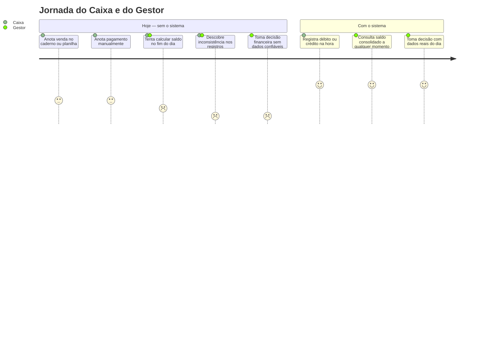
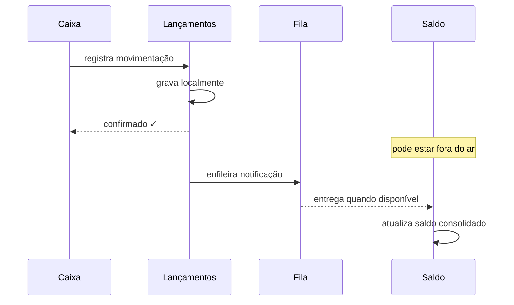

---
tags:
  - executivo
---

# Visão Executiva

**Papel:** 💼 Arquiteto de Negócios · 🏛️ Arquiteto Corporativo  
**Audiência:** Executivos, Product Owners, times de negócio

---

## Fase 1 — Domínio de Negócio

### O problema que estamos resolvendo

Um comerciante encerra o dia sem saber ao certo quanto dinheiro tem disponível. Ao longo do dia, registra vendas e pagamentos em anotações separadas — caderno, planilha, sistema legado — e só consegue enxergar o saldo real quando reconcilia tudo manualmente, geralmente à noite.



Isso gera dois problemas concretos:

- **Decisões tardias:** sem visibilidade em tempo real, o comerciante descobre o saldo negativo quando já é tarde para agir
- **Risco de perda de dados:** registros manuais se perdem, ficam duplicados ou inconsistentes

---

### O que o sistema faz

O sistema resolve os dois problemas com uma abordagem simples:

1. **Cada movimentação é registrada imediatamente** — débito ou crédito, com valor e data
2. **O saldo do dia é calculado automaticamente** e fica disponível para consulta a qualquer momento

O comerciante passa a tomar decisões com base em dados reais do dia, não em estimativas do fim do dia.

---

### A decisão de negócio mais importante

O sistema foi projetado em dois módulos independentes por uma razão de negócio clara:

> **O registro de lançamentos nunca pode parar — mesmo que a tela de saldo esteja fora do ar.**

Para um comerciante, perder um lançamento é pior do que não conseguir consultar o saldo. Um débito não registrado gera inconsistência financeira permanente. Um saldo temporariamente desatualizado é apenas um inconveniente.

Por isso, os dois módulos são desacoplados: uma falha na consulta de saldo não afeta em nada o registro de novos lançamentos.

---

### Como o valor chega ao comerciante


Cada passo é independente. Se o passo 4 estiver lento, os passos 1, 2 e 3 continuam funcionando normalmente.

---

### O que o sistema é capaz de fazer

<table style="width:100%; border-collapse: collapse; font-size: 0.9em;">
  <tr>
    <td colspan="7" align="center" style="background:#1d4ed8; color:#fff; font-weight:bold; padding:10px; border:2px solid #1e3a8a;">
      Controle de Fluxo de Caixa
    </td>
  </tr>
  <tr>
    <td colspan="4" align="center" style="background:#3b82f6; color:#fff; font-weight:bold; padding:8px; border:2px solid #1e3a8a;">
      Registro de Movimentações<br><span style="font-weight:normal; font-size:0.85em;">O que o caixa faz</span>
    </td>
    <td colspan="3" align="center" style="background:#3b82f6; color:#fff; font-weight:bold; padding:8px; border:2px solid #1e3a8a;">
      Consulta de Saldo<br><span style="font-weight:normal; font-size:0.85em;">O que o gestor vê</span>
    </td>
  </tr>
  <tr>
    <td align="center" style="background:#dbeafe; color:#1e3a8a; font-weight:bold; padding:8px; border:2px solid #1e3a8a;">Registrar débito</td>
    <td align="center" style="background:#dbeafe; color:#1e3a8a; font-weight:bold; padding:8px; border:2px solid #1e3a8a;">Registrar crédito</td>
    <td align="center" style="background:#dbeafe; color:#1e3a8a; font-weight:bold; padding:8px; border:2px solid #1e3a8a;">Validar lançamento</td>
    <td align="center" style="background:#dbeafe; color:#1e3a8a; font-weight:bold; padding:8px; border:2px solid #1e3a8a;">Consultar histórico</td>
    <td align="center" style="background:#dbeafe; color:#1e3a8a; font-weight:bold; padding:8px; border:2px solid #1e3a8a;">Ver total de entradas e saídas</td>
    <td align="center" style="background:#dbeafe; color:#1e3a8a; font-weight:bold; padding:8px; border:2px solid #1e3a8a;">Ver saldo líquido do dia</td>
    <td align="center" style="background:#dbeafe; color:#1e3a8a; font-weight:bold; padding:8px; border:2px solid #1e3a8a;">Acompanhar atualização em tempo real</td>
  </tr>
</table>

---

### O que foi definido nesta fase

| O que | Decisão |
|-------|---------|
| **Prioridade do sistema** | Registro de movimentações é o núcleo do negócio — recebe o maior cuidado de design |
| **Autenticação** | Solução de mercado existente (não construímos do zero) |
| **Infraestrutura** | Serviço gerenciado — commodity, sem diferencial competitivo |
| **Lançamentos são imutáveis** | Um lançamento confirmado nunca é alterado; correções geram novos lançamentos |
| **Saldo pode estar levemente desatualizado** | Aceitável — o importante é que nenhum lançamento seja perdido |

---

### Compromissos assumidos com o negócio

| Compromisso | O que significa na prática |
|-------------|---------------------------|
| Registro sempre disponível | Mesmo com falha parcial no sistema, o caixa continua operando |
| Zero perda de lançamentos | Nenhuma movimentação confirmada desaparece, mesmo em falhas |
| Saldo suporta picos | O sistema aguenta o volume de consultas em dias de alta movimentação |
| Auditável | Toda movimentação registrada é rastreável — quem, quando, quanto |

> Para a visão técnica desta fase: [Drivers e Stakeholders](negocio/drivers.md) · [Requisitos](negocio/requisitos.md) · [Domínios e Capacidades](negocio/dominios.md) · [Principles Catalog](negocio/principios.md)

---

## Fase 2 — Arquitetura da Solução

Com o domínio de negócio definido, a Fase 2 tomou as decisões sobre como o sistema é construído para honrar os compromissos firmados na Fase 1. As decisões técnicas foram guiadas por uma diretriz simples: **cada escolha deve ter um requisito de negócio como origem**, não uma preferência de tecnologia.

---

### A garantia técnica do compromisso mais importante

O compromisso de que o registro de lançamentos nunca para — mesmo com falha no módulo de saldo — é garantido por um mecanismo de fila interna:



Antes de qualquer notificação para o módulo de saldo, o lançamento é gravado localmente e confirmado para o Caixa. Se a notificação falhar, ela é reenviada automaticamente assim que o serviço se recuperar. O Caixa **nunca** precisa repetir um lançamento manualmente.

---

### Quem acessa e como

Três perfis de acesso foram definidos:

| Perfil | Como acessa | O que pode fazer |
|--------|------------|-----------------|
| **Caixa** | Aplicação web com login pessoal | Registra lançamentos; consulta histórico |
| **Gestor** | Aplicação web com login pessoal | Consulta saldo consolidado por dia ou período |
| **Sistema PDV** | Integração direta via API | Envia lançamentos automaticamente |

O PDV existente pode ser integrado sem substituição — ele passa a enviar lançamentos via API em vez de exportar relatórios manualmente. Isso elimina a etapa de transcrição que hoje é fonte de erros.

Cada acesso é autenticado por credencial digital. O sistema valida essas credenciais localmente — sem depender de servidor externo para cada requisição. Isso elimina um potencial ponto de falha no fluxo crítico de registro.

---

### Preparação para picos

O saldo consolidado é servido de um cache de alta performance. Em dias de alto volume — quando múltiplos gestores e sistemas consultam o saldo simultaneamente — o cache absorve a carga sem onerar o banco de dados.

O sistema está dimensionado para **50 consultas por segundo**, com comportamento degradado controlado em caso de sobrecarga: novas requisições acima do limite recebem resposta imediata de "tente novamente", sem comprometer as que já estão sendo processadas.

---

### O plano de transição — sem big-bang

O comerciante não precisa abandonar o processo atual de uma vez. A [Arquitetura de Transição](engenharia/transicao.md) define três estados operacionais, cada um com critérios claros de entrada e saída:


| Estado | O que muda | Critério de avanço |
|--------|-----------|-------------------|
| **Operação paralela** | Novo sistema registra em paralelo com a planilha | Divergência < 0,5% por 5 dias úteis |
| **Migração e integração** | Histórico importado; PDV integrado via API; planilha em somente-leitura | PDV operando via API por 3 dias; Gestor aceita formalmente |
| **Corte total** | Novo sistema é fonte única da verdade | Planilhas disponíveis em somente-leitura por 30 dias (janela de rollback) |

---

### O que foi decidido nesta fase

| O que | Decisão |
|-------|---------|
| **Estrutura do sistema** | Dois módulos independentes com fila de mensagens — garante o NFR crítico |
| **Garantia de entrega** | Lançamento gravado localmente antes de qualquer notificação — zero perda mesmo com falha parcial |
| **Autenticação** | Credencial digital validada localmente — sem dependência de servidor externo por requisição |
| **Performance** | Cache de alta performance absorve picos — dimensionado para 50 req/s |
| **Integração PDV** | PDV existente integrado via API — sem necessidade de substituição |
| **Transição** | Três estados controlados com critérios objetivos — rollback disponível por 30 dias após corte |

> Para a visão técnica desta fase: [Decisões Arquiteturais (ADRs)](adr/index.md) · [Contratos de Integração](engenharia/contratos.md) · [Arquitetura de Transição](engenharia/transicao.md) · [Plano de Entrega Incremental](engenharia/plano-entregas.md)

---

## Fase 3 — Como o sistema é executado

Com a arquitetura definida, a Fase 3 respondeu a uma pergunta prática: **como o sistema roda?** Containers, redes, isolamento de dados e escalabilidade foram definidos aqui. O resultado é um ambiente reproduzível com um único comando.

---

### Um ambiente que sobe completo com um comando

Todo o sistema — banco de dados, fila de mensagens, cache, gateway e serviços de aplicação — é definido em um único arquivo de configuração. Qualquer desenvolvedor ou auditor pode rodar o sistema localmente sem instalar dependências além do Docker:

```bash
docker-compose up
```

Isso levanta dez containers em ordem correta, com verificações de saúde entre eles, volumes persistentes e redes isoladas. Nenhum dado sai da máquina local.

---

### Isolamento de dados por camada

Os componentes de dados (dois bancos de dados, cache e fila de mensagens) estão em **redes internas sem saída para a internet**. O banco do serviço de Lançamentos não é acessível pelo serviço de Consolidação — e vice-versa. Essa separação existe em rede, não apenas em configuração de software.

O único ponto de entrada externo é o API Gateway, que fica em uma rede própria separada das camadas de dados.


---

### Escalabilidade sem reconfiguração

O serviço de Consolidação — o que recebe o maior volume de consultas — pode ser escalado horizontalmente sem alterar nenhuma configuração:

```bash
docker-compose up --scale consolidado=3
```

O cache compartilhado garante que todas as réplicas sirvam o mesmo saldo. A fila de mensagens distribui o processamento automaticamente: cada mensagem é processada por exatamente uma réplica, sem duplicação.

---

### Preparado para produção em nuvem

A mesma arquitetura de containers é mapeada para Kubernetes em produção — a diferença é apenas o orquestrador. As variáveis de ambiente que configuram o sistema localmente são injetadas por mecanismos de segredos da nuvem em produção. Os healthchecks definidos localmente viram probes de saúde do cluster. A escala horizontal automática substitui o comando manual.

---

### O que foi definido nesta fase

| O que | Decisão |
|-------|---------|
| **Execução local** | docker-compose com 10 containers, healthchecks e volumes persistentes |
| **Isolamento** | 4 redes Docker — dados e mensageria sem saída para internet |
| **Escalabilidade** | Consolidação escala horizontalmente sem reconfiguração |
| **Rate limiting** | API Gateway bloqueia abuso por origem — sistema suporta 50+ req/s em agregado independentemente |
| **Runtime de produção** | Kubernetes — mesmas imagens, orquestração gerenciada |

> Para a visão técnica desta fase: [Topologia e Plataforma](infraestrutura/topologia.md) · [ADR-006 — Container Runtime](adr/ADR-006-container-runtime.md)
