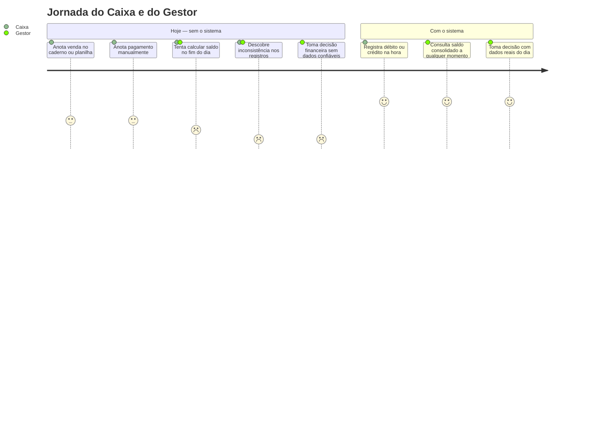
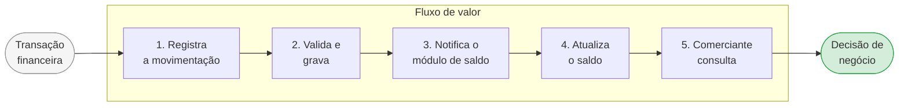
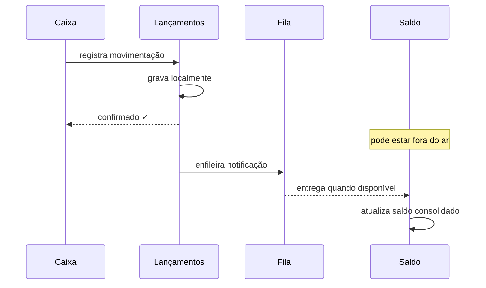
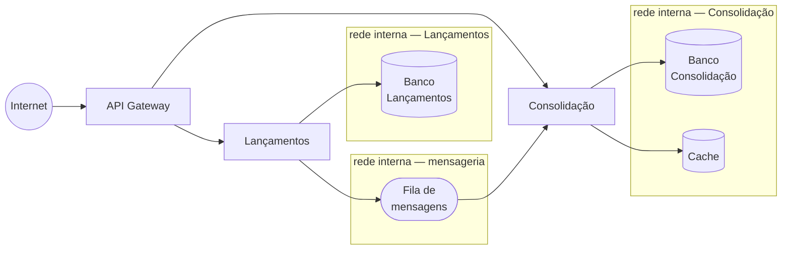
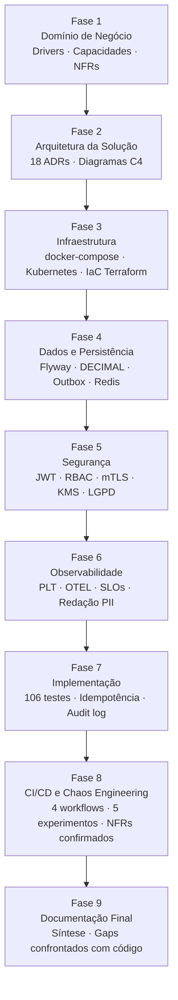

---
tags:
  - executivo
---

# Visão Executiva

**Papel:** 💼 Arquiteto de Negócios · 🏛️ Arquiteto Corporativo  
**Audiência:** Executivos, Product Owners, times de negócio

---

## Fase 1 — Domínio de Negócio

### O problema que estamos resolvendo

Um comerciante encerra o dia sem saber ao certo quanto dinheiro tem disponível. Ao longo do dia, registra vendas e pagamentos em anotações separadas — caderno, planilha, sistema legado — e só consegue enxergar o saldo real quando reconcilia tudo manualmente, geralmente à noite.



Isso gera dois problemas concretos:

- **Decisões tardias:** sem visibilidade em tempo real, o comerciante descobre o saldo negativo quando já é tarde para agir
- **Risco de perda de dados:** registros manuais se perdem, ficam duplicados ou inconsistentes

---

### O que o sistema faz

O sistema resolve os dois problemas com uma abordagem simples:

1. **Cada movimentação é registrada imediatamente** — débito ou crédito, com valor e data
2. **O saldo do dia é calculado automaticamente** e fica disponível para consulta a qualquer momento

O comerciante passa a tomar decisões com base em dados reais do dia, não em estimativas do fim do dia.

---

### A decisão de negócio mais importante

O sistema foi projetado em dois módulos independentes por uma razão de negócio clara:

> **O registro de lançamentos nunca pode parar — mesmo que a tela de saldo esteja fora do ar.**

Para um comerciante, perder um lançamento é pior do que não conseguir consultar o saldo. Um débito não registrado gera inconsistência financeira permanente. Um saldo temporariamente desatualizado é apenas um inconveniente.

Por isso, os dois módulos são desacoplados: uma falha na consulta de saldo não afeta em nada o registro de novos lançamentos.

---

### Como o valor chega ao comerciante



Cada passo é independente. Se o passo 4 estiver lento, os passos 1, 2 e 3 continuam funcionando normalmente.

---

### O que o sistema é capaz de fazer

<table style="width:100%; border-collapse: collapse; font-size: 0.9em;">
  <tr>
    <td colspan="10" align="center" style="background:#1d4ed8; color:#fff; font-weight:bold; padding:10px; border:2px solid #1e3a8a;">
      Controle de Fluxo de Caixa
    </td>
  </tr>
  <tr>
    <td colspan="5" align="center" style="background:#3b82f6; color:#fff; font-weight:bold; padding:8px; border:2px solid #1e3a8a;">
      Registro de Movimentações<br><span style="font-weight:normal; font-size:0.85em;">O que o caixa faz</span>
    </td>
    <td colspan="5" align="center" style="background:#3b82f6; color:#fff; font-weight:bold; padding:8px; border:2px solid #1e3a8a;">
      Consulta de Saldo<br><span style="font-weight:normal; font-size:0.85em;">O que o gestor vê</span>
    </td>
  </tr>
  <tr>
    <td align="center" style="background:#dbeafe; color:#1e3a8a; font-weight:bold; padding:8px; border:2px solid #1e3a8a;">Registrar débito</td>
    <td align="center" style="background:#dbeafe; color:#1e3a8a; font-weight:bold; padding:8px; border:2px solid #1e3a8a;">Registrar crédito</td>
    <td align="center" style="background:#dbeafe; color:#1e3a8a; font-weight:bold; padding:8px; border:2px solid #1e3a8a;">Validar lançamento</td>
    <td align="center" style="background:#dbeafe; color:#1e3a8a; font-weight:bold; padding:8px; border:2px solid #1e3a8a;">Consultar histórico</td>
    <td align="center" style="background:#dbeafe; color:#1e3a8a; font-weight:bold; padding:8px; border:2px solid #1e3a8a;">Estornar lançamento</td>
    <td align="center" style="background:#dbeafe; color:#1e3a8a; font-weight:bold; padding:8px; border:2px solid #1e3a8a;">Ver total de entradas e saídas</td>
    <td align="center" style="background:#dbeafe; color:#1e3a8a; font-weight:bold; padding:8px; border:2px solid #1e3a8a;">Ver saldo líquido do dia</td>
    <td align="center" style="background:#dbeafe; color:#1e3a8a; font-weight:bold; padding:8px; border:2px solid #1e3a8a;">Acompanhar atualização em tempo real</td>
    <td align="center" style="background:#dbeafe; color:#1e3a8a; font-weight:bold; padding:8px; border:2px solid #1e3a8a;">Verificar integridade diária</td>
    <td align="center" style="background:#dbeafe; color:#1e3a8a; font-weight:bold; padding:8px; border:2px solid #1e3a8a;">Reconstruir histórico de saldos</td>
  </tr>
</table>

---

### O que foi definido nesta fase

| O que | Decisão |
|-------|---------|
| **Prioridade do sistema** | Registro de movimentações é o núcleo do negócio — recebe o maior cuidado de design |
| **Autenticação** | Solução de mercado existente (não construímos do zero) |
| **Infraestrutura** | Serviço gerenciado — commodity, sem diferencial competitivo |
| **Lançamentos são imutáveis** | Um lançamento confirmado nunca é alterado; correções geram novos lançamentos |
| **Saldo pode estar levemente desatualizado** | Aceitável — o importante é que nenhum lançamento seja perdido |

---

### Compromissos assumidos com o negócio

| Compromisso | O que significa na prática |
|-------------|---------------------------|
| Registro sempre disponível | Mesmo com falha parcial no sistema, o caixa continua operando |
| Zero perda de lançamentos | Nenhuma movimentação confirmada desaparece, mesmo em falhas |
| Saldo suporta picos | O sistema aguenta o volume de consultas em dias de alta movimentação |
| Auditável | Toda movimentação registrada é rastreável — quem, quando, quanto |

> Para a visão técnica desta fase: [Drivers e Stakeholders](negocio/drivers.md) · [Requisitos](negocio/requisitos.md) · [Domínios e Capacidades](negocio/dominios.md) · [Principles Catalog](negocio/principios.md)

---

## Fase 2 — Arquitetura da Solução

Com o domínio de negócio definido, a Fase 2 tomou as decisões sobre como o sistema é construído para atender os requisitos definidos na Fase 1. As decisões técnicas foram guiadas por uma diretriz simples: **cada escolha deve ter um requisito de negócio como origem**, não uma preferência de tecnologia.

---

### A garantia técnica do compromisso mais importante

O compromisso de que o registro de lançamentos nunca para — mesmo com falha no módulo de saldo — é garantido por um mecanismo de fila interna:



Antes de qualquer notificação para o módulo de saldo, o lançamento é gravado localmente e confirmado para o Caixa. Se a notificação falhar, ela é reenviada automaticamente assim que o serviço se recuperar. O Caixa **nunca** precisa repetir um lançamento manualmente.

---

### Quem acessa e como

Três perfis de acesso foram definidos:

| Perfil | Como acessa | O que pode fazer |
|--------|------------|-----------------|
| **Caixa** | Aplicação web com login pessoal | Registra lançamentos; consulta histórico |
| **Gestor** | Aplicação web com login pessoal | Consulta saldo consolidado por dia ou período |
| **Sistema PDV** | Integração direta via API | Envia lançamentos automaticamente |

O PDV existente pode ser integrado sem substituição — ele passa a enviar lançamentos via API em vez de exportar relatórios manualmente. Isso elimina a etapa de transcrição que hoje é fonte de erros.

Cada acesso é autenticado por credencial digital. O sistema valida essas credenciais localmente — sem depender de servidor externo para cada requisição. Isso elimina um potencial ponto de falha no fluxo crítico de registro.

---

### Preparação para picos

O saldo consolidado é servido de um cache de alta performance. Em dias de alto volume — quando múltiplos gestores e sistemas consultam o saldo simultaneamente — o cache absorve a carga sem onerar o banco de dados.

O sistema está dimensionado para **50 consultas por segundo**, com comportamento degradado controlado em caso de sobrecarga: novas requisições acima do limite recebem resposta imediata de "tente novamente", sem comprometer as que já estão sendo processadas.

---

### O plano de transição — sem big-bang

O comerciante não precisa abandonar o processo atual de uma vez. A [Arquitetura de Transição](engenharia/transicao.md) define três estados operacionais, cada um com critérios claros de entrada e saída:


| Estado | O que muda | Critério de avanço |
|--------|-----------|-------------------|
| **Operação paralela** | Novo sistema registra em paralelo com a planilha | Divergência < 0,5% por 5 dias úteis |
| **Migração e integração** | Histórico importado; PDV integrado via API; planilha em somente-leitura | PDV operando via API por 3 dias; Gestor aceita formalmente |
| **Corte total** | Novo sistema é fonte única da verdade | Planilhas disponíveis em somente-leitura por 30 dias (janela de rollback) |

---

### O que foi decidido nesta fase

| O que | Decisão |
|-------|---------|
| **Estrutura do sistema** | Dois módulos independentes com fila de mensagens — garante o NFR crítico |
| **Garantia de entrega** | Lançamento gravado localmente antes de qualquer notificação — zero perda mesmo com falha parcial |
| **Autenticação** | Credencial digital validada localmente — sem dependência de servidor externo por requisição |
| **Performance** | Cache de alta performance absorve picos — dimensionado para 50 req/s |
| **Integração PDV** | PDV existente integrado via API — sem necessidade de substituição |
| **Transição** | Três estados controlados com critérios objetivos — rollback disponível por 30 dias após corte |

> Para a visão técnica desta fase: [Decisões Arquiteturais (ADRs)](adr/index.md) · [Contratos de Integração](engenharia/contratos.md) · [Arquitetura de Transição](engenharia/transicao.md) · [Plano de Entrega Incremental](engenharia/plano-entregas.md)

---

## Fase 3 — Como o sistema é executado

Com a arquitetura definida, a Fase 3 respondeu a uma pergunta prática: **como o sistema roda?** Containers, redes, isolamento de dados e escalabilidade foram definidos aqui. O resultado é um ambiente reproduzível com um único comando.

---

### Um ambiente que sobe completo com um comando

Todo o sistema está definido em um único arquivo de configuração. Qualquer desenvolvedor ou auditor pode rodar o ambiente completo localmente sem instalar dependências além do Docker:

```bash
docker compose up --profile app
```

O ambiente é composto por **24 containers** organizados em quatro grupos com responsabilidades distintas:

| Grupo | Containers | O que fazem |
|-------|-----------|-------------|
| **Sistema de negócio** | 3 | Os serviços que implementam o domínio — Lançamentos, Outbox Relay e Consolidação |
| **Dados e mensageria** | 4 | PostgreSQL (×2), Redis e RabbitMQ — cada um isolado na sua rede interna |
| **Gateway e identidade** | 2 | API Gateway (Traefik) e Identity Provider (Keycloak) |
| **Observabilidade** | 12 | Stack completo de monitoramento — logs, métricas, traces e alertas |
| **Ferramentas de desenvolvimento** | 3 | Portainer (gestão visual), documentação e diagramas |

Os 3 containers do sistema de negócio sobem sob demanda (`--profile app`). Os demais 21 — dados, gateway, identidade e observabilidade — sobem sempre, pois representam a plataforma sobre a qual o sistema opera.

Todos os containers sobem em ordem correta, com verificações de saúde entre eles, volumes persistentes e redes isoladas. Nenhum dado sai da máquina local.

---

### Isolamento de dados por camada

Os componentes de dados (dois bancos de dados, cache e fila de mensagens) estão em **redes internas sem saída para a internet**. O banco do serviço de Lançamentos não é acessível pelo serviço de Consolidação — e vice-versa. Essa separação existe em rede, não apenas em configuração de software.

O único ponto de entrada externo é o API Gateway, que fica em uma rede própria separada das camadas de dados.



---

### Escalabilidade sem reconfiguração

O serviço de Consolidação — o que recebe o maior volume de consultas — pode ser escalado horizontalmente sem alterar nenhuma configuração:

```bash
docker-compose up --scale consolidado=3
```

O cache compartilhado garante que todas as réplicas sirvam o mesmo saldo. A fila de mensagens distribui o processamento automaticamente: cada mensagem é processada por exatamente uma réplica, sem duplicação.

---

### Preparado para produção em nuvem

A mesma arquitetura de containers é mapeada para Kubernetes em produção — a diferença é apenas o orquestrador. As variáveis de ambiente que configuram o sistema localmente são injetadas por mecanismos de segredos da nuvem em produção. Os healthchecks definidos localmente viram probes de saúde do cluster. A escala horizontal automática substitui o comando manual.

---

### O que foi definido nesta fase

| O que | Decisão |
|-------|---------|
| **Execução local** | 24 containers (21 de plataforma + 3 de negócio sob demanda), healthchecks e volumes persistentes |
| **Isolamento** | 4 redes Docker — dados e mensageria sem saída para internet |
| **Escalabilidade** | Consolidação escala horizontalmente sem reconfiguração |
| **Rate limiting** | API Gateway bloqueia abuso por origem — sistema suporta 50+ req/s em agregado independentemente |
| **Runtime de produção** | Kubernetes — mesmas imagens, orquestração gerenciada |

> Para a visão técnica desta fase: [Topologia e Plataforma](infraestrutura/topologia.md) · [ADR-006 — Container Runtime](adr/ADR-006-container-runtime.md)

---

## Fase 4 — Como os dados são protegidos e organizados

Com a infraestrutura definida, a Fase 4 garantiu que os dados financeiros sejam armazenados com a precisão e a integridade que uma operação de caixa exige. Três princípios guiaram todas as decisões desta fase.

---

### Cada centavo conta — precisão financeira não é opcional

Sistemas que usam representação de ponto flutuante para valores monetários cometem erros de arredondamento. Para um saldo de R$ 1.000.000,00, a diferença pode ser de centavos — mas em auditoria financeira, qualquer divergência é um problema.

O sistema armazena todos os valores com **precisão exata de 15 dígitos e 2 casas decimais**. Nenhum valor financeiro passa por representação aproximada em nenhum momento do ciclo de vida dos dados.

---

### Lançamentos são imutáveis — erros geram estornos, não edições

Uma vez confirmado, um lançamento nunca é alterado. Se o operador cometeu um erro, o sistema registra um novo lançamento de estorno — criando uma trilha auditável completa de toda a movimentação.

Isso é análogo a um livro-caixa físico: você não apaga o que está escrito, você registra a correção em uma linha nova. O resultado é um histórico financeiro que pode ser auditado em qualquer momento, sem lacunas ou alterações invisíveis.

---

### Os dados do módulo de registro nunca se misturam com os do módulo de saldo

Cada serviço tem seu próprio banco de dados, inacessível ao outro em nível de rede — não apenas por configuração de software. Isso garante que uma falha em um banco não afeta o outro, e que a evolução de um serviço não quebra o schema do outro.

---

### O que foi definido nesta fase

| O que | Decisão |
|-------|---------|
| **Precisão financeira** | Valores armazenados com precisão exata — sem ponto flutuante |
| **Imutabilidade** | Lançamentos são append-only — correções geram estornos |
| **Isolamento de dados** | Banco dedicado por serviço, inacessível entre serviços |
| **Saldo pré-calculado** | Saldo por dia calculado incrementalmente — consulta em tempo constante |
| **Retenção** | Dados financeiros retidos por 5 anos conforme legislação fiscal |
| **Privacidade** | Nenhum dado pessoal armazenado nas tabelas financeiras por design |

> Para a visão técnica desta fase: [Modelagem de Dados](arquitetura/dados.md) · [ADR-012 — Persistência](adr/ADR-012-persistencia.md)

---

## Fase 5 — Como o acesso é controlado e o sistema é protegido

A Fase 5 definiu quem pode fazer o quê no sistema, como as identidades são verificadas, e como o sistema se comporta diante de ataques ou uso indevido.

---

### Nenhuma requisição é confiável por padrão

O sistema adota o princípio de **confiança zero**: toda requisição — mesmo vindas de dentro da rede interna — precisa apresentar uma credencial válida. Não existe zona "segura" onde requisições são aceitas sem verificação.

Na prática, isso significa que:
- O Caixa e o Gestor fazem login com usuário e senha — o sistema emite uma credencial com validade de 5 minutos
- O Sistema PDV se autentica com chaves de sistema — sem interação humana
- O API Gateway verifica a credencial antes de qualquer requisição chegar aos serviços internos
- Os serviços internos nunca recebem requisições não autenticadas

---

### Identidade é uma capacidade compartilhada, não um componente deste sistema

A gestão de identidades (login, senhas, tokens) é operada por uma plataforma separada — não construída dentro deste sistema. Essa decisão segue o princípio de que sistemas de identidade são capacidades corporativas, potencialmente compartilhadas entre dezenas de sistemas.

Em desenvolvimento: Keycloak local. Em produção: o Identity Provider corporativo do Banco Carrefour (ex: AWS Cognito, Azure AD). A troca não requer alteração no código dos serviços.

---

### Cada perfil tem acesso apenas ao que precisa

| Perfil | Pode registrar lançamentos | Pode consultar saldo consolidado | Pode fazer reconciliação |
|--------|:--------------------------:|:--------------------------------:|:------------------------:|
| Caixa | ✅ | ❌ | ❌ |
| Gestor | ❌ | ✅ | ❌ |
| Admin | ✅ | ✅ | ✅ |
| Sistema PDV | ✅ | ❌ | ❌ |

---

### O que foi definido nesta fase

| O que | Decisão |
|-------|---------|
| **Modelo de acesso** | Confiança zero — toda requisição verificada, nenhuma zona implicitamente segura |
| **Identidade** | Plataforma externa — não construída neste sistema, substituível sem mudança de código |
| **Credenciais** | Validade de 5 minutos — sem listas de revogação, sem dependência de banco de dados por requisição |
| **Autorização** | Escopos por operação — acesso mínimo necessário por perfil |
| **Proteção contra abuso** | Rate limiting por camada — API Gateway bloqueia antes de chegar aos serviços |
| **Auditoria** | Todo acesso e operação registrado com identidade, horário e resultado |

> Para a visão técnica desta fase: [Segurança](seguranca/index.md) · [ADR-013 — Revogação de Tokens](adr/ADR-013-revogacao-tokens.md) · [ADR-014 — Identity Provider](adr/ADR-014-identity-provider.md)

---

## Fase 6 — Como sabemos que o sistema está funcionando

A Fase 6 respondeu à pergunta que toda operação em produção precisa responder: **como você sabe, antes do cliente reclamar, que algo está errado?**

---

### Visibilidade completa em um único lugar

Toda a telemetria do sistema — logs, métricas de performance, rastreamento de requisições e uso de recursos — converge em uma única interface de monitoramento. Um incidente que começa com um alerta de lentidão pode ser investigado sem trocar de ferramenta: do alerta, para a requisição lenta, para os logs daquele momento, para a linha de código que causou o problema.

---

### Compromissos mensuráveis — não intuição

Cada compromisso de negócio firmado na Fase 1 foi traduzido em um indicador técnico monitorado continuamente:

| Compromisso de negócio | Indicador técnico | Meta |
|------------------------|-------------------|------|
| Registro sempre disponível | Taxa de sucesso do `POST /lancamentos` | ≥ 99,5% nos últimos 30 dias |
| Saldo suporta picos | Throughput sob carga | ≥ 50 req/s com < 5% de erros |
| Saldo atualizado rapidamente | Tempo lançamento → saldo atualizado | < 30 segundos (p99) |
| Zero mensagens perdidas | Mensagens na fila de reprocessamento | 0 por hora |

Quando um indicador começa a se deteriorar — antes de violar a meta — o sistema alerta automaticamente a equipe de operação via Telegram (dev) ou PagerDuty (produção).

---

### Dados sensíveis nunca chegam ao monitoramento

Antes de qualquer log ser persistido, o sistema aplica **redação automática de dados pessoais**: CPF, CNPJ, e-mail e número de cartão são substituídos por marcadores inidentificáveis. Isso acontece na camada de infraestrutura, sem depender de disciplina individual dos desenvolvedores — em conformidade com a LGPD.

---

### O que foi definido nesta fase

| O que | Decisão |
|-------|---------|
| **Visibilidade** | Logs, métricas, traces e profiles centralizados em plataforma única |
| **Alertas** | Baseados em consumo de budget de erro — alerta antes de violar a meta |
| **Privacidade nos logs** | Redação automática de PII na camada de infraestrutura — LGPD |
| **Uptime sintético** | Sondas ativas verificam disponibilidade dos componentes a cada 30 segundos |
| **Rastreabilidade** | Cada requisição tem um identificador único que percorre todos os serviços |

> Para a visão técnica desta fase: [Observabilidade](observabilidade/index.md) · [ADR-015 — Stack de Observabilidade](adr/ADR-015-observabilidade.md) · [ADR-016 — Redação de PII](adr/ADR-016-redacao-pii-logs.md)

---

## Fase 7 — O sistema funcionando de ponta a ponta

Com toda a infraestrutura e arquitetura definidas, a Fase 7 produziu o sistema funcionando: código implementado, testado e operando com todas as regras de negócio ativas.

---

### 106 verificações automáticas de correção

Cada regra de negócio definida nas fases anteriores foi traduzida em um teste automatizado. Antes de qualquer alteração entrar no sistema, 106 verificações são executadas automaticamente — cobrindo desde o comportamento do domínio financeiro até a integração com banco de dados, mensageria e autenticação.

Isso significa que uma mudança que quebre uma regra de negócio existente é detectada **antes** de chegar à produção, não depois.

---

### O PDV pode tentar de novo — sem criar lançamentos duplicados

Se o sistema PDV envia um lançamento e não recebe confirmação (por falha de rede, timeout ou qualquer interrupção), ele pode reenviar a mesma operação com segurança. O sistema reconhece que já recebeu aquela operação e retorna o resultado original — sem criar um segundo lançamento.

Esse comportamento é garantido por uma chave de idempotência: cada operação tem uma identidade única que o sistema usa para detectar e absorver repetições. Do ponto de vista do comerciante, o saldo nunca fica errado por causa de uma retentativa.

---

### Correções sem apagar o histórico

Quando um operador registra um lançamento incorreto, a correção segue o mesmo princípio de um livro-caixa físico: não se apaga o que foi escrito, registra-se um estorno. O sistema cria um novo lançamento que anula o anterior, mantendo a trilha completa de quem fez o quê e quando.

Isso é requisito regulatório em operações financeiras — e aqui é a única forma de corrigir um erro, por design.

---

### O sistema detecta inconsistências sozinho

Todo dia às 2h da madrugada, o sistema compara automaticamente o total de lançamentos registrados com o saldo consolidado. Se houver divergência — por qualquer razão — o sistema alerta a equipe de operação e registra a discrepância como métrica. O Gestor não precisa fazer reconciliação manual.

Em caso de falha grave que corrompa o saldo consolidado, o sistema consegue **reconstruir o saldo do zero** a partir do histórico de lançamentos — sem perda de nenhuma informação financeira.

---

### Toda operação é rastreável até o operador

Cada lançamento registrado carrega a identidade digital de quem o realizou — extraída da credencial de autenticação no momento da operação. Essa informação é imutável e retida por 5 anos, conforme exigência fiscal.

Em paralelo, um registro de auditoria é criado automaticamente após cada operação confirmada, documentando a ação, o recurso afetado e o contexto relevante. Esse registro é assíncrono — a resposta ao operador não espera por ele — e sua falha nunca compromete a operação de negócio.

---

### O que foi entregue nesta fase

| O que | Resultado |
|-------|-----------|
| **Implementação completa** | Todos os endpoints de lançamento, estorno, consulta e consolidação operando |
| **Qualidade verificada** | 106 testes automatizados cobrindo domínio, persistência, mensageria e segurança |
| **Idempotência** | Retentativas do PDV absorvidas sem duplicação — saldo sempre correto |
| **Estorno** | Correções geram trilha auditável — histórico financeiro nunca é apagado |
| **Reconciliação automática** | Divergências detectadas e alertadas diariamente sem intervenção humana |
| **Recuperação catastrófica** | Saldo pode ser reconstruído integralmente a partir do histórico |
| **Rastreabilidade** | Identidade do operador gravada em cada lançamento; audit log pós-confirmação |

> Para a visão técnica desta fase: [Implementação](implementacao/index.md) · [Dados e Persistência](arquitetura/dados.md) · [Segurança](seguranca/index.md)

---

## Fase 8 — Como sabemos que o sistema aguenta pressão real

Construir o sistema e testá-lo em condições normais não é suficiente. A Fase 8 verificou o comportamento do sistema em condições adversas — falhas deliberadas, sobrecarga controlada e implantação automatizada.

---

### Quebramos o sistema de propósito para provar que ele funciona

Cinco experimentos de engenharia do caos foram executados: o serviço de Consolidação foi derrubado, a rede foi interrompida, o broker de mensagens foi sobrecarregado, a latência foi artificialmente aumentada. Em todos os casos, o resultado esperado foi confirmado:

- **O registro de lançamentos continuou funcionando** enquanto o módulo de saldo estava fora do ar
- **Nenhum lançamento foi perdido** — todos chegaram ao destino quando o sistema se recuperou
- **O sistema de filas absorveu** as mensagens pendentes sem intervenção humana

Esses experimentos não são especulação — são evidência documentada de que o compromisso assumido na Fase 1 ("o registro nunca para") é real e verificado.

---

### Nenhuma mudança entra em produção sem passar por verificação automática

Cada alteração no código — de qualquer desenvolvedor, em qualquer branch — dispara automaticamente uma sequência de verificações:


Imagens com vulnerabilidades conhecidas de severidade crítica ou alta são **bloqueadas automaticamente** — não chegam ao repositório de imagens.

---

### Cada serviço tem seu próprio ciclo de vida

Os dois serviços — Lançamentos e Consolidação — podem ser atualizados e implantados de forma completamente independente. Uma correção no serviço de Consolidação não exige nova versão do serviço de Lançamentos, e vice-versa.

Cada serviço segue seu próprio versionamento semântico. Quando arquivos do serviço de Lançamentos são alterados e chegam à branch principal, o pipeline de implantação daquele serviço dispara automaticamente — lê a versão do arquivo `VERSION` do serviço e publica a nova imagem.

---

### O custo da infraestrutura é visível e atualizado automaticamente

A cada execução do pipeline de CI na branch principal, uma estimativa de custo da infraestrutura AWS é gerada e publicada automaticamente na documentação do projeto. O valor atual estimado é de **$1.219/mês** para a configuração de produção completa — visível para qualquer stakeholder sem precisar executar nenhum comando.

---

### O que foi entregue nesta fase

| O que | Resultado |
|-------|-----------|
| **Caos Engineering** | 5 experimentos executados — NFR crítico confirmado em condições adversas reais |
| **Pipeline de qualidade** | Testes + cobertura + build + scan de segurança + custo — automático em toda alteração |
| **Scan de vulnerabilidades** | Imagens com CVE crítico ou alto bloqueadas antes de chegar ao ambiente de produção |
| **Implantação independente** | CD separado por serviço com versionamento semântico independente |
| **Custo transparente** | Estimativa de infraestrutura publicada e atualizada automaticamente no CI |
| **Documentação publicada** | Documentação técnica completa, diagramas C4, relatórios de testes e cobertura disponíveis publicamente |

> Para a visão técnica desta fase: [Pipeline CI/CD](infraestrutura/pipeline.md) · [Chaos Engineering](implementacao/caos.md) · [Conformidade e Evidências](seguranca/conformidade.md)

---

## Fase 9 — Documentação final e fechamento

A Fase 9 consolidou toda a documentação técnica produzida ao longo do projeto, revisou a coerência entre o que foi documentado e o que foi implementado, e registrou formalmente o que fica fora do escopo e por quê.

---

### Uma análise que leu o código

A documentação desta fase não foi escrita a partir de memória ou de notas — foi produzida após leitura direta do código dos dois serviços. Cada claim sobre o que está implementado tem como origem um arquivo Java específico.

Essa análise encontrou quatro gaps técnicos não documentados anteriormente:

- O consumer do Consolidado não verifica se um evento já foi processado — redelivery do RabbitMQ pode duplicar o saldo
- O gateway que chama o serviço de Lançamentos não tem retry nem circuit breaker
- O job de reconciliação não tem proteção contra execução simultânea em múltiplas instâncias
- A operação de reconstrução de saldo usa uma transação única para todo o período — falha no meio reverte o trabalho todo

Todos foram documentados com código de evidência, risco concreto e caminho de evolução em [`docs/evolucoes.md`](evolucoes.md).

---

### O estado real dos pendentes

Quatro itens estavam registrados como "pendentes para versões futuras". A análise confirmou três e encerrou um:

- O **backoffice de reprocessamento da DLQ** está corretamente adiado — o `DlqConsumer` só loga e mede; sem replay intencional.
- A **idempotência do estorno** estava registrada como não verificada. A análise do código mostrou que está resolvida: o ID do estorno é derivado deterministicamente do ID original, tornando o replay naturalmente idempotente.
- O **build info no MDC** e a **estética do site C4** continuam pendentes conforme documentado.

---

### O que foi produzido nesta fase

| Artefato | O que contém |
|----------|-------------|
| [`docs/arquitetura/index.md`](arquitetura/index.md) | Síntese da arquitetura — conecta NFRs → ADRs → classes de implementação |
| [`docs/evolucoes.md`](evolucoes.md) | Backlog técnico confrontado com o código — 3 decisões de escopo + 5 gaps com evidência e caminho |
| [`docs/visao-executiva.md`](visao-executiva.md) | Este documento — todas as 9 fases fechadas |
| [`docs/index.md`](index.md) | Landing page revisada — orientação de navegação para o leitor |

---

### O que foi construído ao longo das 9 fases



---

### O que está pronto para produção

| Área | Estado |
|------|--------|
| Serviço de Lançamentos | ✅ Implementado, testado, containerizado |
| Serviço de Consolidação | ✅ Implementado, testado, containerizado |
| Autenticação JWT + RBAC | ✅ Operacional com Keycloak local |
| Pipeline CI/CD | ✅ 4 workflows no GitHub Actions — testes, cobertura, Trivy, Infracost, CD por serviço |
| Infraestrutura como código | ✅ 21 arquivos Terraform cobrindo VPC, RDS, ElastiCache, EKS, CloudFront, WAF, KMS |
| Observabilidade | ✅ PLT + OTEL + 4 dashboards Grafana + alertas configurados |
| Estimativa de custo | ✅ $1.219/mês estimados pelo Infracost — publicado no GitHub Pages |
| Documentação | ✅ GitHub Pages com MkDocs + C4 + relatórios de testes + cobertura |

**O gap de maior prioridade antes de produção:** idempotência no consumer do Consolidado (G-01 em [`docs/evolucoes.md`](evolucoes.md)) — sem essa proteção, redelivery do RabbitMQ pode gerar saldo duplicado.
